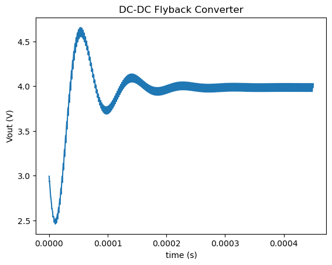

# Run a simulation with Simba python module

This circuit launches a simulation of the **Flyback** circuit and plots the output voltage.

The python script can be downloaded [here](1.%20Run%20Simulation.py).

The circuit model is directly loaded from the collection of design examples.

The main steps of this script example are the following:

1. Load python modules: aesim.simba and matplotlib
2. Load the design from the collection of design examples
3. Run a transient simulation
4. Get the output voltage
5. Plot the output voltage depending on time

