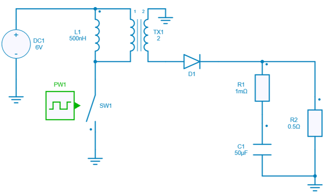

# Run a simulation

This circuit launches a simulation of circuit from the design example collection and plots the output voltage.

The python script can be downloaded [here](1.%20Run%20Simulation.py).

