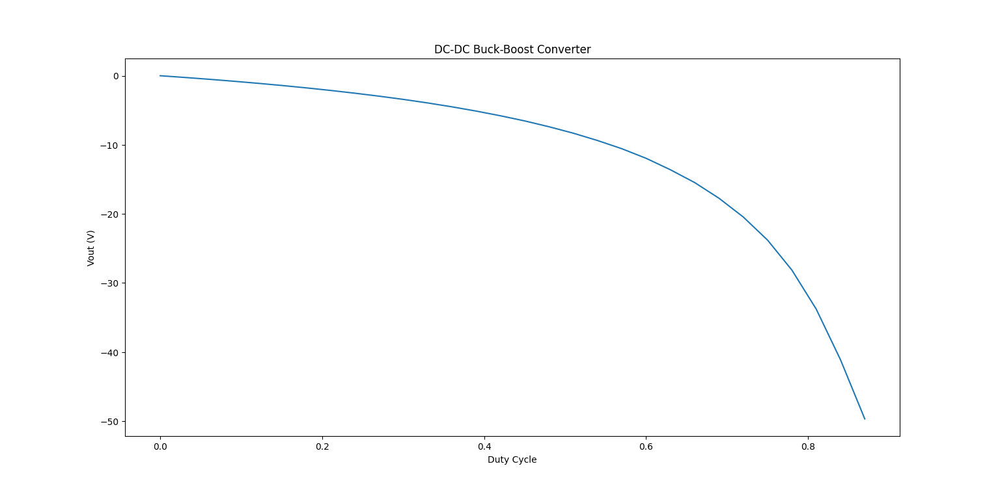

---
tags:
  - Python Scripts
  - DC-DC
  - Python Basics
---

# Perform a Parameter Sweep with Simba python module

[Download python script](2.%20Parameter%20Sweep.py)

When doing a transient, AC, or DC sweep analysis, a parametric sweep can be used to move a parameter across a range of values. A voltage or current source, temperature or a model parameter are examples of variables that may be changed.

This example proposes a sweep of the duty cycle of a buck boost conveter for a transient analysis.

The circuit model is directly loaded from the collection of design examples.

The script uses a **for loop** to scan 30 values of the duty cycle between 0 and 0.9. At each simulation the average value of the output voltage (in steady state) is computed and store in a python list.

Then the average value of the ouptut voltage depending on this duty cycle variation is displayed.

