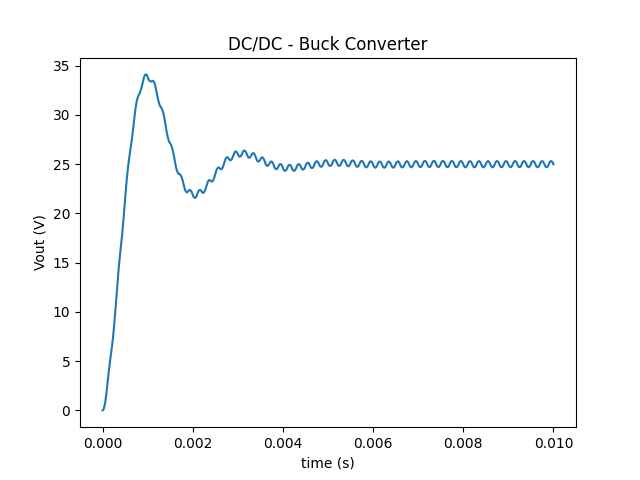

---
tags:
  - Python Scripts
  - DC-DC
  - Python Basics
---

# Create a circuit in Python using SIMBA Python Library

[Download **python script**](3.%20Create%20Circuit.py)

This example creates from scratch a simple Buck Chopper circuit with the following steps:

## Load Module

The first step is to load modules as per the requirements. The mandatory module to load is **aesim.simba** which enables to use the SIMBA features. Also, matplotlib.pyplot can be imported to view the curves and results.

## Create Design

In the next step, the design can be created using **Design()** class and subsequently, it's nomenclature and other properties can be updated. To create or update the circuit, a variable "circuit" can be created for the design using the command **design.circuit** and the updates will be saved in the circuit variable.

## Add and Rotate Devices

Further, to add devices in the circuit, **circuit.AddDevice()** command can be used. The parameter in this command is the device name to be added. For example, if dc voltage source to be added between the nodes 2 and 6, the complete command can be "V1 = circuit.AddDevice("DC Voltage Source", 2, 6)" and it's attribute like voltage value can be set as "V1.Voltage = 50". Similarly, other devices and it's attributes can be set in the same manner. Also, Scopes in the elements an be enabled by the command "for R1.Scopes: scope.Enabled = True". To rotate the elements, **RotateRight()** or **RotateLeft()** can be used.

## Make Connections

Now, to make connections between the elements, **AddConnection()** class must be used. For example, if the positive terminal of dc voltage source is to be connected to the positive terminal of the controlled switch, "circuit.AddConnection(V1.P, SW1.P)" command can be used. Other connections can be completed in the same way.

In this script, a method *print_pin_names* has been added to print device pin names. This allows the user to see how the device pins can be used in the code. 

#%%  Create Design
design = Design()
design.Name = "DC/DC - Buck Converter"
design.TransientAnalysis.TimeStep = 1e-6
design.TransientAnalysis.EndTime = 10e-3
circuit = design.Circuit

## Run Simulation and Plot Curves

Finally, the simulation can be run using "design.TransientAnalysis.NewJob()" and "job.run()" and curves can be plotted using "plt.plot" commands. 
The example is created for a DC-DC Buck Converter whose output voltage after final simulation is shown as below:

