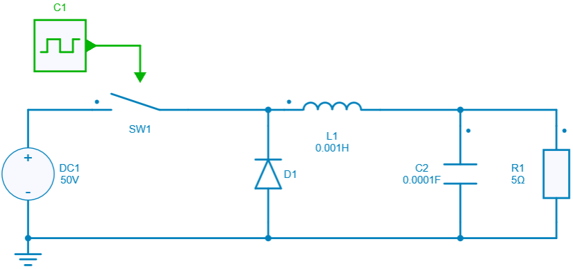
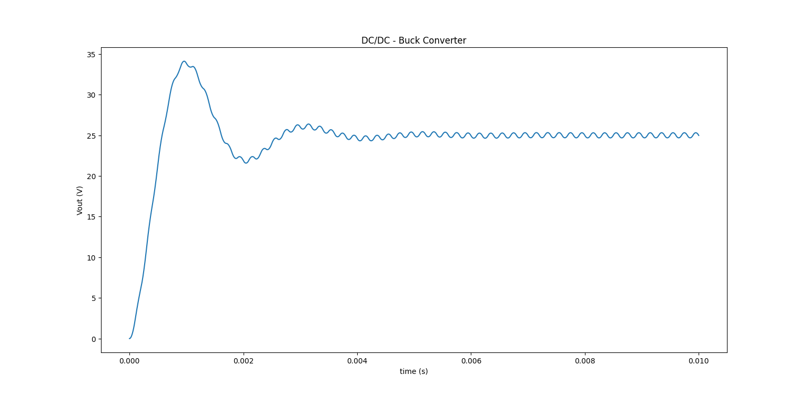

---
tags:
  - Python Scripts
  - DC-DC
  - Basics
---

# Create a Simple Circuit, Save and Open using Simba Python Library

[Download **python script**](4.%20Open-Save%20Project%20File.py)

Simba Python Library gives user flexibility to design any circuit. The example shows the creation of a simple buck chopper from scratch, how to save or re-open the design with the different steps:

1. *Design and circuit creation*:
   A user specific component placement gives exact configration, for connection in proper aspect ratio and resolution. Each connection is added according to the topology configuration.
2. *Save / Open the design*:
    Further, the design can be named and a model will be created in the same folder where the python Script is written.
    The newly created model can be saved and later opened.
3. *Run simulation*:
   The user can perform all operations on the model and run the simulation using Simba Python Library.
4. *Get and plot results*

The results for the simulation can be retrieved and plotted. In this example *Output voltage Vs Time axis* is plotted.

