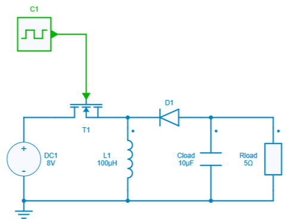
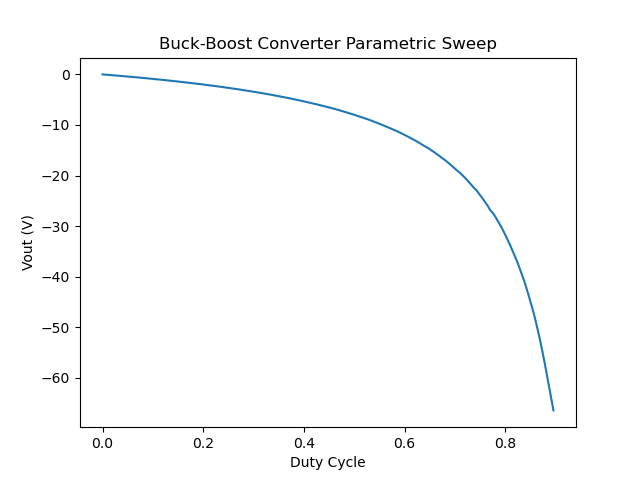

# Parallel parameter sweep

[Download **multiprocessing python script**](5.%20Parameter%20Sweep%20(multiprocessing).py)

[Download **multithreading python script**](5.%20Parameter%20Sweep%20(multiprocessing).py)

[Download **python module requirements**](requirements.txt)

These two examples scripts respectively show how the SIMBA python module can be used to run calculations on parallel processes and threads and accelerate simulation.

Make sure to run 'pip install -r requirements.txt' to ensure you have the required packages.

*Multiprocessing* or *multithreading* are two different options for performing a parallel calculation. The choice of one of them will depend on the application and more precisely on the simulation time of a *single job*. Indeed, knowing that the creation of a process can take between 10 and 100 ms depending on the computer, the multiprocessing option will be more interesting when the simulation time of a single job is much longer.

These scripts use a buck-boost circuit from the collection of design examples.

 These scripts propose a sweep of the duty cycle to run 200 simulations in parallel and then plot the average value of the output voltage depending on the duty cycle.

