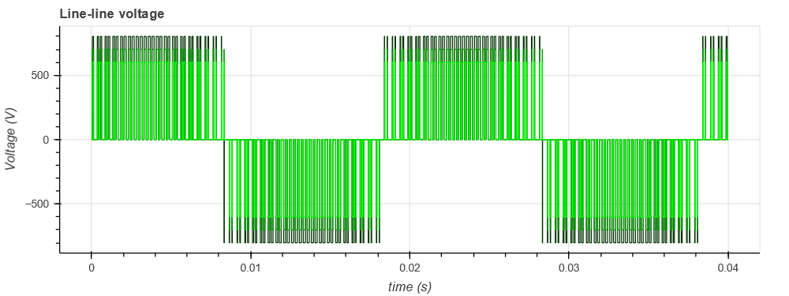
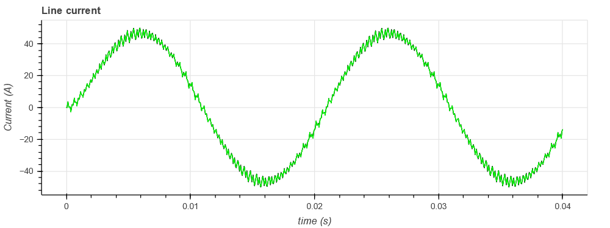
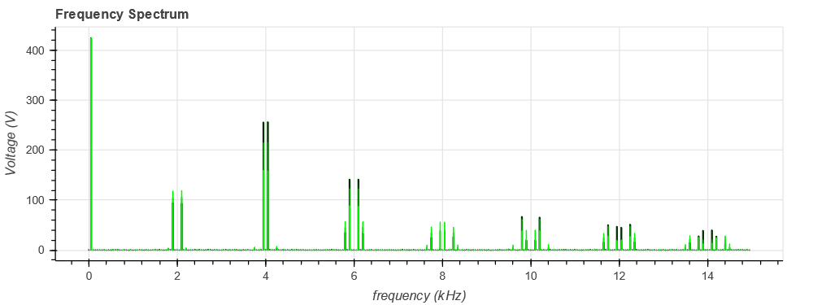

---
tags:
  - Python Scripts
  - DC-AC
  - Parameter Sweep
---

# Three-phase inverter parameter sweep

[Download **python notebook** here](Three-phase-inverter_parametersweep.ipynb)

[Download **Simba model** here](Three-phase-inverter.jsimba)

This example shows a combined use of python notebook and Simba to handle a pre-design phase of a three-phase inverter.

The goal is to evaluate the influence of the DC bus voltage value (through the modulation index) on the waveforms and the frequency spectrum of the output voltage (for example to design an AC filter).


This example can be divided into three steps:

* a "pre-processing" step where the range of the modulation index is computed from a variation range of the DC bus voltage to get a constant defined output line-line voltage,
* a simulation step which runs the Simba simulations for the different output voltages,
* a "post-processing" step to perform a Fast-Fourier Transform with **numpy** on a defined number of harmonics.

## Step 1: computation of the range of the modulation index

The modulation index $m$ is computed for different values of DC bus voltage to get the same line-line voltage $U$ according to the relation:

$$ m = \frac{2 U \sqrt{2}}{E \sqrt{3}} $$

``` py
line_line_voltage = 300
fmod = 50
dc_bus_voltages = [800, 700, 600]
modulation_indices = 2 * line_line_voltage * np.sqrt(2) / dc_bus_voltages / np.sqrt(3)
```

## Step 2: Run Simba simulations

Simba simulations are run for the different modulation indices which have been computed. The results are stored in different lists (one for each type).

``` py
res_time = []
res_u12 = []
res_iL = []
for dc_bus_voltage, modulation_index in zip(dc_bus_voltages, modulation_indices):
    vdc1.Voltage = dc_bus_voltage / 2
    vdc2.Voltage = dc_bus_voltage / 2
    for pwm in pwms:
        pwm.Amplitude = modulation_index
        pwm.Frequency = fmod
    job = mycvs.TransientAnalysis.NewJob()
    status = job.Run()
    res_time.append(job.TimePoints)
    res_u12.append(job.GetSignalByName('U12 - Voltage').DataPoints) 
    res_iL.append(job.GetSignalByName('L1 - Current').DataPoints)
```
Waveforms of output voltage and line current can be plotted.





## Step 3: Perform a Fast Fourier Transform with numpy

First, the results are resampled with a frequency of 500 kHz which leads to a maximum frequency with the FFT of $\left( \frac{f_{sample}}{2} - f_{step} \right)$ i.e. 245.95 kHz.

After the FFT, only the first 300 harmonics are plotted.

``` py
# Prepare resampling
N = 10000
time_resamp = np.linspace(0, 2 / fmod, 2 * N, endpoint=False)

for time, u12 in zip(res_time, res_u12):
    # resampling for fft
    u12_resamp = np.interp(time_resamp, time, u12)
    fstep = 50    # consider only N points of the 2N point resampled vector
    time_resamp_window = time_resamp[-N:]
    u12_resamp_window = u12_resamp[-N:]
    
    # do fft
    freq = np.fft.fftfreq(N) * fstep * N
    positivefreq = freq[freq >= 0]
    freqval = np.abs(np.fft.fft(u12_resamp_window)) / N
    freqval[1:] = freqval[1:] * 2
    freqval = freqval[freq >= 0]

    # Get only 300 harmonics
    max_index = 300
    positivefreq = positivefreq[:300]
    freqval = freqval[:300]
    p1.vbar(x=(positivefreq/1e3), width=width, bottom=0, top=freqval, color=(0, green_color, 0))
    green_color += 100
    width *= 0.5
``` 

