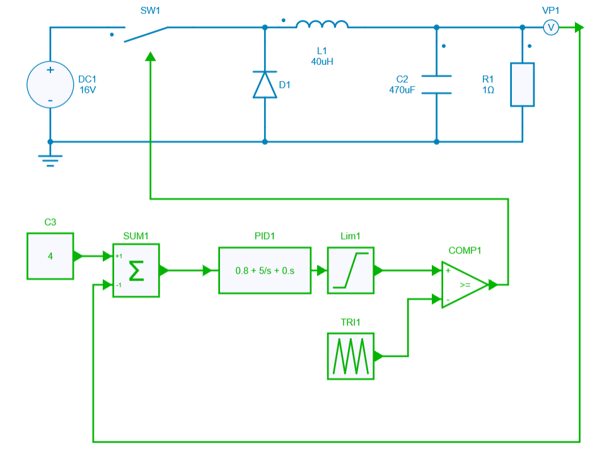
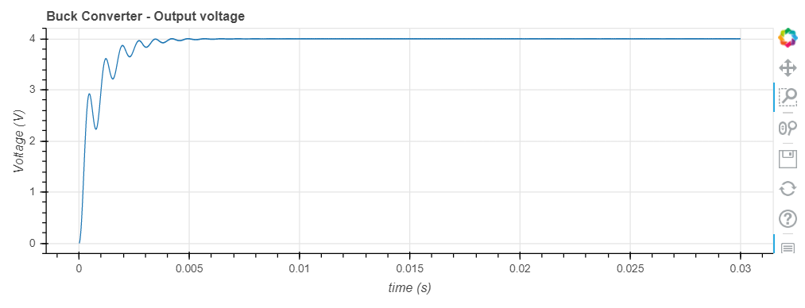

# Buck converter PID Parameters optimization using Scipy

[Download **python notebook**](buck_opti.ipynb)

[Download **Simba model**](Buck.jsimba)

This example describes how the Scipy package of Python is used in a buck converter to optimize the PID parameters of the voltage regulation with specifications:

* The output voltage should be equal to the reference voltage (error = 0, non-linear constraint),
* No overshoot (overshoot = 0, non-linear constraint)
* Minimize rise time



## Scipy module

Scipy provides fundamental algorithms for scientific computing in Python such as optimization, integration, interpolation, eigenvalue problems, algebraic equations, differential equations, statistics and many other classes of problems.

In this example the *differential evolution algorithm* is used.

## Algorithm

The below python portion of code will perform the algorithm expected to optimize PID parameters:

```py
# Define nonlinear constraints (no error and no overshoot)
nonlinear_constraint_err = NonlinearConstraint(constraintError3D, 0.0, 10**(-2))
nonlinear_constraint_OverShoot = NonlinearConstraint(constraintOverShoot3D, 0.0, 10**(-2))

# Run optimization algorithm
bounds = Bounds([0, 0.0, 0.0], [100,1, 1E-6],True) # 0 < Ki < 100; 0 < Kp < 1; 0 < Kd < 1E-6
tic = t.process_time()
res = differential_evolution(objective3D,
                             bounds,
                             strategy = 'rand1exp', # works well with a small population and preserve the population diversity
                             maxiter = 30,
                             tol = 0.01,
                             popsize = 5, 
                             init = 'latinhypercube',
                             polish = False,
                             workers = 1, # -1 to use all ressources available
                             constraints = [nonlinear_constraint_err, nonlinear_constraint_OverShoot]
```

## Result

Once the simulation is performed, the PID parameters are newly calculed with such values:

* *Ki*:  93.5427481225505
* *Kp*:  0.021372901813493217
* *Kd*:  9.710245029255805e-07

and those below constraints have been respected: 

* *risetime*:  0.002484855895240199
* *error*:  0.0006358038658891285
* *overshoot*:  0.0020231748446197795

Finally the output voltage is having this shape:



To conclude, this example retrieves the optimized parameters and corresponding metrics from the optimization result and the simulation history dictionary. It then prints these values to display the results of the optimization process, including the optimized parameters (Ki, Kp, Kd) and the corresponding rise time, error, and overshoot.