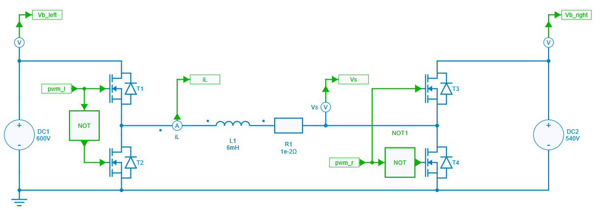
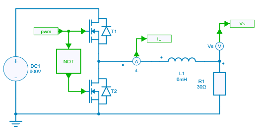
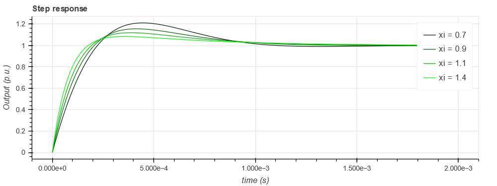
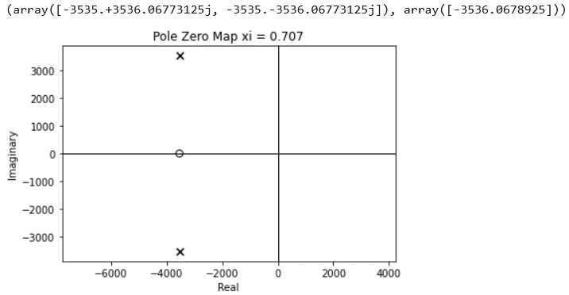
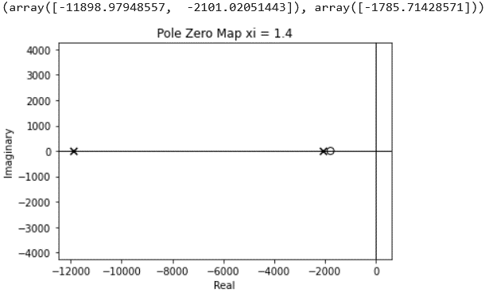
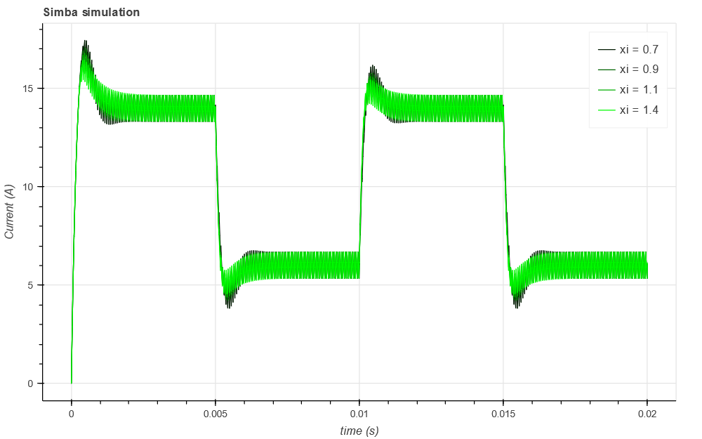
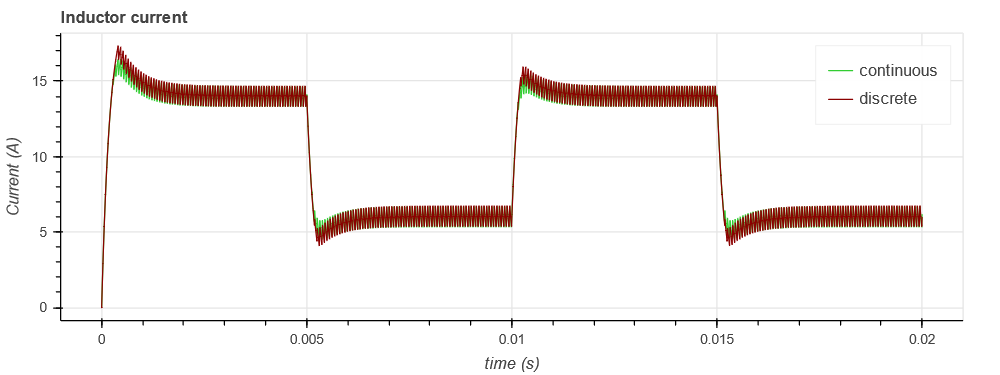
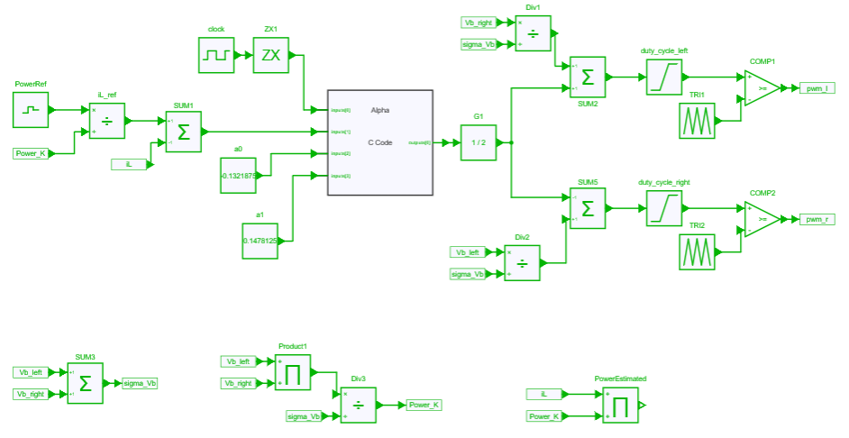
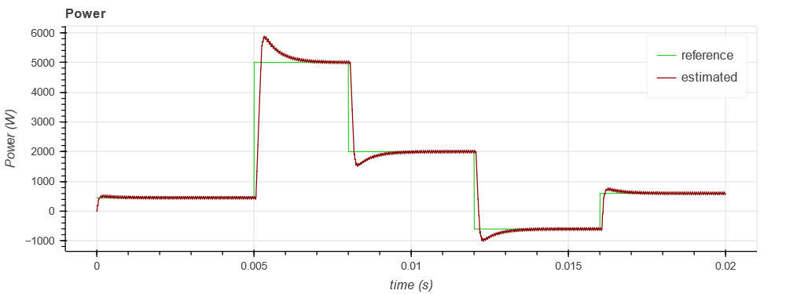

---
tags:
  - Python
  - DC-DC
  - Control Design
---

# DC Power Flow Control

[Download **python notebook**](direct_current_power_flow_control.ipynb) and its
[figure 1](fig/dc_power_flow_control.png) and
[figure 2](fig/current_control_with_voltage_compensation.png) 

[Download **Simba model**](direct_current_power_flow_control.jsimba)

This example shows a combined use of *python control toolbox* and *Simba* to design and check a DC power flow control between two switching legs.



In a first step, the current control of a single leg is considered: continuous and discrete controllers are designed and then checked with Simba simulations. Secondly, the controller is used to control the power flow between the two switching legs.

## Step 1: Controller design of single leg

### Design of a continuous controller




The controller is considered with a compensation of the output voltage as shown below:


The closed loop transfer function can then be computed:

$$TF_{CL}(s) = \dfrac{1 + \frac{K_p}{K_i} s}{1 + \frac{K_p}{K_i} s + \frac{L}{E ~ K_i} s^2 }$$

Considering the denominator of this transfer function can be written as:

$$D(p) = 1 + 2 \xi \frac{s}{\omega_n} + \frac{s^2}{\omega_n^2}$$

This leads to:

$$K_i = \dfrac{L \omega_n^2}{E}  ~~~~ \text{and} ~~~~  K_p = \dfrac{2 \xi K_i}{\omega_n}$$

$K_p$ and $K_i$ are computed for different values of damping $\xi$. The steps reponses are plotted thanks to the python control toolbox.

``` py
# Step responses with xi parameter sweep
for xi in [0.7, 0.9, 1.1, 1.4]:
    Ki = wn ** 2 * L / E
    Kp = 2 * xi * Ki / wn
    tf = control.tf(np.array([Kp / Ki, 1]), np.array([1 / wn**2, 2 * xi / wn, 1]))
    (simutime, output) = control.step_response(tf, simutime, X0=0)
    step_response_sweep.line(simutime, output, color=(0, green_color, 0), legend_label='xi = ' + str(xi))
    green_color += 75
show(step_response_sweep)
```




The pole-zero maps can also be plotted to evalute the evolution of the imaginary part of the poles with the following command:

``` py
control.pzmap(tf, plot=True, grid=False, title='Pole Zero Map xi = ' + str(xi))
```





The behavior of the switching leg with this continuous controller is checked with real waveforms thanks to **Simba** simulations:

``` py
# Simba simulations and plot with xi parameter sweep
for xi in [0.7, 0.9, 1.1, 1.4]:
    Ki = wn ** 2 * L / E
    Kp = 2 * xi * Ki / wn
    PI.Kp = Kp
    PI.Ki = Ki
    sweep_job = direct_current_continuous_controller.TransientAnalysis.NewJob()
    status = sweep_job.Run()
    simba_time_continuous = sweep_job.TimePoints
    iL_continuous = sweep_job.GetSignalByName('L1 - Instantaneous Current').DataPoints
    simba_sweep.line(simba_time_continuous, iL_continuous, color=(0, green_color, 0), legend_label='xi = ' + str(xi))
    green_color += 75
show(simba_sweep)
```



### Design of a discrete controller

The continuous to discrete transformation using Tustin method gives: $s = \dfrac{2}{T_s} \dfrac{z-1}{z+1}$,

which leads to:
$C(z) = \dfrac{1}{1-z^{-1}} \left(K_p + \frac{1}{2} K_i T_s + (- K_p + \frac{1}{2} K_i T_s) ~ z^{-1}\right)$

and then to the recurrence equation:
$\alpha(k) = \alpha(k-1) + a_1 \varepsilon(k) + a_0 \varepsilon(k-1)$

with: $a_0 = -K_p + \frac{1}{2} K_i T_s$ and $a_1 = K_p + \frac{1}{2} K_i T_s$

This values are loaded in the Simba simulation file.

``` py
direct_current_discrete_controller = project.GetDesignByName('direct_current_discrete_controller')
a0_element = direct_current_discrete_controller.Circuit.GetDeviceByName('a0')
a1_element = direct_current_discrete_controller.Circuit.GetDeviceByName('a1')
a0_element.Value = a0
a1_element.Value = a1
discrete_job = direct_current_discrete_controller.TransientAnalysis.NewJob()
status = discrete_job.Run()
```

The results got with this discrete controller can be compared with the continuous controller:



## Step 2: DC Power flow control

This discrete controller is then used to control the power flow between two switching legs via the current reference.
Indeed, the current reference is first directly derived from the power reference transferred from the left leg to the right leg. Then, the controller computes the *delta* duty cycle which must be applied between the two legs.

Figure below shows this control model which provides the duty cycles for each leg.



Figure below shows some results with the power reference and the estimated transferred power.




## Acknowledgments

This example has been built from a work by [A. Berasain et al. "Power control between two DC buses for on-board systems network stability support" in Proc. of Industrial Electronics, 2009](http://dx.doi.org/10.1109/IECON.2009.5415240) and from a lab session prepared at N7 by G. Gateau, J. Regnier.