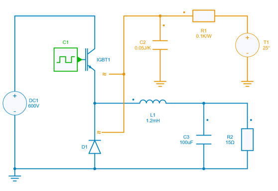
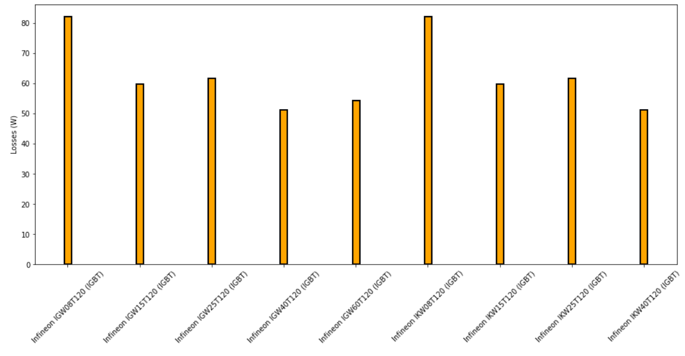
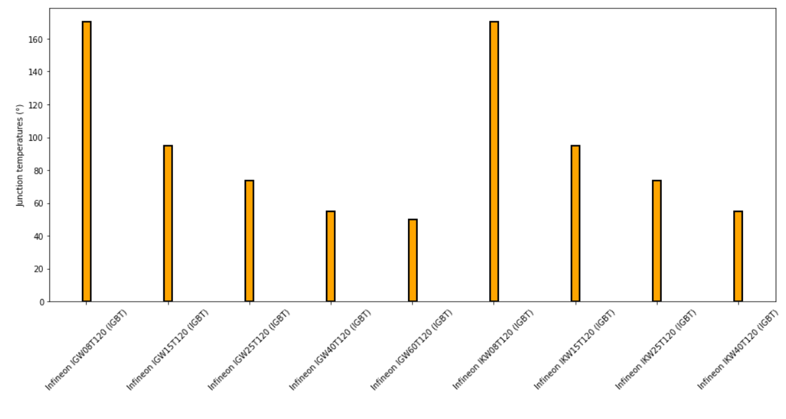

---
tags:
  - Python
  - Parameter Sweep
  - Thermal
---

# Thermal Data management: explore different powerswitch references

[Download **Python Script**](thermaldata.py)

[Download **Simba Model**](thermal_buck_4pythonexp.jsimba)

This python script shows an exploration of different powerswitch references through their thermal data description.

## Power semiconductor switch losses

Electrothermal modeling and analysis are key aspects of power converters especially for power semiconductor switches. Thus, SIMBA thermal analysis focuses on thermal loss of power semiconductors.

A power semiconductor switch dissipates losses which can be split into two categories:

* conduction losses: when the power semiconductor conducts a current.
* switching losses: when the power semiconductor turns on or turns off.

## Import thermal library File

SIMBA supports the thermal library file format (.xml) that is currently supported by many semiconductor manufacturers. All the necessary datas to compute losses are stored inside those .xml files.

In that sense, any users could import this standard and assign it to power semiconductor switches in order to estimate their losses and junction temperature during simulation.

The goal of this "Thermal" python part is to sweep various .xml files linked to “IGBT” property in order to create a benchmark of different powerswitch references.

Let's show the SIMBA circuit used for this simulation:

After running the python script which sweeps several IGBTS parts, simulation results are shown for both average total losses and juntion temperature:

We observe the *Loss* picture on the top and the *junction temperature* picture at the bottom for different IGBTs chosen.

We can clearly highlight the fact that for different IGBT selected, we observe huge differences for average losses and  junction temperature values.

In that sense, any user could choose the appropriate power semiconductor switch.