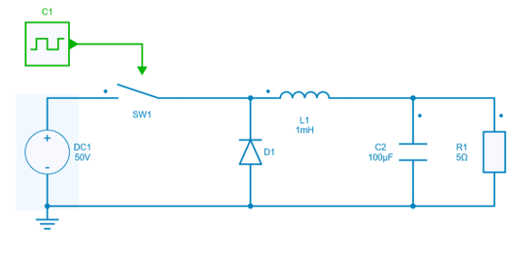
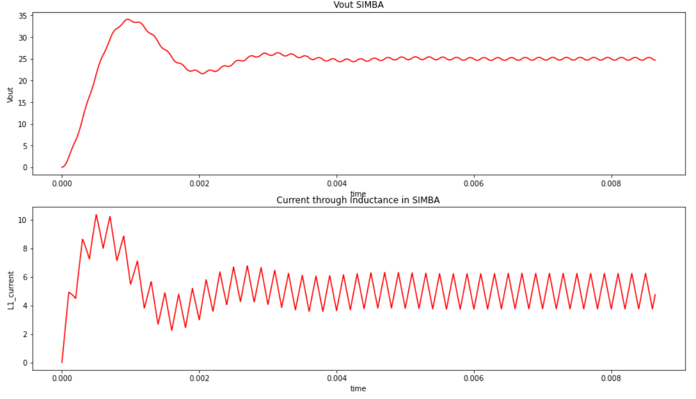
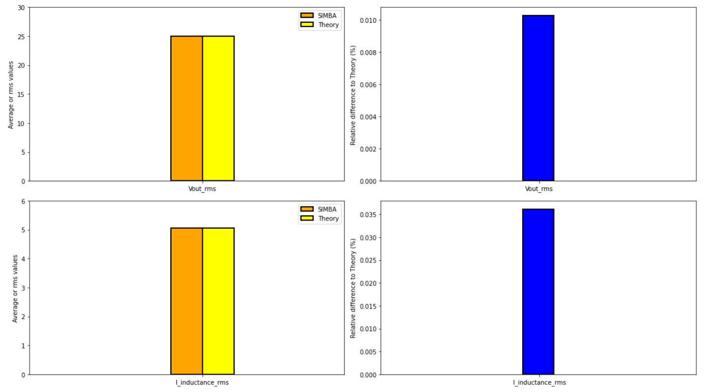
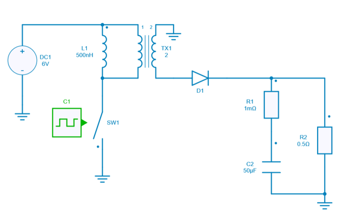
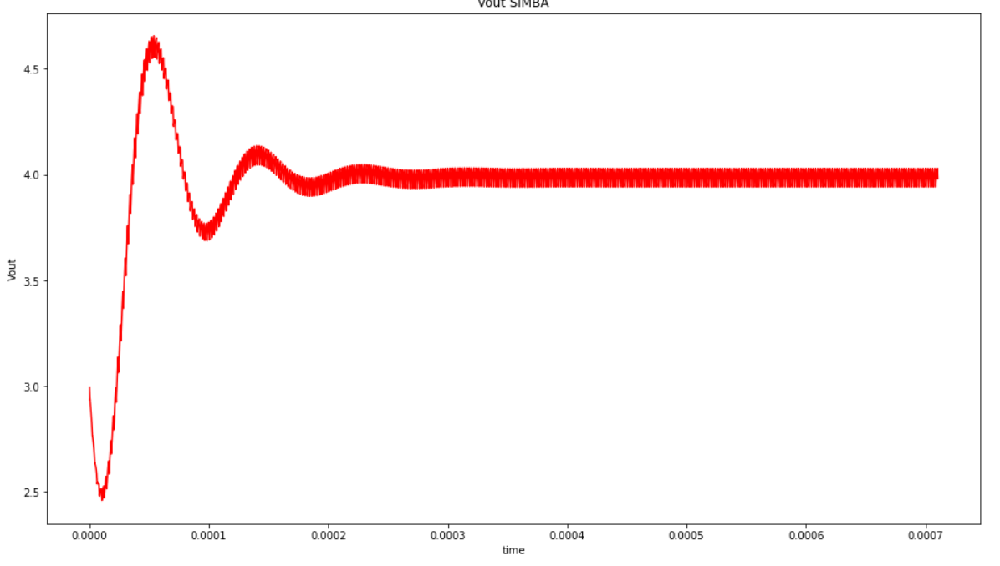
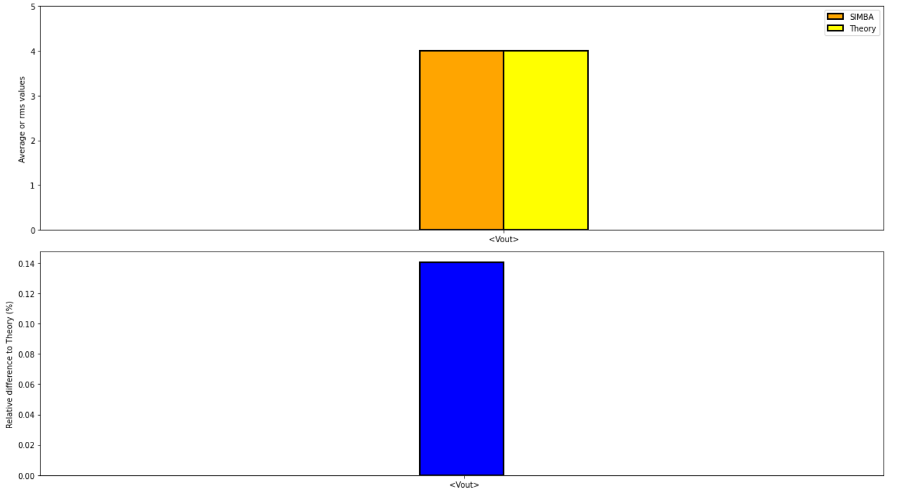
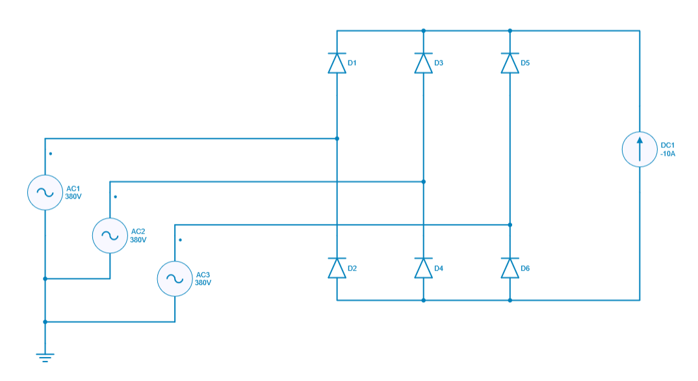
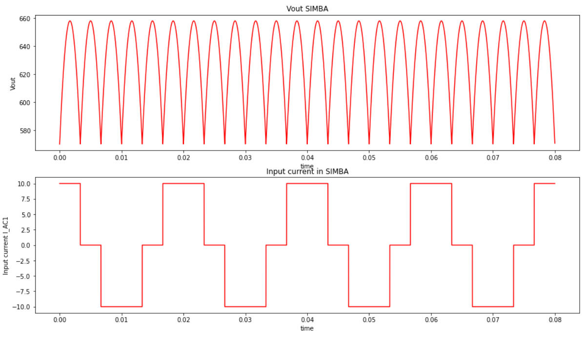
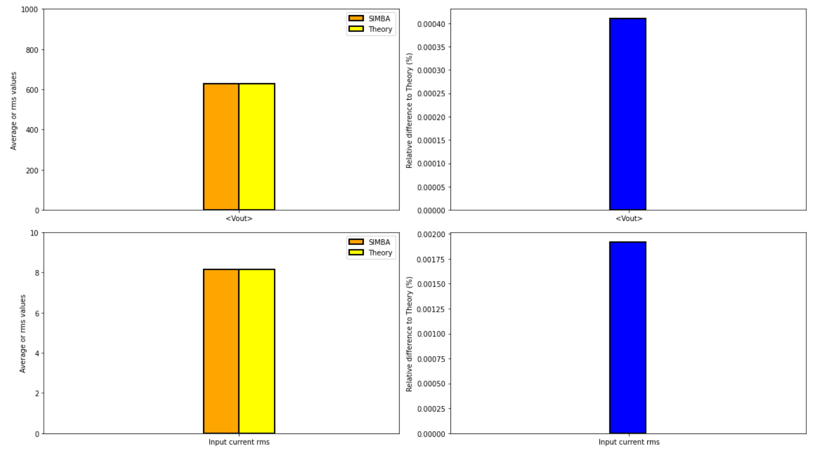

---
tags:
  - Python
  - Benchmark
---

# SIMBA Benchmark with Analytical Calculations

A benchmark has been realized in order to compare SIMBA simulation results vs analytical calculations from theory for three basic topologies:

* DC-DC Buck converter
* Flyback
* 3-phase Diode Bridge 

## DC-DC Buck converter

[Download **Python notebook**](buckchopper/Buck_simba_th.ipynb) and its [figure](buckchopper/fig/buck.png)

[Download **Simba Model**](buckchopper/buck.jsimba)

Let's compare the output voltage accross R1 and RMS current through the inductance L1.

### SIMBA circuit

### Theoritical calculation

#### Output voltage

$<V_{out}> =  D \times V_{in}$

with:

* $V_{in}$ = 50 V
* duty cycle D= 0.5 

#### Inductance RMS current

$(I_L)_{rms} = \sqrt{\frac{<I_L>^2 + (\Delta_{i_L})^2}{12}}$

with: 

* R = 5 $\Omega$
* L = 0.001 H
* $f_{sw}$ = 5000 Hz

$<I_L> = \frac{D \times Vin}{R}$

$\Delta_{i_L} = \frac{D \times (1-D) \times Vin}{L*f_{sw}}$

### SIMBA simulation

The SIMBA output voltage accross R1 and the RMS current through the inductance L1 have been simulated and below the results:

Therefore the comparison between SIMBA and Theory has been done by using histogram to have a clear view of the SIMBA's accuracy:

The relative difference is negligeable which shows the reliability and robustness of SIMBA's solver.

## Flyback

[Download **Python notebook**](flyback/flyback_simba_th.ipynb) and its [figure](flyback/fig/flyback.png)

[Download **Simba Model**](flyback/flyback_converter.jsimba)

For this topology, only the average output voltage accross R2 is compared.

### SIMBA circuit

### Theory calculation

#### Output voltage

$<V_{out}> =  V_{in} \times m \times \frac{D}{1-D}$

with:

* $V_{in} = 6 V
* duty cycle D = 0.25
* $N_2$ = 2
* $N_1$ = 1
* $m = \frac{N_2}{N_1}$

### SIMBA simulation

The SIMBA output voltage accross R2 has been simulated and below the results:

Therefore the comparison between SIMBA and Theory for the average output voltage has been realized and we used the "histogram" way to plot those results.

## 3 phase Bridge Diode

[Download **Python notebook**](diodebridge/Bridge_simba_th.ipynb) and its [figure](diodebridge/fig/diode_bridge.png)

[Download **Simba Model**](diodebridge/3ph_bridge_diode.jsimba)

For this topology we will compare the output average voltage accross DC1 and the input rms current through AC1.

### SIMBA circuit

### Theory calculation

#### Average Output voltage

$<V_{out}> =  \frac{V_{in} \times 3 \times \sqrt{6}}{\pi*\sqrt{2}}$

with :

* $V_{in} = 380 V
* Input RMS current: $(I_{input})_{rms} = I_{dc} \times \sqrt{\frac{2}{3}} $
* DC current $I_{dc}$ = 10 A

### SIMBA simulation

The SIMBA Output Voltage accross DC1 and the input rms current through AC1 have been simulated and below the results:

Therefore the comparison between SIMBA and Theory for the average output voltage and the input rms current have been realized.
We also plot the results with "histogram" chart. 

