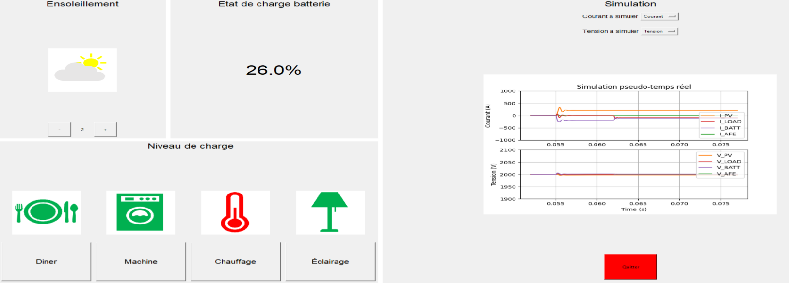
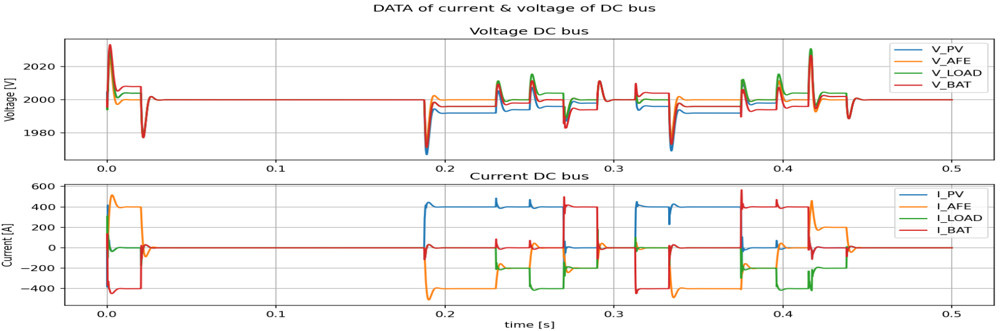

---
tags:
  - Python GUI
  - Interactive simulation
---

# Pseudo real-time simulation of DC grids

[Download **python script**](DistributionPV.py)

[Download **Simba model**](DistributionPV.jsimba)

This example is extracted from a work realized by [Maxime Félix](https://www.linkedin.com/in/maxime-f%C3%A9lix-5451701a3/) for his bachelor degree at [HEIG-VD](https://heig-vd.ch/) supervised by [Mauro Carpita](https://www.linkedin.com/in/mauro-carpita-956607202/) and [Daniel Siemaszko](https://www.linkedin.com/in/danielsiemaszko/).

It proposes a graphical interface (as shown in the screenshot below) for a *pseudo real-time simulation* of a DC grid composed of:

* a solar panel,
* a load consumption (which can represent a typical house consumption),
* a battery,
* a connection to the AC grid.

*Pseudo real time simulation* is performed with successive simulations whose results are added one after the other. Each simulation is fast enough to offer pseudo-real-time rendering.

The graphical user interface has been realised with the [tkinter](https://docs.python.org/fr/3/library/tkinter.html) python package. It allows to user to:

* change the solar panel insolation,
* change the level of load consumption (by adding or removing different loads),
* get an estimation of the battery state of charge,
* get the currents and voltages of the total load(I_LOAD), the solar panel (I_PV), the battery (I_BATT) and of the grid trhorugh the active front end converter (I_AFE), as shown in the figure below.

