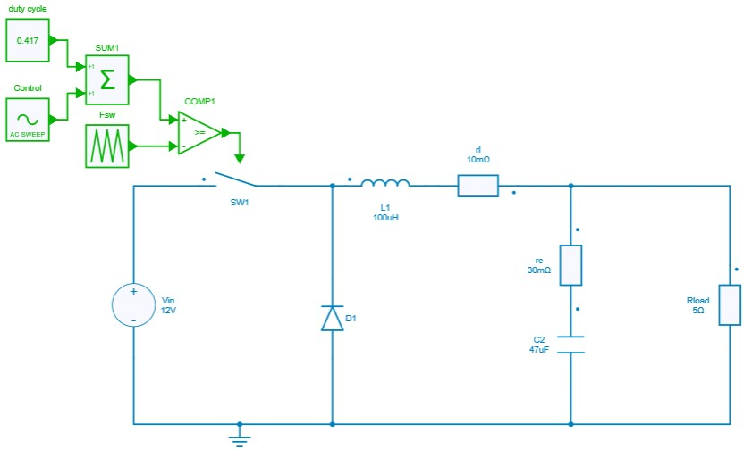
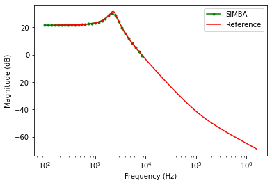
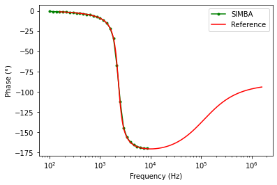
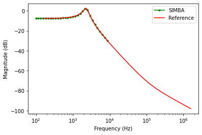
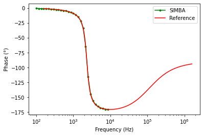
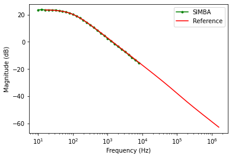
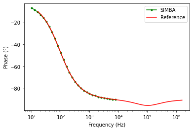
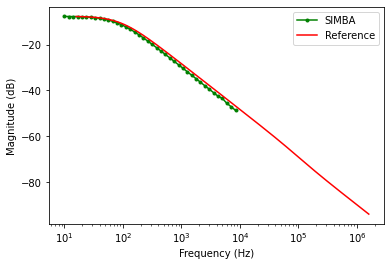
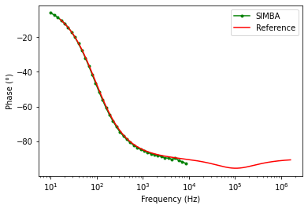

# AC sweep examples

[Download **python notebook**](ACSweepExamples.ipynb)

[Download **Simba model**](ACSweepTest.simba)

The examples show the validation of AC sweep analysis with analytical equations derived from the book [Transfer Functions of Switching Converters](https://stairwaypress.com/product/transfer-functions-of-switching-converters/) by Christophe P. Basso.

These examples deal with a buck converter, a boost converter and a flyback converter.

Below are presented the details and results of the buck converter in current continuous mode (CCM) and in discontinuous mode (DCM)  with open loop transfer functions of:

* control to output voltage,
* input voltage to output voltage.


## Buck converter model
 Below provided figure shows the method adopted to perform AC sweep for Buck Converter in CCM mode of operation.

 

## CCM Transfer functions

### Control to output voltage

The theoretical analytical equation in continuous current mode (CCM) is:

$$\frac{v_{out}}{v_{control}}=\frac{V_{input}}{D}\frac{1}{1+(\frac{L}{R})s+(LC)s^2}$$

Where the *s* domain can be converted to digital domain by replacing $s = j\omega$.

To get this transfer function with SIMBA, the design of the buck converter is loaded and associated with a sweep test bench.

```
design = project.GetDesignByName('Buck Converter - CCM - Open Loop');
acsweep =  project.GetACSweepByName('AC Sweep - Buck CCM - Open Loop');
acsweep.Design = design;
```

Frequency range is then defined as well as the magnitude of the perturbation along the frequency range.

```py
acsweep.Fmin = Fsw/1000;
acsweep.Fmax = Fsw/10;
acsweep.MagMin  = 0.03;
acsweep.MagMax  = 0.05;
acsweep.NumberOfPoints  = 31;
job = acsweep.NewJob();
```

The figure presented below shows the results for the comparison between the theoritical reference and SIMBA in terms of the magnitude and phase plot for control to output voltage.




### Input voltage to output voltage

The theoretical analytical equation in continuous current mode (CCM) is:

$$\frac{v_{out}}{v_{input}}=D\frac{1}{1+(\frac{L}{R})s+LCs^2}$$

To get this transfer function with SIMBA, the design of the buck converter is loaded and associated with a sweep test bench.

```py
design = project.GetDesignByName('Buck Converter - CCM - Open Loop');
acsweep =  project.GetACSweepByName('AC Sweep - Buck CCM - Input To Output');
acsweep.Design = design;

```

As for the previous analysis, frequency range is then defined as well as the magnitude of the perturbation along the frequency range.

```
acsweep.Fmin = Fsw/1000;
acsweep.Fmax = Fsw/10;
acsweep.BaseSwitchingFrequency = Fsw;
acsweep.BaseSwitchingFrequencyEnabled = False;
acsweep.MagMin  = 0.5;
acsweep.MagMax  = 0.5;
acsweep.NumberOfPoints  = 31;
job = acsweep.NewJob();

```

The figure presented below shows the results for the comparsion between the theoritical reference and SIMBA in terms of the magnitude and phase plot for **input to output voltage**.





## DCM Transfer functions

### Control to output voltage

The theoretical analytical equation in discontinuous current mode (DCM) is:

$$\frac{v_{out}}{v_{control}} = \frac{sRV_{in}(V_{in}-V_c)D^{2}T_s}{s^2+s(4V_{c}L+RV_{in}D^{2}T_s)}$$

This expression can further be simplified as:

$$\frac{v_{out}}{v_{control}} = \frac{sRV_{in}(V_{in}-V_c)D^{2}T_s}{\Delta}$$

where $\Delta = s^2+s(4V_{c}L+RV_{in}D^{2}T_s)$

To get this transfer function with SIMBA, the design of the buck converter is loaded and associated with a sweep test bench.

```py
design = project.GetDesignByName('Buck Converter - DCM - Open Loop')
acsweep =  project.GetACSweepByName('AC Sweep - Buck DCM - Open Loop');
acsweep.Design = design;
```
Frequency range is then defined as well as the magnitude of the perturbation along the frequency range.

```py
acsweep.Design = design;
acsweep.Fmin = Fsw/10000;
acsweep.Fmax = Fsw/10;
acsweep.MagMin  = 0.05;
acsweep.MagMax  = 0.1;
acsweep.NumberOfPoints  = 31;
job = acsweep.NewJob();
```
The figure presented below shows the results for the comparsion between the theoritical reference and SIMBA in terms of the magnitude and phase plot for **control to output voltage**.





### Input voltage to output voltage

The final expression for input to output is expressed as:

$$\frac{v_{out}}{v_{input}}=\frac{sR(V_{in}-V_c)D^{2}T_s}{s^2+s(4V_{c}L+RV_{in}D^{2}T_s)}$$

To get this transfer function with SIMBA, the design of the buck converter is loaded and associated with a sweep test bench.

```py
design = project.GetDesignByName('Buck Converter - DCM - Open Loop')
acsweep =  project.GetACSweepByName('AC Sweep - Buck DCM - Input To Output');
acsweep.Design = design;
```
Frequency range is then defined as well as the magnitude of the perturbation along the frequency range.

```py
acsweep.Fmin = Fsw/10000;
acsweep.Fmax = Fsw/10;
acsweep.MagMin  = 5;
acsweep.MagMax  = 10;
acsweep.NumberOfPoints  = 41;
job = acsweep.NewJob();
status = job.Run();
```

The figure presented below shows the results for the comparsion between the theoritical reference and SIMBA in terms of the magnitude and phase plot for **input to output voltage**.


