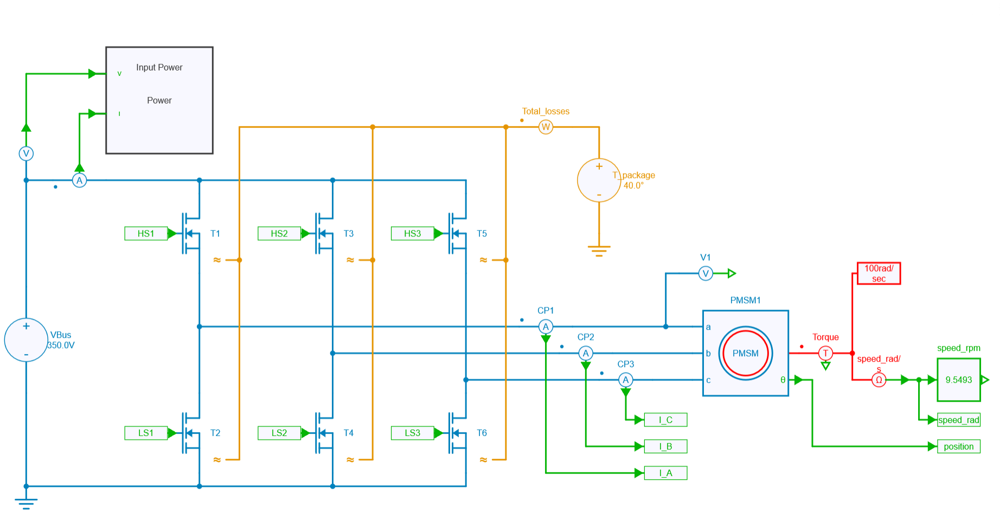
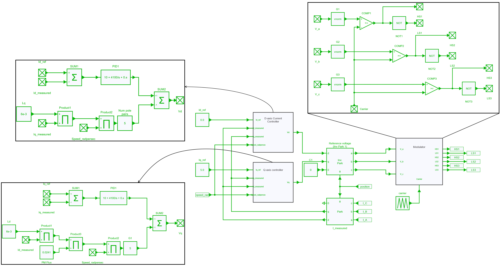
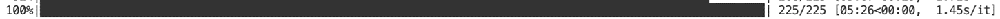

---
tags:
  - Python
  - Motor Drives
  - Parameter Sweep
  - Thermal
---

# Efficiency map of a motor drive inverter

[Download **python script**](inverter_map.py)

[Download **Simba model**](inverter_map.jsimba)

[Download **Python Library requirements**](requirements.txt)


## Motor drive inverter model

### Inverter & motor model in SIMBA
The motor drive inverter model consists of a 3-phase 2-level voltage source inverter (VSI) that supplies a permanent magnet synchronous motor (PMSM). The PMSM is connected to a load that imposes a constant speed, meaning that the motor must be able to produce enough torque to maintain the desired speed.



### Control
PMSMs have a strong coupling between the d- and q-axis currents, so a decoupling network is required to linearise and remove the coupling effect. The control system consists of two PI controllers and a decoupling network. The calculated reference voltages are fed into the sinusoidal PWM modulator to generate voltage signals for  the motor windings. The duty cycle of the PWM signal determines the magnitude of the voltage applied to the motor.



### Thermal modeling
To model the thermal performance of MOSFETs in an inverter, their package temperature is held constant and data is extracted from the .xml files provided by the manufacturer. This data, which includes parameters such as thermal impedance, conduction losses and switching losses, plays a crucial role in determining the power dissipation during operation. In this particular case, Wolfspeed C2M0025120D transistors were used.


## Python script
This script uses the architecture presented in the tutorial *Parallel (multiprocessing) computing* and also available on [Github repository](https://github.com/aesim-tech/simba-python-examples/tree/main/05.%20Parallel%20Parameter%20Sweep)).

Its primary objective is to run simulations at various operating points, such as different torque and speed levels, to obtain power switch losses in steady-state and generate an efficiency map of the inverter. To achieve this, the script uses the multiprocessing library in Python, which allows multiple simulations to be run in parallel, increasing simulation speed and efficiency.

```py
import multiprocessing
from tqdm import tqdm
number_of_parallel_simulations = License.NumberOfAvailableParallelSimulationLicense()
```

### Id, Iq current references calculation
Current references are calculated using MTPA (Maximum Torque Per Ampere) and FW (Flux Weakening) algorithm according to the targeted operation point. The function `SelectIdIq()` takes in current and speed references, and returns a boolean value indicating whether the Id and Iq references were successfully calculated or not.

### Operating points
The efficiency of the motor is calculated with the use of function `run_simulation()` for each current and speed reference defined as: 
```py 
speed_refs = numpy.arange(min_speed_ref, max_speed_ref, (max_speed_ref - min_speed_ref)/number_of_speed_points)
current_refs = numpy.arange(min_current_ref, max_current_ref, (max_current_ref - min_current_ref)/number_of_current_points)
``` 
where the maximum speed and current references are defined by user with  `max_speed_ref` and `max_current_ref` variables.

### Multiprocessing
```py
manager = multiprocessing.Manager()
result_dict = manager.dict()
```
The code creates a multiprocessing manager and a dictionary called `result_dict` that will be used to store the results of the simulation. 

```py
for current_ref in current_refs:
        for speed_ref in speed_refs:
            
            ref_idiq = [0.0, 0.0]
            ret = SelectIdIq(ref_idiq, current_ref, speed_ref)
            
            if ret == True:
                pool_args.append((ref_idiq[0], ref_idiq[1], speed_ref, case_temperature, Rg,  i, result_dict, lock));
                i=i+1
```
The code loops through each combination of current and speed references and executes a `SelectIdIq()` function to get the desired current reference values. The computed values are added to the `pool_args` if the function returns True.

```py
pool = multiprocessing.Pool(number_of_parallel_simulations)
for _ in tqdm(pool.imap(run_simulation_star, pool_args), total=len(pool_args)):
    pass
```

!!! note
    The variable named "number_of_parallel_simulations" allows to set automatically the number of available parallel simulation based on the license of each user. This variable is defined earlier into       the python script directly.
    
The code creates a processing pool using `multiprocessing.Pool(number_of_parallel_simulations)` and starts the simulation using `pool.imap(run_simulation_star, pool_args)`. The `tqdm()` function is used to display a progress bar for the simulation.

```py
for i in result_dict.items():
    t.append(i[1][1])
    s.append(i[1][2])
    e.append(i[1][3])

t = numpy.array(t)
s = numpy.array(s)
e = numpy.array(e)

show_heatmap(s, t, e)
```
After the simulation is complete, the code extracts the results from `result_dict`, stores them in arrays t, s, e and uses them to create a heatmap plot using the `show_heatmap()` function.

## Results
The efficiency map was generated for a total of 225 speed/torque targets using the following simulation parameters: 
```python
case_temperature = 80           # Case temperature [Celsius]
Rg = 10                         # Gate resistance [Ohm]
switching_frequency = 50000     # Switching Frequency [Hz]
bus_voltage = 450               # Bus Voltage [V]
max_speed_ref = 4000            # [RPM]
max_current_ref = 10            # [A]

number_of_speed_points = 15     # Total number of simulations is number_of_speed_points * number_of_current_points
number_of_current_points = 15   # Total number of simulations is number_of_speed_points * number_of_current_points
relative_minimum_speed = 0.2    # fraction of max_speed_ref
relative_minimum_current = 0.2  # fraction of max_torque_ref
simulation_time = 1             # time simulated in each run

NPP = 5.0                       # PMSM Number of pole pair [-]
PM_Wb = 0.0802                  # PMSM Ke/NPP [Wb]
Ld_H = 14.0e-3                  # Motor Ld [H]
Lq_H = 14.0e-3                  # Motor Ld [H]
Rs = 0.814                      # Motor Stator Resistance [Ohm]
```
Each run took approximately 10 seconds, and thanks to the use of the Python multiprocessing library, all cases were run in parallel, resulting in a total run time of only 5 minutes on a 10-core CPU. 



The resulting efficiency map of the PMSM inverter, is shown below:


