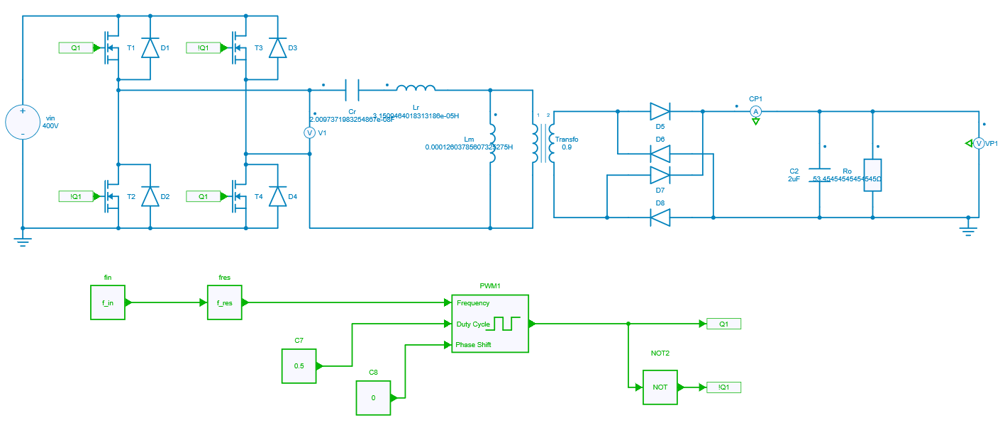
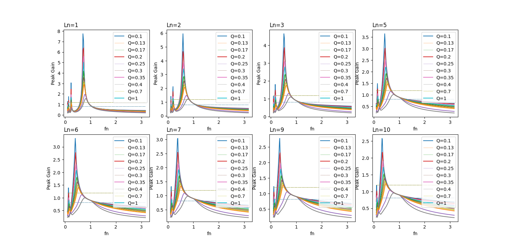
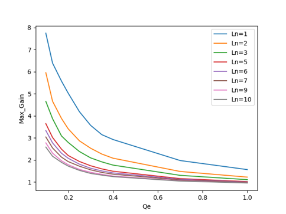

---
tags:
  - Python Scripts
  - Power Supplies
  - Parameter Sweep
  - Converter Design
---

# DC-DC Full Bridge LLC Resonant Converter

[Download **python script**](LLC_Resonant_Converter.py)

[Download **Simba model**](LLC_Resonant_Converter.jsimba)

[Download **Python Library requirements**](requirements.txt)

This example shows a design of DC-DC Full Bridge LLC Resonant Converter for 3.3 kW on-board charger applications with specs as below:

* Input:
    - $(V_{in})_{rated}$ = 400 V
    - $(V_{in})_{min}$ = 390 V
    - $(V_{in})_{max}$ = 410 V
* Output:
    - $(V_o)_{rated}$ = 420 V
    - $(V_o)_{min}$ = 300 V
    - $(V_o)_{max}$ = 420 V
    - $(P_o)_{rated}$ = 3.3 kW
* Resonant frequency: $f_{res}$ = 200kHz

The Resonant converter is a power electronics DC-DC converter which uses a resonant circuit at the intermediate stage for conversion as shown below. It is a three stage converter where the input stage consists of a combination of switches to provide **switched DC supply** to the next stage. The next stage consists of a resonant tank cicuit and a transformer which converts switched DC waveform to the AC waveform. The last stage consists of a rectifier and a filter circuit which converts the AC waveform at the output of the transformer to the fixed DC at the load. This type of converter reduces the switching losses & switching noise with the help of soft switching.


There are two ways to proceed for designing the converter:

1. Frequency Domain with the First Harmonic Approximation (FHA)
2. Time-domain Approach

Frequency domain analysis with FHA is a conventional approach, where the transfer function is being derived from the equivalent model of the converter by approximating the input to be sinusoidal at resonant frequency. In the next step, the resonant gain curves are being plotted for different cases as there are four to five degrees of freedom. Then the **initial** tank values can be calculated from the Peak Gain vs Load plot which is derived form the resonant gain curves plotted in the previous step. The obtained tank values are "initial" as it is derived from the approximated transfer function. Indeed, the gain curve provides a good approximation of the real gain near the resonant frequency and it deviates as we move away from it. Hence, to reach the **final** tank values, a lot of iterations on model / prototype has to be done. So, the overall design process may take some time.

On the other hand, the time-domain approach is a modern one where the resonant gain curves are plotted directly from the switched model instead of the equivalent model. The challenge to get a good resolution of gain curve plots is to perform 8000 to 10000 iterations. It can be tricky and time consuming if the simulation software doesn't offer speed and accuracy. But this can be easily achieved with the Python API feature of SIMBA. The script has to be written in python that supports multiprocessing and the job can be done in just within ten minutes which is explained in the following section.

## Creation of Model in GUI

The first step to go ahead is to create a open loop model of the converter as shown below. Further, non-linearities like ESR, ESL values and switch on-state voltage drops can be added to get more accuracy.



Here, $f_{in}$ is the normalized frequency. Lr and Cr are the inductor and capacitor values of the resonant tank respectively. Lm is the value of magnetizing inductance of the transformer.

## Writing a Python Script

The requirements to write the python code are explained in a tutorial:

- tqdm
- multiprocessing
- aesim.simba
- numpy
- matplotlib

The simulation parameters used in the script are defined as specifications mentioned above for the converter.
The operating conditions can be described using python code as shown below for some of them:

``` py
N = (VO_MAX + VO_MIN) / (2 * VIN_RATED)
G_DC_MIN = VO_MIN / (N * VIN_MAX)
G_DC_MAX = VO_MAX / (N * VIN_MIN)
```
Similarly, the sweep parameters to run 8000 iterations are:

``` py
LN_RANGE = [1, 2, 3, 5, 6, 7, 9, 10]
Q_RANGE = [0.1, 0.13, 0.17, 0.2, 0.25, 0.3, 0.35, 0.4, 0.7, 1]
FIN_RANGE= np.logspace(-1, 0.5, num=100)
```
It is to be noted that these parameters can be modified by the user as per the specifications and requirements. Iterations can further be increased to enhance the resolution of the curve.

### Function called by the main script

The main script uses a function to run each simulation. This function first gets the circuit elements for which the values are pushed in each iteration, as shown below for the elements of the resonant tank:

``` py
simba_Lr = LLC_open_loop.Circuit.GetDeviceByName('Lr')
simba_Cr = LLC_open_loop.Circuit.GetDeviceByName('Cr')
simba_Lm = LLC_open_loop.Circuit.GetDeviceByName('Lm')
```

Hence, the values for these elements are pushed:

``` py
simba_Lr.Value = Lr
simba_Cr.Value = Cr 
simba_Lm.Value = Lm
```

The simulation uses the **StopAtSteadyState** feature to ensure that steady state waveforms are obtained and thus saves time by avoiding prolonging the simulation time more than necessary.

``` py
LLC_open_loop.TransientAnalysis.TimeStep = 1e-8
LLC_open_loop.TransientAnalysis.StopAtSteadyState = True
```

Then, the simulation is run:

``` py
job = LLC_open_loop.TransientAnalysis.NewJob()
status = job.Run()
if str(status) != "OK": 
    print ("\nSimulation {0} Failed > (Lr={1:.2f} Cr={2:.2f} Lm={3:.2f})".format(sim_number, Lr, Cr, Lm))
    print (job.Summary()[:-1])
    result_dict[sim_number] = [fin, math.nan]
    return; # ERROR 

if log: print (job.Summary()[:-1])
```

Below is the code to extract the steady state results for three switching periods:

```py
horizon_time = 3 / fsw
time, vout_res = steadystate_signal(
    horizon_time,
    np.array(job.TimePoints),
    np.array(job.GetSignalByName('Ro - Instantaneous Voltage').DataPoints)
    )
```
At last, the average of the steady state output voltage is calculated using the trapezoidal rule.

``` py
t1 = time[0]
t2 = time[-1]
vout_sum = 0
range_idx = range(0, len(time)-1, 1)
for idx in range_idx:
    vout_sum += (time[idx+1] - time[idx]) * (vout_res[idx+1] + vout_res[idx]) / 2
vout_average = 1 / (t2 - t1) * vout_sum * 1 / VIN_RATED
if log: print ("\n{0}> vout_average={1:.3f}".format(sim_number, vout_average))
result_dict[sim_number] = [fin, vout_average]
```

### Main script

This part deals with the multiprocessing computation which is used here to speed up the simulation. To prepare the simulations, the arguments and the future results (a python dictionnary) are stored in a python list which will be managed by the *pool* of the multiprocessing module to distribute the calculations.


``` py
if __name__ == "__main__": # Called only in main thread.

    manager = multiprocessing.Manager()
    result_dict = manager.dict()
    i=0
    jobs=[]
    lock = manager.Lock()
    pool_args = []
    figure, axs = plt.subplots(nrows=2, ncols=4, figsize=(15, 12))

    # Prepare arguments
    for L, ax in zip(LN_RANGE, axs.ravel()):
        for Q in Q_RANGE:
            Lr = (Q*RO_RATED_PRI)/(2*np.pi*F_RES)
            Cr = 1/(2*np.pi*F_RES*Q*RO_RATED_PRI)
            Lm = L*Lr
            for fin in FIN_RANGE:
                pool_args.append((Lr, Cr, Lm, fin,  i, result_dict, lock));
                i=i+1
```

Finally, a process *pool* object - from the multiprocessing module - which controls a pool of worker processes is used. The *'tqdm'* module is used to display a progress bar.

``` py
pool = multiprocessing.Pool()
for _ in tqdm.tqdm(pool.imap(run_simulation_star, pool_args), total=len(pool_args)):
    pass
```

## Final Design From the Plot

The curves that are plotted using Matplotlib for 8000 iterations, are shown below. It is to to be noted that in each plot minimum gain and maximum gain as per the calculation are also marked which is based on the requirement of the converter. It will be helpful for the selection of frequency ranges for converter operation to counter the line and load regulation.



In the next step, from the above curves, there is a need to plot Peak_gain vs Qe (load) curve to reach the final design values. It can be plotted by considering the peak value from the above curves and plotting it w.r.t load for Ln ranges which is shown below.



Now, suppose the nominal load Qe = 0.35 is chosen and the peak gain requirement for the converter specification is 1.25.

1. Hence, to calculate the final design values, slightly above than the calculated peak gain value can be considered and the point (0.35, 1.3) can be located in the above curve. The corresponding Ln value can be chosen and if the curve is not present at the located point, interpolation can also be done. It can also be redrawn to avoid the interpolation by tuning the parameter range in the script.
2. In this case, value for the located point can be considered as Ln=7.
3. Then, for this Ln value, the plotted curves can again be analysed and frequency ranges can be extracted.

    * To get the minimum frequency of operation, the intersection point between maximum gain and the curve for Qe = 0.35 can be considered and the corresponding fn_min can finally be selected.
    * Similarly, for maximum frequency of operation, the intersection point between minimum gain and the curve for Qe = 0.1 can be considered and the corresponding fn_max can be finalised.

4. Hence, all the resonant tank values can be calculated and the frequecny of operation for the converter can be finalised.