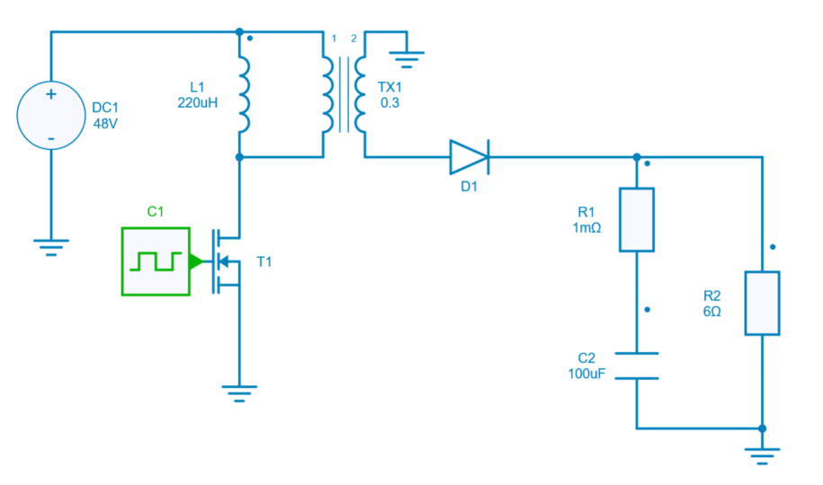
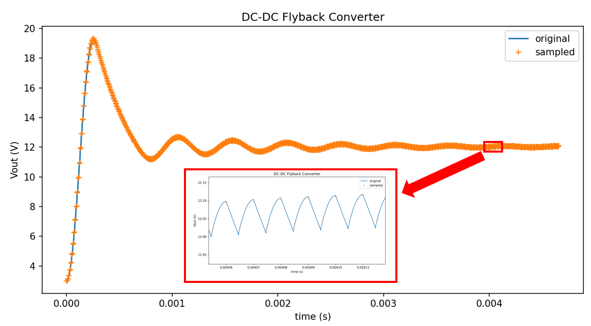

---
tags:
  - Python Scripts
  - Python Basics
---

# Read and use sampled signals (Multi Time-Steps Solver)

[Download **python script**](15.%20Sampled%20Signals.py)

This example shows how to read and use sampled signals which have been created with the [multi time-step solver](../simulation_engine/#multi-time-step-solver).

The circuit model used in this example is a flyback converter which is directly loaded from the collection of design examples.



The main steps of this example are the following:


## Load Module, Project and Design Example

It requires *aesim.simba version 2023.01.19 or higher*. Also, matplotlib.pyplot can be imported to view the curves and results.


## Add an output voltage probe sampled at 1u

An output voltage probe is added, with a sampling time is set at $1\mu s$:

```py
VP1 = flybackConverter.Circuit.AddDevice("Voltage Probe", 50, 50)
VP1.SamplingTime = 1E-6
```

## Run Simulation and plot sampled signals

After running the simulation, this last step shows the difference of size between:

* the *default* output voltage $V_{out}$ measured accross the resistor R2,
* the sampled signal (at $1 \mu s$) *sampled_signal_data*  from the voltage probe.

```
len(t): 4750
len(Vout): 4750
len(sampled_signal_data): 298
```

As $V_{out}$ and *sampled_signal_data* have different sizes, they cannot be plotted with the same time vector and the current vector *job.TimePoints* cannot be used to plot the sampled signal.

A time data array has to be rebuilt from the sampling time and the *sampled_signal_data* size with the commande line: 

```py
sampled_signal_time = [sampled_signal.SamplingTime*i for i in range(len(sampled_signal_data))]
```

Results are shown below: 


