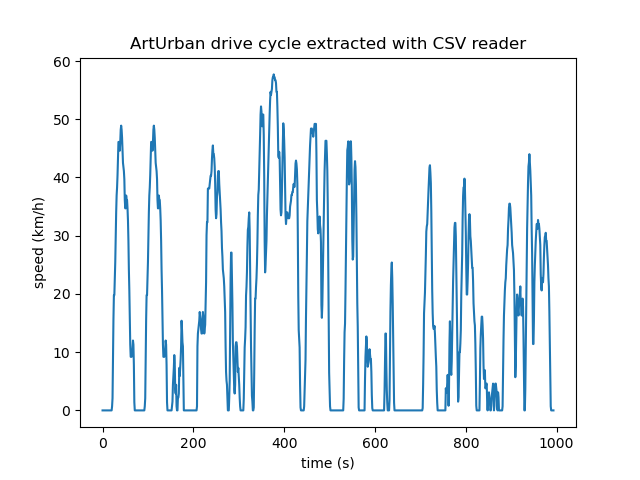
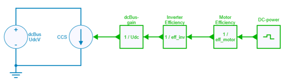
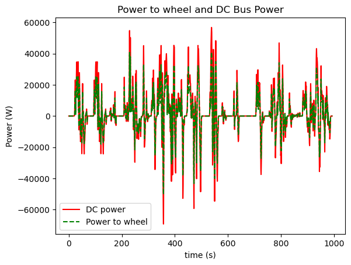

---
tags:
  - Python
  - File Import Export
---

# CSV File importation

[Download **Python notebook**](csv_file_import.ipynb)

[Download **SIMBA CSV file**](ArtUrban.csv)

[Download **SIMBA Model**](csv_file_import.jsimba)

File importation is possible by using Python language.

This python notebook example shows two *different ways* to import a CSV file of a standardised drive cycle (Artemis Urban):

* with CSV module and the reader function,
* with pandas module and the read_csv function.

For each way, data are loaded and displayed in a graph.

This feature can be used for different cases:

* to compare several results obtained from external measurements,
* to load external input data and load them in a Simba circuit
* ...

## CSV file: Artemis Urban drive cycle

This CSV file has been created from another python example [Import MAT File](../31.%20MAT%20File%20Import/readme.md) which loads several standardised drive cycles.

## Use case example

This notebook shows then an example to compute the required DC power with the following steps:

* Compute of the *tractive force* and the *power-to-wheel* of an electric vehicule
* Load this power-to-wheel data into a *piece-wise-linear* control source element in a Simba circuit
* Consider typical efficiencies of a motor and an inverter
* Simulate and plot DC bus power and power to wheel

The tractive force and the required power to wheel are computed with the relations: 

$$m \dfrac{dv}{dt} = F_t - a + b \times v + c \times v^2$$

$$P_{wheel} = F_t \times v$$

with:

* $v$: velocity (m / s)
* $F_t$: tractive force (N)
* $a$: rolling resistance on flat land (N)
* $b$: component of the rolling resistance (N / (m / s))
* $c$: aerodynamic drag (N / (m / s²))

This required power to wheel is then loaded into a [piecewise linear control source element](https://doc.simba.io/model_library/Control_Sources_Piecewise%20Linear){:target="_blank"} to control a current source which models the DC current delivered to the inverter.

Motor and inverter efficiencies are considered with simple gains for the simulation.

Power to wheel and DC bus power are plotted in the same graph.

