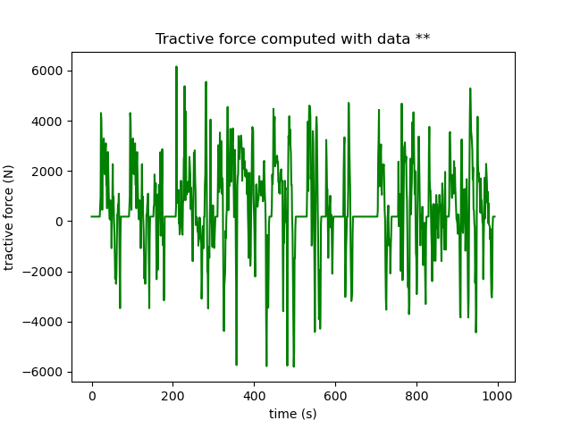

---
tags:
  - Python Scripts
  - File Import Export
---

# CSV File importation

[Download **Python notebook**](import_csv_file.py)

[Download **SIMBA CSV file**](ArtUrban.csv)

File importation is possible by using Python language.

This python script example shows two *different ways* to import a CSV file of a standardised drive cycle (Artemis Urban Road):

* with CSV module and the reader function,
* with pandas module and the read_csv function.

For each way, data are loaded and displayed in a graph.

This feature can be used for different cases:

* to compare several results obtained from external measurements,
* to load external input data,
* ...

## CSV file considered: Artemis Urban Road drive cycle

This CSV file has been created from another python example [Import MAT File](../31.%20MAT%20File%20Import/readme.md) which loads several standardised drive cycles.

## Use case example

This example shows then a computation of the tractive force from the following relation:

$$m \dfrac{dv}{dt} = F_t - a + b * v + c * v^2$$

with:

* $v$: velocity (m / s)
* $F_t$: tractive force (N)
* $a$: rolling resistance on flat land (N)
* $b$: component of the rolling resistance (N / (m / s))
* $c$: aerodynamic drag (N / (m / s²))

