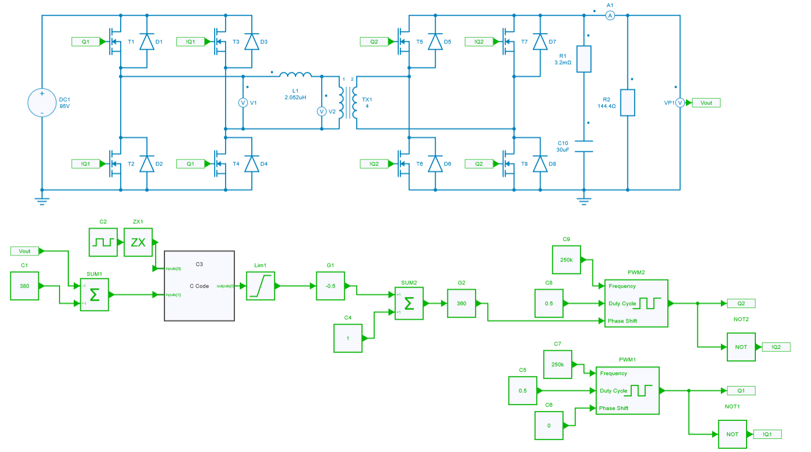
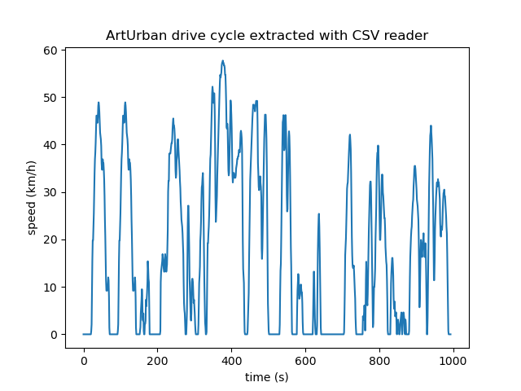

---
tags:
  - Python Notebooks
  - File Importation
---

# CSV File importation

[Download **Python notebook**](DAB_simba.py)

[Download **Simba Model**](DAB_2.jsimba)

[Download **SIMBA CSV file**](Vout_DAB_2.csv)

File importation is possible by using Python language.

In this way this python script example helps to understand how to import any CSV files, load the datas imported and displayed them into a graph.

It can be useful when we want to compare severals results obtained from external measurements or if several datas parameters need to be analyzed carefully.

The power converter topology used for this example is a DAB: Dual Active Bridge

### SIMBA circuit

Below the DAB power converter designed and simulated inside SIMBA Desktop.

### Python Script

Beforehand, the DAB converter has been simulated into SIMBA Desktop and then the output voltage values (**VP1**) has been exported inside a CSV file.

Once the CSV file is ready, it will be injected inside the python script in order to perform a transient analysis and plot the output voltage (VP1).

Moreover we will calculate the average output voltage by using a function called **average_value**.

Below the result of VP1 once the simulation is over through Python script

If you compare this plot with the original circuit in SIMBA desktop you'll observe the same behavior.