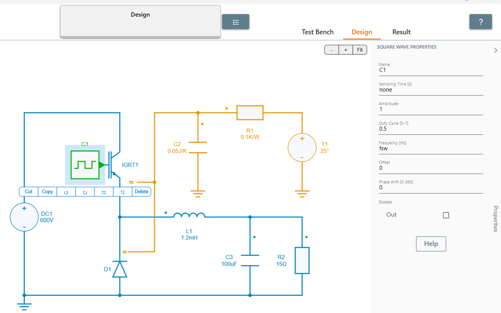
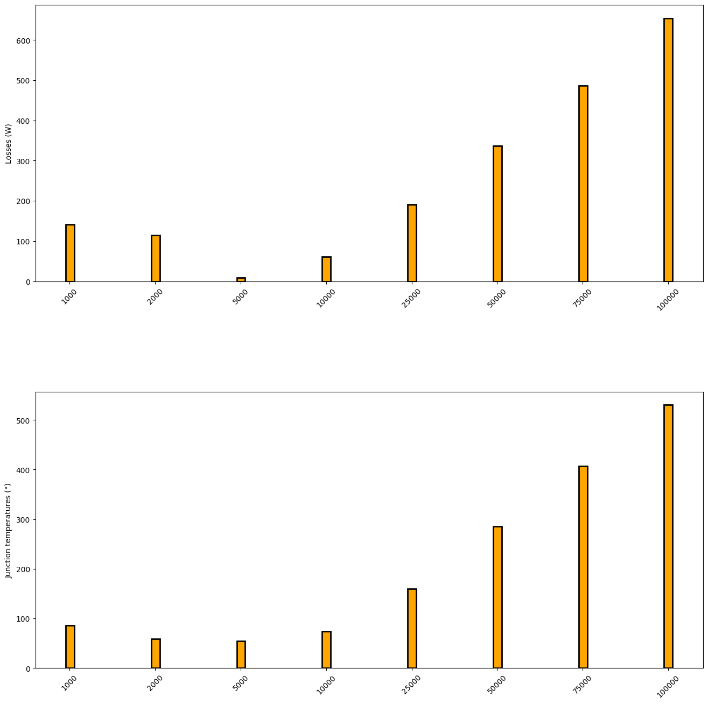

---
tags:
  - Python
  - Parameter Sweep
  - Thermal
---

# Thermal Data Fsw Sweep

[Download **Python Script**](switching_frequency_sweep.py)

[Download **Simba Model**](thermal_buck_4pythonexp.jsimba)

This python example proposes a sweep of the switching frequency to evaluate its effect on junction temperature and switching losses.


## How to Proceed
Create a thermal model in SIMBA GUI and look for a custom variable **Fsw**.



Write a Python script to call the model and add sweep range for **Fsw**.

```py
Fsw  = [1000, 2000, 5000, 10000, 25000, 50000, 75000, 100000]
```

After running the script, its effect on **losses** and **junction temperature** can be seen in the histogram plotted.



The impact of switching frequency on the loss profile and junction temperature of the Buck converter can be seen.

