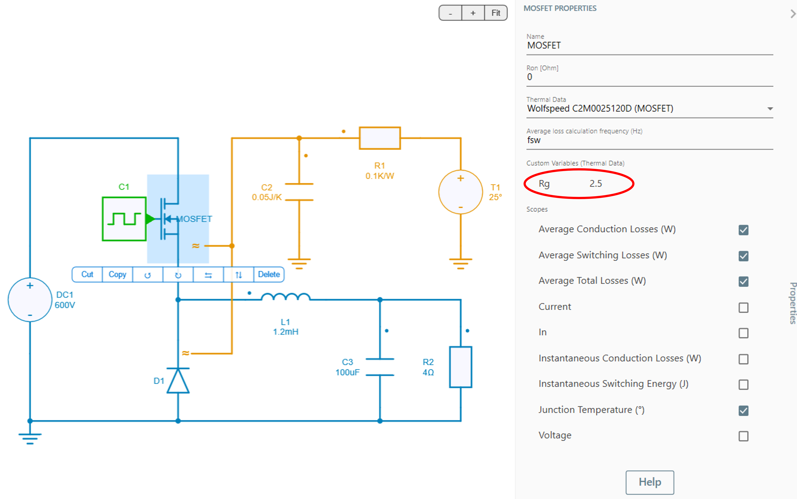
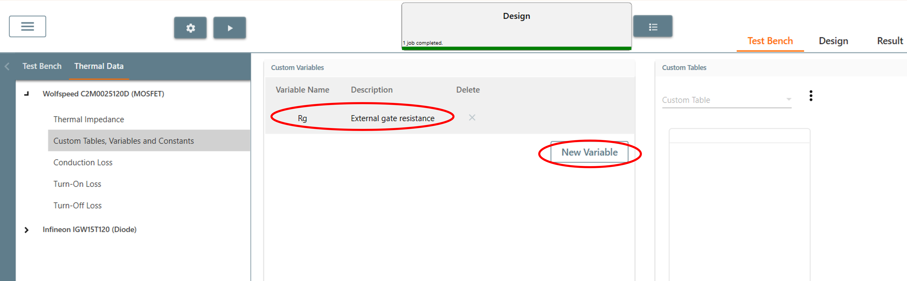
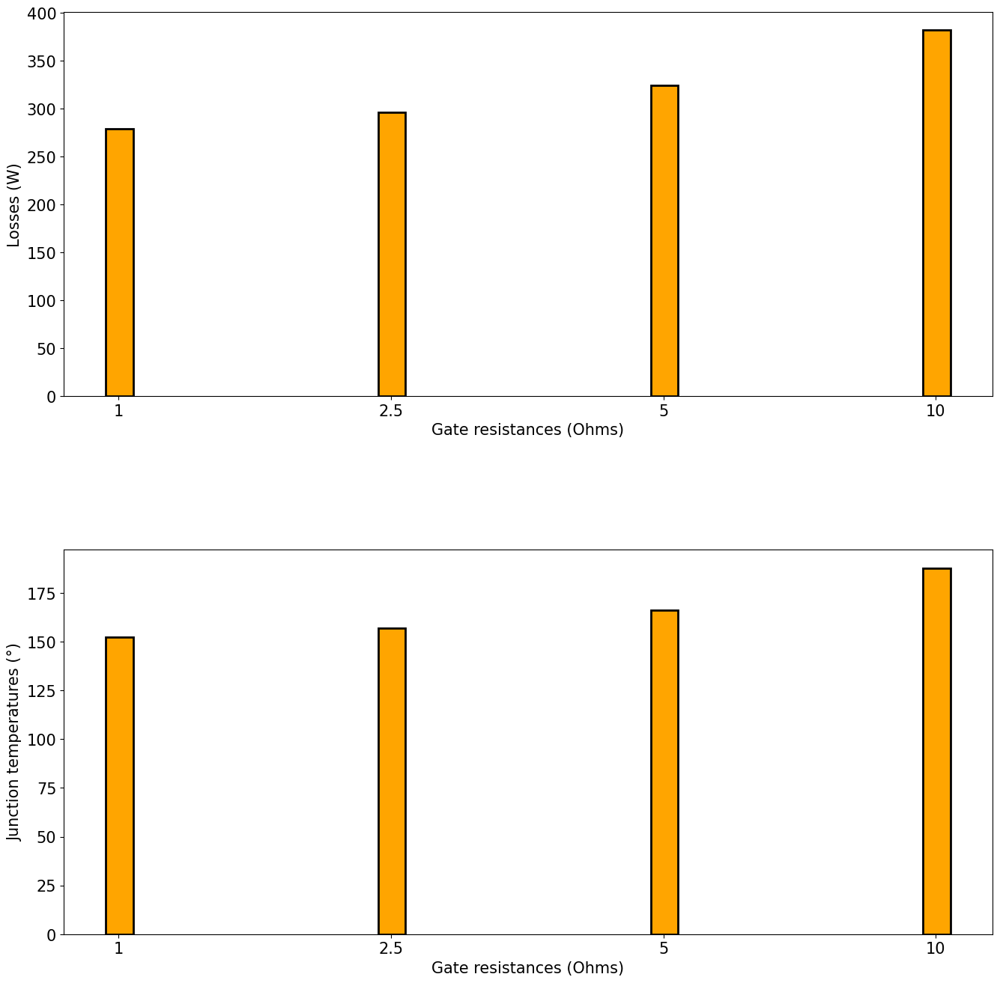

---
tags:
  - Python Scripts
  - Parameter Sweep
  - Thermal
---

# Peform a sweep of the gate resistance of a power semiconductor switch

[Download **Python Script**](Rg_sweep.py)

[Download **Simba Model**](thermal_buck_Rg_4pythonexp.jsimba)

This python example proposes a sweep of the gate resistance $R_g$ to evaluate its effect on junction temperature and switching losses.


## How to Proceed
1. Create a thermal model in SIMBA GUI and look for a custom variable $R_g$.



If it is not added in the xml file of the device, it can be manually added by navigating through:

*testbench --> Thermal Data --> Device --> Add Custom Variable*

as shown in figure below:



2. Write a Python script to load the model and run simulations for the different values of $R_g$.

```py
Rg_list = [1, 2.5, 5, 10]
for Rg in Rg_list: 
    mosfet.CustomVariables[0].Value = str(Rg)
    job = design.TransientAnalysis.NewJob()
    ...
```

After running the script, its effect on **switching losses** and **junction temperature** can be seen in the histogram plotted.



As it can be seen, when increasing the gate resistance, switching losses also get increased along and the slight increase in the junction temperature.

This concludes the python example on ThermaldataRgsweep.
