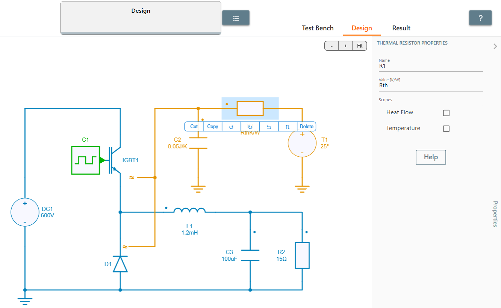

---
tags:
  - Python
  - Parameter Sweep
  - Thermal
---

# Thermal Data Rth Sweep

[Download **Python Script**](heatsink_resistance_sweep.py)

[Download **Simba Model**](thermal_buck_Rth_4pythonexp.jsimba)

This python example proposes a sweep of the heatsink resistance resistance $R_{th}$ to view its effect on junction temperature and losses.


## How to Proceed
Create a thermal model in SIMBA GUI and look for a custom variable Rth.




Write a Python script to call the model and add sweep range for Rth.

```py
Rth  = [0.1, 0.2, 0.3, 0.4, 0.5, 0.6, 0.7, 0.8, 0.9, 1.0]
```

After running the script, its effect on **losses** and **junction temperature** can be seen in the histogram plotted.


As it can be seen, on increasing the heatsink resistance, losses increases slowly. But, there is a drastic increase in junction temperature.