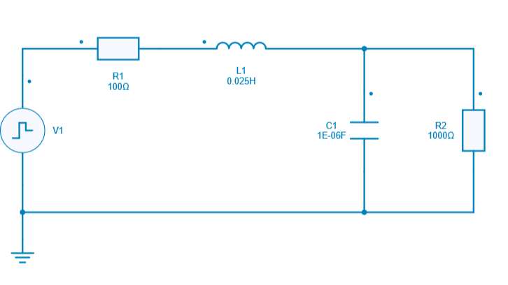
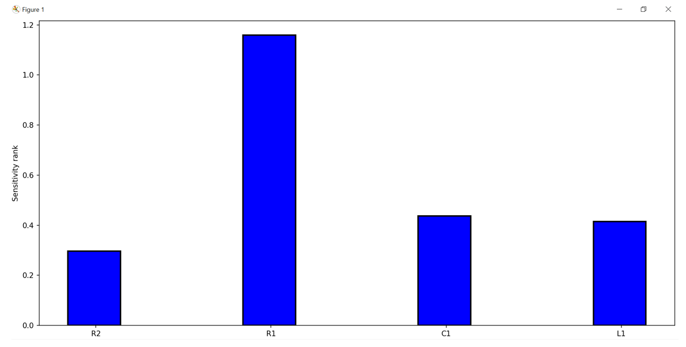

---
tags:
  - Python Script
  - Advanced Analysis
  - Sensitivity Analysis
---

# Sensitivity Analysis

[Download **Python script**](sensitivity.py)

[Download **Simba Model**](sensitivity.jsimba)

The sensitivity analysis is used to determine how sensitive a specified design performance measurement is to variations in design parameters.

A performance measurement is in reality a single numeric characteristic of the circuit (risetime, overshoot, bandwidth...)

This analysis requires :
* a parameter list which specifies the design parameters to be perturbed (varied)

* to specify which analyses/measures to use after each perturbation

To sum up:

Python library allows the modification of each design parameter by a small amount and calculates the effect on the performance measure.

This sensitivity analysis is mainly used if you want to reduce the variation of your system, but you don’t know which parameters influence your system most.

## Theoritical calculation

Below the equation showing how the sensitivity calculation is performed:

$sensitivity = {\dfrac{\Delta m}{\Delta p}}$

with **p** is the parameter value and **m** is the performance measure.

We can also use the normalized sensitivity:

$norm\_sensitivity = {\dfrac{\Delta m}{\Delta p}} \times {\dfrac{p}{m}}$

The normalized sensitivity will be used in this python script example in order to know which parameter has the highest impact (influence) for the **overshoot** measurement.

The circuit used for this example is a simple RLC circuit.

## SIMBA circuit

Below the RLC circuit designed for this sensitivity analysis which will be performed only by using Python script.

## Python Script

The Python script used for performing the sensitivity analysis will do the following tasks:

* Perform a parameter variation of 10% for each of the components R1, L1, C1, R2 and do the below tasks:
* Run a transient analysis of the RLC circuit
* Get the output voltage across R2 load resistor
* Calculate the maximum value of output voltage (Vout = VR2)
* Perform calculation of the average output voltage at the steady state
* Perform calculation of the overshoot for R2 signal (output voltage)
* Perform the sensitivity calculation for each component based on the "normalized sensitivity" equation mentionned above
* Plot the sensitivity values for each component in a graph
* Create a report mentionning the parameter which has the biggest impact for overshoot measurement

## Conclusion

Sensitivity analysis helps to improve the design quality and the design confidence in order to get the best Return on Investment.

Below the Sensitivity rank of such simulation with python

We can clearly observe that the most sensitive parameter for overshoot measurement is R1 (highest sensitivity value)
