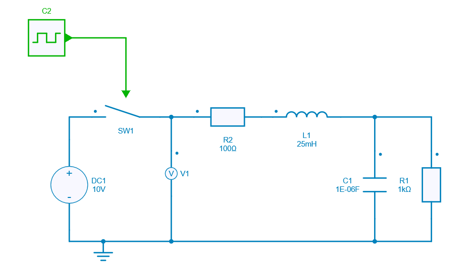
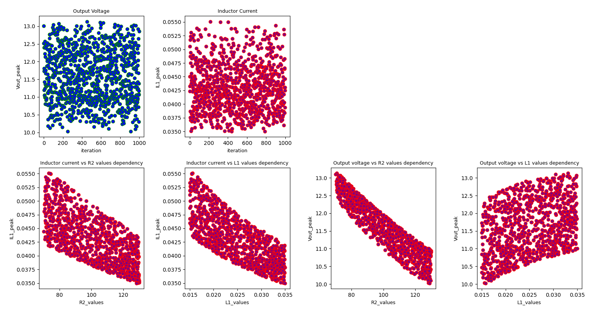

---
tags:
  - Python Scripts
  - Worst Case Analysis
---

# Monte Carlo Worst Case Analysis on RLC Circuit

[Download **Python script**](montecarlo_worstcase_analysis.py)

[Download **Simba Model**](montecarlo_worstcase_analysis.jsimba)


This python example performs a Monte Carlo Worst Case Analysis (MC-WCA) on an RLC circuit to check the effect of tolerance of the components on its peak overshoot.

This example can help you to:

* perform the Monte Carlo Worst Case Analysis (MC-WCA),
* check the effect of tolerance of the components on its peak overshoot,
* component selection along with the circuit validation.


## How to Proceed

Create a model in SIMBA GUI on which MC-WCA has to be performed.




Write a Python script to:

* define the number of iterations,
* define nominal and tolerance values of the  components whose tolerance value has to be checked,
* create the set of values according a uniform distribution,
* run the simulations,
* store and plot resultds

Here, the number of iterations has been set to 1000. The influence of the inductor and resistor component will be checked with the definition of nominal and tolerance values.

```py
iterations = range(1000)
circuit = {
           'inductor' : {'nominal': 25e-3, 'tolerance': 0.4},
           'resistor' : {'nominal': 100, 'tolerance': 0.3}
          }
```
A great number of components can be added. The values for the components are distributed using uniform distribution with mean value as a nominal value and variance as the tolerance range.

After running the script, its influence on the peak overshoot coule be observed.



The 2 graphs at the top show the overall uniform distribution for peak measurement on output voltage and inductor current vs number of iterations.

The 4 graphs at the bottom show the dependency between output voltage/inductor current vs R2/L1 values for all the iterations. 

As it can be seen, within the tolerance range of the components, peak overshoot value varies within the range and hence worst case values can be seen and reliabilty analysis can be done.

This concludes the python example on Monte Carlo Worst Case Analysis.
