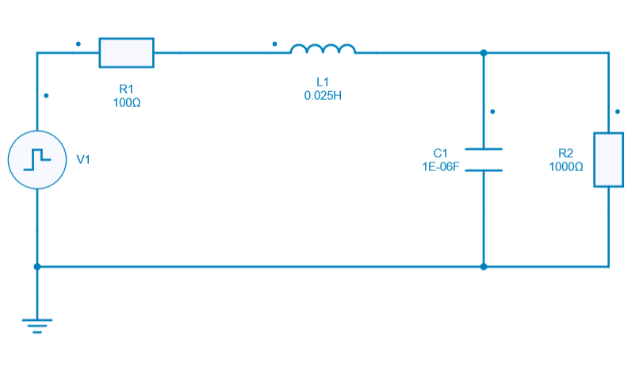
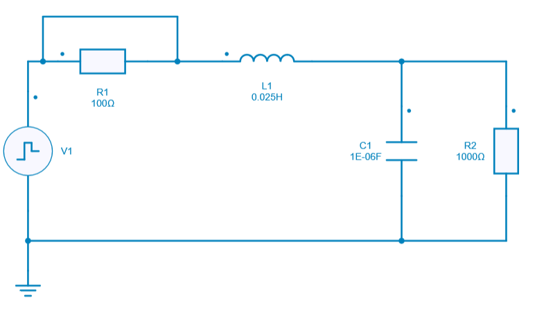
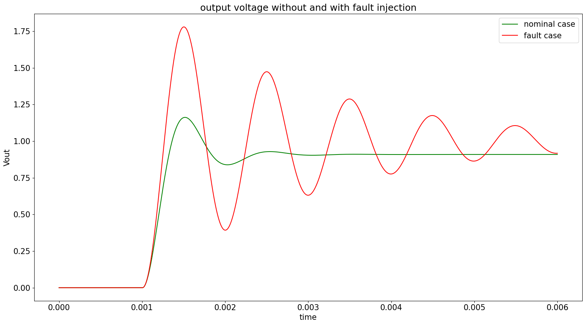

---
tags:
  - Python Scripts
  - Worst Case Analysis
---

# Fault Analysis

[Download **Python script**](fault_analysis.py)

[Download **Simba Model**](fault_analysis.jsimba)

The Fault analysis is used to inject any kind of faults into a design and check the impact of such faults for any test case scenarii or performance measures.

This analysis helps any engineers to :

* Reduce costly test-bench fault experiments
* Improve time to compliance
* Simulate fault scenarios that could not be tested before

Fault analysis could be performed in Hardware and System level.

The nature of fault could be extended to check compliance to:

* short circuit
* open circuit
* parameter fault
* ...

Some safety critera could also be elaborated and some test cases could be performed to check if the fault injection violates or not the safety criterias.

In that sense, several safety mechanisms could be developed in order to avoid any damages due to faults simulation.

**To sum up:**

Fault analysis could be really useful for safety constraints and help to understand the impact of faults on system behavior.
Generally speaking, it is possible to apply several faults into a system and test it for ongoing operation in a safe range.

## SIMBA circuit

The circuit used for this example is a simple RLC circuit. Below are shown the circuit for the **nomical case** and for the **fault case**.

### Nominal case

### Fault cause

The same circuit will be re used with fault injection: short circuit across R1 is set up.

## Python Script

This python script example will propose the following main steps:

* For each case **nominal** and **fault case**:
  - Run a transient analysis of the RLC circuit
  - Get the output voltage across R2 (load resistor)
  - Get maximum and final values of output voltage (Vout = R2)
  - Compute overshoot of output voltage
* Set up a test case to check if the overshoot calculated with fault injection is above the nominal case
* Write a report
* Plot the output voltage with and without fault

## Results

We can display the output voltage *without* and *with* fault injection once the python script has been run.

We can clearly observe that the shortcircuit across R1 has an impact on the output voltage.