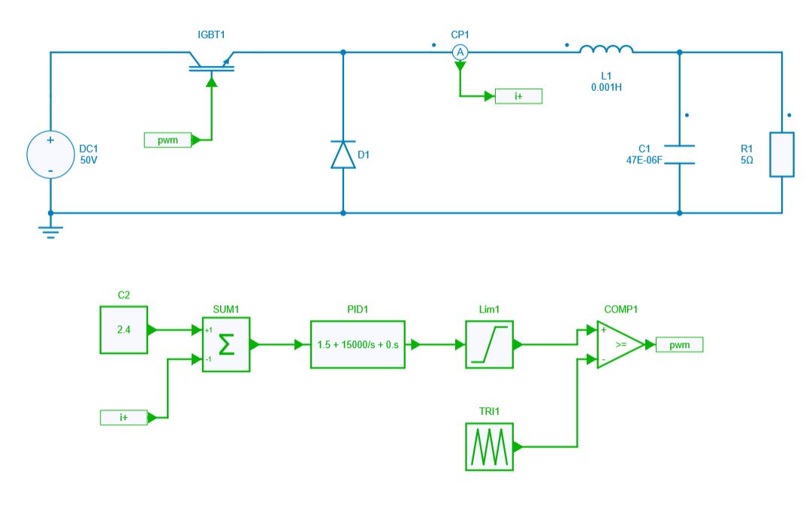
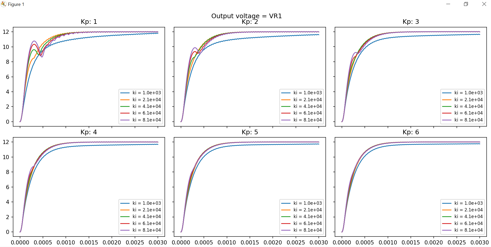

---
tags:
  - Python
  - Control Design
---

# PID controller values tuning

[Download **Python script**](PI_tuning.py)

[Download **Simba Model**](DC-DC_Average-current_mode_control.jsimba)

This python script example helps to understand how to set up two loops respectively dedicated to Kp and Ki values in order to tune the PID controller.

In deed, a nested loop is used by sweeping Kp and Ki values for having a quick idea of the impact of PID controller values to the output voltage.

It can be useful when we want to optimize the circuit into a semi automated way to extract the best couple of **Kp,Ki** values depending on constraints and specifications set.

The power converter topology used for this example is a simple Buck with Average Current Mode Control.

## SIMBA circuit

Below the DC-DC power converter designed inside SIMBA Desktop.

## Python Script

The Python script used for showing semi automated PID controller tuning will do the following tasks:

* define 2 variables Kp and Ki within minimum and maximum limit values
* create a loop dedicated to Kp parameter which varies between minimum and maximum values defined
* create a second loop dedicated to Ki parameter (inside the first Kp loop) which also varies between minimum and maximum limit values defined
* retrieve the ouput voltage which is equal to the voltage accross R1 for each couple of values **Kp,Ki** swept
* plot the output voltage by using matplotlib module for each different cases

## Conclusion

Below the result of the output voltage once the simulation is over through the Python script

As we can see, there is a big impact of **Kp** and **Ki** values for the output voltage.

Indeed, the overshoot, ripple and rise time are strongly dependent of such values.