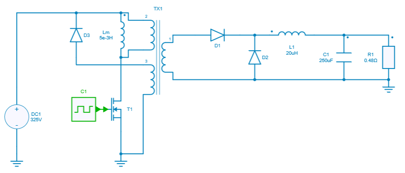
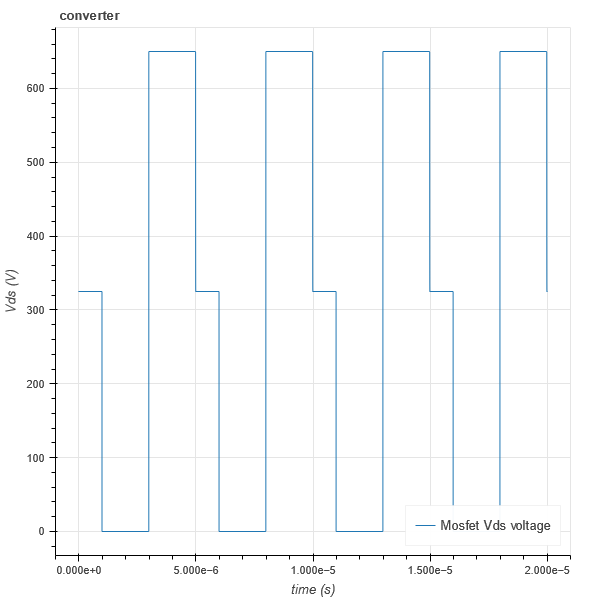

---
tags:
  - Python
---

# Data visualization: Use of Bokeh for interactive plots of waveforms and XY graphs

[Download **Python script**](dataviz_bokeh.py)

[Download **Simba Model**](DAB.jsimba)

Bokeh is an interactive visualization library for modern web browsers. It provides elegant, concise construction of versatile graphics and affords high-performance interactivity across large or streaming datasets. 

Bokeh can help anyone who wants to create interactive plots, dashboards, and data applications quickly and easily.

More information about **Bokeh** could be found [here](https://bokeh.org/).

## SIMBA circuit

Below the Forward converter circuit used for illustrating this Bokeh Python script. This example comes from the existing SIMBA collection of design examples.

## Python Script

The Python script used for showing Bokeh capabilities will do the following tasks:

* Import Bokeh library
* Run a transient analysis of the Forward Converter and get the voltage across the mosfet $T_{1}$,
* Plot the output voltage with Bokeh and observe the ***time*** and $V_{ds}$ values when the signal is highlighted. 

The following syntax **output_notebook()**  is for Jupyter Notebook. In deed, if this line is disabled, a new HTML page will be opened showing the result once the script is run. 
If this line is enable, the script needs to be run with interactive cell option.

## Conclusion

Below the simulation result once the script has been executed. 

We can clearly observe time and voltage values on the figure.

It is also important to say that a valid internet connection is required when using bokeh library.
