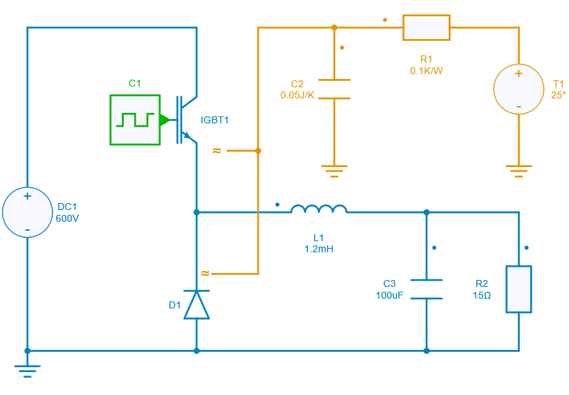
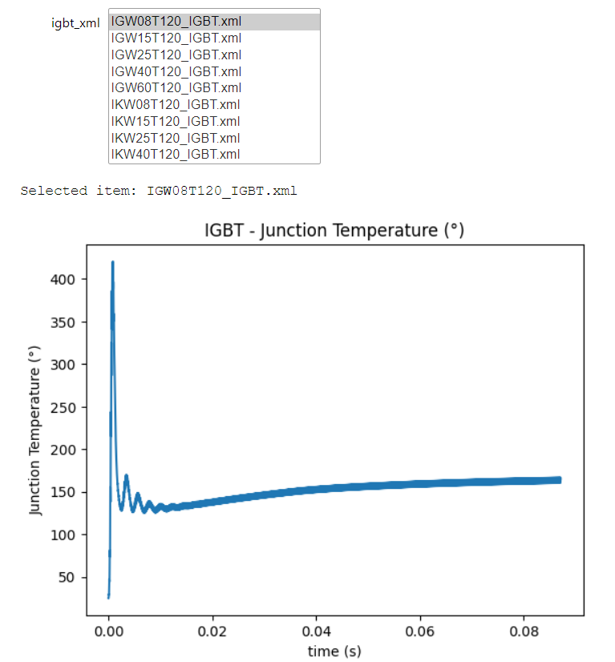

---
tags:
  - Python Notebook
  - Scrolling menu
  - Thermal data selection
---

# Thermal Data Selection using Scrolling Menu

[Download **Python notebook**](scrolling_menu_thermal.ipynb)

[Download **Simba Model**](scrolling_menu_thermal_buck.jsimba)

This python example performs the thermal simulation by selecting the thermal data from the given folder using Scrolling Menu.

This example can help you to:

* select the thermal data file from the multiple files in a folder.
* use of scrolling menu with interactive simulation.
* thermal simulation to analyse the switching losses and jnction temperature.

Python library allows to choose the options available with the help of scrolling menu.

## Theory

The thermal simulation of the converter in SIMBA helps to calculate the following parameters:

* Average Conduction Losses
* Average Switching Losses
* Average Total Losses
* Instantaneous Conduction Losses
* Instantaneous Switching Energy
* Junction Temperature

In this example, the thermal simulation is performed by selecting the thermal data using Scrolling Menu.

## SIMBA circuit

Below the Buck Converter circuit for thermal simulation which is performed by using Python script written in Jupyter notebook.

## Python Script

The structure of the python script is as follows:

* Initialization of the required modules.
* Make a list of thermal devices available in the folder.
* Define a scrolling menu by using Select feature of Ipywidgets.
* In this scrolling menu, provide the list of thermal devices.
* Define the handle function to be performed on selection of item from the scrolling menu.
* This defined function performs the thermal simualtion with the device selected from scrolling menu.
* Finally, use the interactive feature of Ipywidgets for interactive simulation.

## Conclusion

The scrolling menu of Python library will help you to perform the interactive simulation by selecting the appropriate option.

Below the snapshot of the result in the output widget.

This concludes the python example on Thermal Data Selection using Scrolling Menu.
