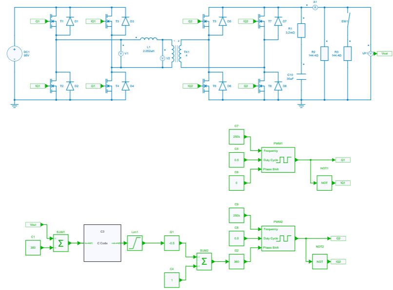

---
tags:
  - Python Scripts
  - File Import Export
---

# CSV File Exportation

[Download **Python script**](csv_file_export.py)

[Download **Simba Model**](DAB.jsimba)

File exportation is possible by using Python language.

In this way this python script example helps to understand how to export any csv files from results obtained by running a SIMBA circuit (.jsimba).

It can be useful when we want to compare several results obtained from external measurements or if several data parameters need to be analyzed carefully between simulation and reality.

The power converter topology used for this example is a DAB: Dual Active Bridge

## SIMBA circuit

Below the DAB power converter designed and simulated inside SIMBA Desktop.

## Python Script

The Python script used for showing csv exportation will do the following tasks:

* simulate the transient behavior of a DAB converter (created with SIMBA Desktop) and get ouput voltage (accross R2 resistor)
* create a csv file named **Output_voltage.csv** by opening it in **w** mode (for writing purpose)
* export time and output voltage (vout = VR2) into the csv file
* plot the output voltage by using matplotlib module

Once the csv file is ready, it will contain all the datas (time and output voltage values) needed.

## Conclusion

Below the result of the output voltage once the simulation is over through SIMBA Desktop

As we can see, the last value of the signal is equal to 379,99V. 

If we compare this plot with the datas exported into the csv file **Output_voltage.csv** created, you'll observe the same result:

Both output voltages are close to 380V at t=0.2s 