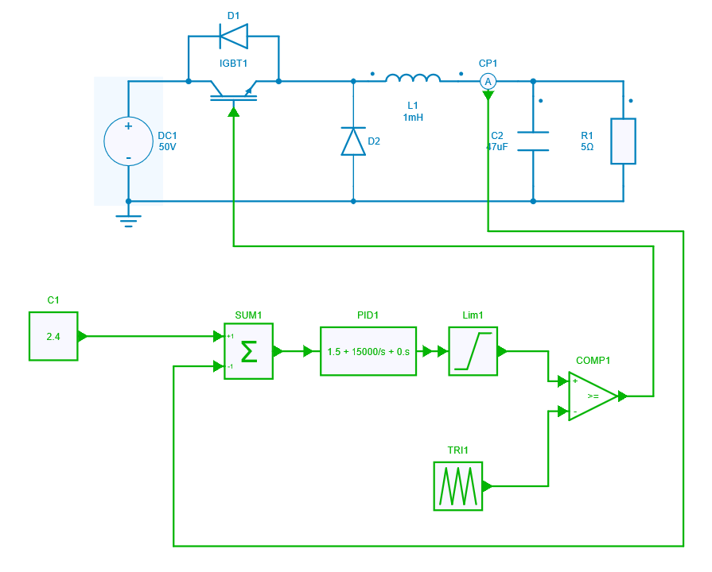
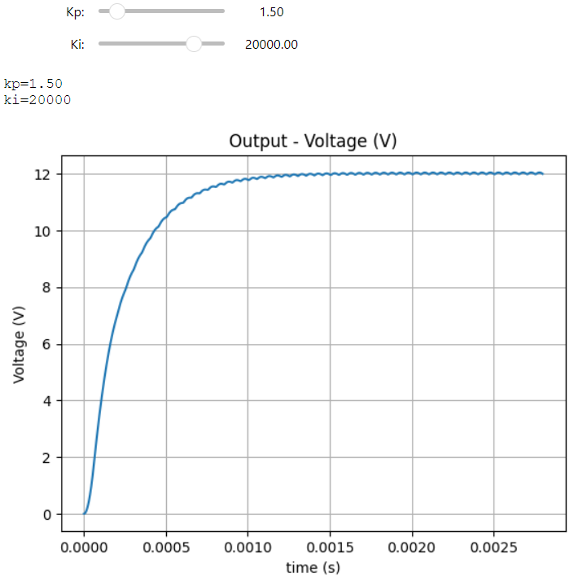

---
tags:
  - Python Notebooks
  - Python GUI
  - Control Design
---

# Buck Converter PI-Tuning using Slider Widget

[Download **Python notebook**](SliderWidget_BuckAverageCM.ipynb)

[Download **Simba Model**](SliderWidget_BuckAverageCM.jsimba)

This python example performs the PI-Tuning of a Buck Converter with average current mode control whose python code is written in Jupyter notebook.

This example can help you to:

* design and analyse the Buck Converter average current mode control.
* tune the PI controller values using slider widget.

Python library allows the modification of each controller parameter defined by the range provided in the slider widget.

This analysis also helps you to understand PI-tuining of the controller.

## Theory

A buck converter is designed for a constant output voltage but due to uncertain disturbances in the system like change in load or a surge in supply, the output voltage of the system might rise or fall, which needs to be checked by using a controller. A transfer function helps in relating a signal which is to be controlled and a control signal. Doing so aids in understanding how the system behaves in certain conditions.

Average current mode control is quite similar to peak current mode architecture in that there are two loops:

* Outer loop: This is the voltage control loop where the comparison of the output voltage with the reference voltage provides the error; this is processed by the voltage compensator (PI). Its output is the reference current.

* Inner loop: This loop measures the average current flowing into the inductor and compares it to the reference current. The current error is then processed by the current compensator (PI) to generate a signal that is compared with the locally generated sawtooth signal. The comparator output drives through the two usual flip-flops that control the switches.

In this example, tuning of inner current loop is being implemented.

## SIMBA circuit

Below the Buck Converter circuit design where PI-tuning is to be performed by using Python script written in Jupyter notebook.

## Python Script

The structure of the python script is as follows:

* Initialize the required modules.
* Initialize and define the float slider widget each for kp and ki values.
* Group the two widgets in a box and display the box.
* Define a handle function which will capture the changed values of the slider. In this function write the main script which calls the model and run the simulation.
* The output of the handle function is to be displayed with the output widget. This will enable the interactive simulation between the widget and the plot.
* Now write the observe function for the slider widget.
* Finally, display the output widget.
* Now, in each change of the slider widget value, output plot curve will be changed.

## Conclusion

The slider widget of Python library will help you to perform the interactive simulation and tune your PI values.

Below the snapshot of the result in the output widget.

This concludes the python example on PI-tuning of Buck converter average current mode control using slider widget.
