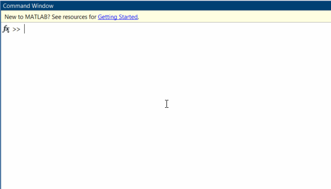
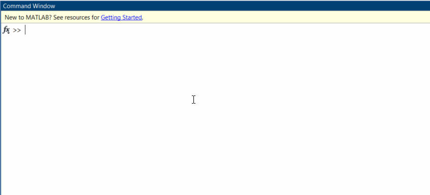
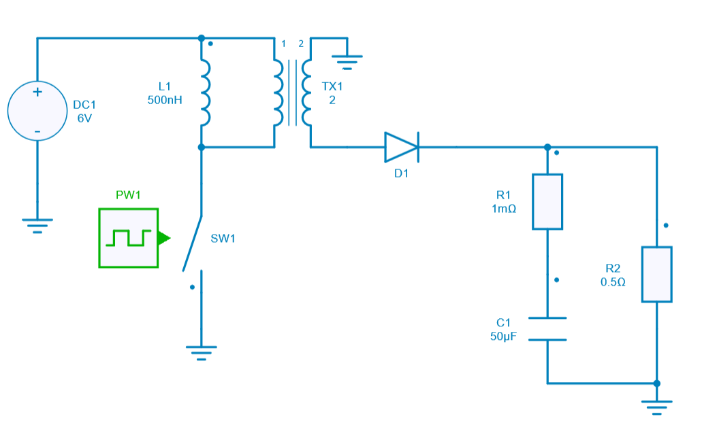
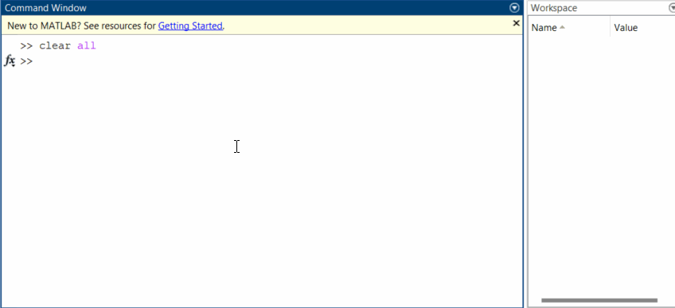

---
tags:
  - Python
  - Matlab
---

# Run Simba from Matlab with Simba python library

[Download **Python script**](flyback_script.py)


This case shows the capability to run a Python script from Matlab with the SIMBA Python library: a python script named *"Flyback.py"* is run from *Matlab* with the matlab command: `pyrunfile(file_name.py)`.

## Set-up procedure

!!! info "Access Python Modules from Matlab - Tutorials"
    See [*Getting Started*](https://fr.mathworks.com/help/matlab/matlab_external/create-object-from-python-class.html){target="_blank"} and also [*Configure Your System to Use Python*](https://fr.mathworks.com/help/matlab/matlab_external/install-supported-python-implementation.html){target="_blank"} tutorials.

Here is a sum-up of the procedure to follow before running a python script from Matlab:

1. Check the Python version that you are using is compatible with the Matlab version installed in your computer on this [Mathworks webpage](https://fr.mathworks.com/support/requirements/python-compatibility.html){target="_blank"}.
2. Set the Python environment with the [pyenv](https://fr.mathworks.com/help/matlab/ref/pyenv.html){target="_blank"} function.
   Call `pyenv` in a matlab console to check if a python version has already been set:
   ```
   pe = pyenv
   ```
   
3. If you want to change the version of the Python interpreter, you can use `pyenv(Version="executable")` (if python is already loaded, you will have to restart matlab), for example on Windows:
   ```
   pyenv(Version="C:\Users\JohnDoe\AppData\Local\Programs\Python\Python311\python.exe");
   ```
   

!!! note
    In cases where `pyenv` is not usable, for example, when running MATLAB apps, an alternative way to set the interpreter is to use the PYTHONHOME environment variable. To set PYTHONHOME, see [python doc](https://docs.python.org/3/using/cmdline.html#envvar-PYTHONHOME){target="_blank"}.


??? tip "How to resolve a possible error *Tclerror* when calling python from Matlab?"

    TCL uses hard coded location of *tcl_library_path* to find its initialization files which does not work when Python is loaded by Matlab.
    More information could be found [there](https://fr.mathworks.com/matlabcentral/answers/1842093-how-to-resolve-error-calling-python-from-matlab).

    In such cases, it is possible to run in a Matlab console the following commands to set the <span style='color:red'>tcl8.6</span> and <span style='color:red'>tk8.6</span> library paths:

    ```
    setenv('TCL_LIBRARY', 'C:/Users/JohnDoe/AppData/Local/Programs/Python/Python310/tcl/tcl8.6');
    setenv('TK_LIBRARY', 'C:/Users/JohnDoe/AppData/Local/Programs/Python/Python310/tcl/tk8.6');
    py.tkinter.Tk;
    ```
    These lines have be changed according to your Python installation.

    As these commands have to be run every time you run Matlab, it is possible to write them in an initialization script, such as the *start.m* file. An example of this startup file can be [downloaded here](start.m).

    Matlab can be restarted to run its startup file or this startup file can be run manually:

    ```
    run("<set_location_path>/start.m")
    ```

## SIMBA circuit

Below the Flyback power converter used for this case. This example comes from the existing SIMBA collection of design examples.




## Python Script

The Python script run from Matlab will do the following tasks:

* Load the flyback power converter from existing SIMBA collection of examples,
* Run a transient analysis and get the ouput voltage accross $R_2$ resistance,
* Create an array named **result** which contains both time and voltage vectors,


## Pyrunfile function in matlab

Now let's call the command in a matlab console below to simulate a flyback converter. The results to be saved are specified and stored in the workspace with a variable named *res*.

```
res = pyrunfile("<filepath>/Flyback.py", "result")
```


!!! info "More information about the [pyrunfile function here](https://fr.mathworks.com/help/matlab/ref/pyrunfile.html){target="_blank"} function."

To manage these collected results in matlab, it is more convenient to convert this *python ndarray* into a *matlab matrix*. Use the `double` function for this. To illustrate this, the results are also plotted in matlab.


## Conclusion

This example shows how it is possible to run Simba from Matlab thanks to the *Simba Python Library*.
Results can be saved in Matlab workspace for later manipulation.