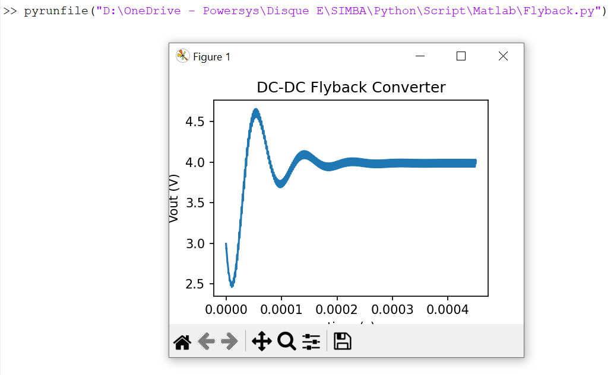
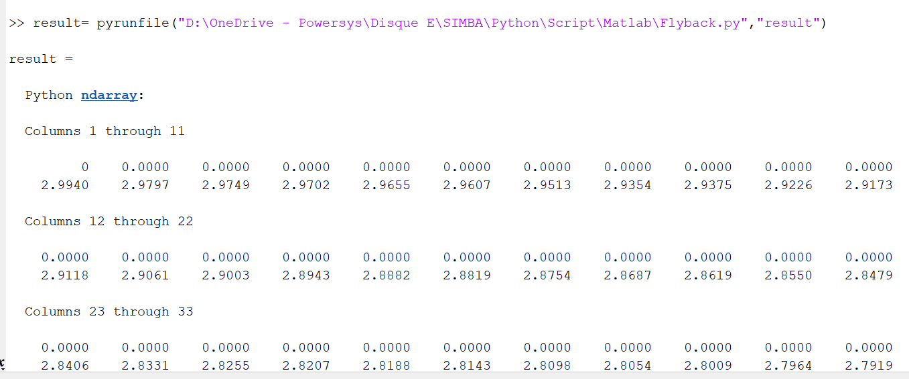

---
tags:
  - Python script
  - Matlab
---

# Run Simba from Matlab with Simba python library

[Download **Python script**](Flyback.py)

[Download **Matlab file**](start.m) (not mandatory)

This case shows the cability to run and launch a Python script from Matlab with the SIMBA Python library.

A Python script named "Flyback.py" is executed from Matlab by using the command **pyrunfile(file_name.py)**

More information about the **pyrunfile** function could been found [there](https://fr.mathworks.com/help/matlab/ref/pyrunfile.html)

Below the procedure to follow before to run the python script into Matlab:

* First you need to make sure that the Python version that you are using is compatible with the Matlab version installed in your computer:
[Matlab/Python_version](https://fr.mathworks.com/support/requirements/python-compatibility.html)

* An environment variable with the following syntax could be set in the OS settings for easier manipulation: **system variable**

PYHOME        C:\Users\amc\AppData\Local\Programs\Python\Python310  (the path needs to be changed depending on your python installation location)

PYTHONPATH    %PY_HOME%\Lib;%PY_HOME%\DLLs;%PY_HOME%\Lib\lib-tk;%PY_HOME%\Scripts\;%PY_HOME%\Lib\site-packages

* the Matlab file **start.m** could be run only if some issues appear with the initialisation of TCL.

In that case you'll need to edit this file and change the installation path of tcl8.6 and tk8.6 (could be changed according to your Python version installed):

setenv('TCL_LIBRARY', 'C:\Users\amc\AppData\Local\Programs\Python\Python310\tcl\tcl8.6');

setenv('TK_LIBRARY', 'C:\Users\amc\AppData\Local\Programs\Python\Python310\tcl\tk8.6');

py.tkinter.Tk;

Once the file is modified according to your environment, please feel free to run this file in Matlab by using the following syntax:

**run("set_location_path\start.m")**

More information could be found [there](https://fr.mathworks.com/matlabcentral/answers/1842093-how-to-resolve-error-calling-python-from-matlab)

## SIMBA circuit

Below the Flyback power converter used for this case. This example comes from the existing SIMBA collection of design examples.

## Python Script

The Python script run from Matlab will do the following tasks:

* Load the flyback power converter from existing SIMBA collection of examples
* Run a transient analysis
* Retrieve the ouput voltage which is equal to the voltage accross R2 (VR2)
* create an array named **result** which host both time and VR2 values
* Plot the output voltage VR2 by using matplotlib module

## Matlab GUI

Open Matlab and in the **Command window**, feel free to type:

py.math.sqrt(4)

You should see the answer : ans = 2

Now you can run the syntax below:

run("D:\OneDrive - Powersys\Disque E\SIMBA\Python\Script\Matlab\start.m")   (only if you face some issues with TCL init + change location_path)

pyrunfile("D:\OneDrive - Powersys\Disque E\SIMBA\Python\Script\Matlab\Flyback.py") (feel free to change the path of the "Flyback.py" file depending on your computer)

Once executed you should obtain this behavior:

## Conclusion

We can also type this below command in order to display in Matlab the array defined in the script which host both time and output voltage values:

result= pyrunfile("D:\OneDrive - Powersys\Disque E\SIMBA\Python\Script\Matlab\Flyback.py","result")

Once executed you should obtain this behavior:

Now this array is also created in Matlab and can be retrieved for later manipulation.