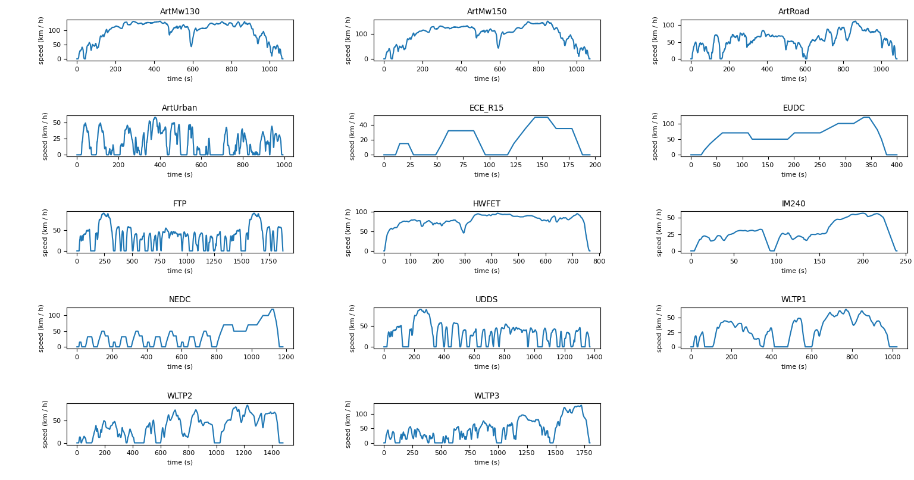

---
tags:
  - Python Script
  - File Importation
  - Matlab
---

# Import MAT File

This example shows how to import a .mat file using **scipy.io** module. The .mat file contains several standardised drive cycles and has been downloaded [here](https://imee.pl/pub/drive-cycles).

The main steps of this script example are the following:

* import .mat file with *loadmat* function of *scipy.io* module: the data are stored in a dictionnary (named *contents* here),
* get the *ndarrays* of this dictionnary *contents* and store them in another array *drive_cycles*
* plot all drive cycles
* optional: store drive cycles in a panda dataframe and write CSV files for each drive cycle

