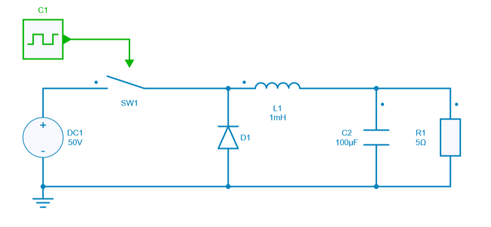
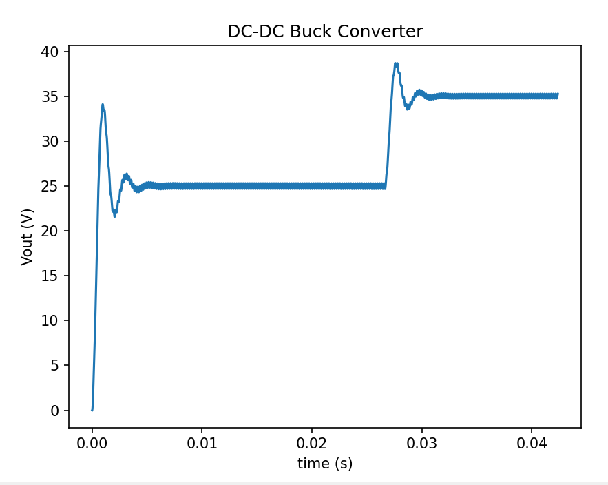

---
tags:
  - Python
  - Interactive simulation
---

# Duty cycle modified during simulation

[Download **Python script**](duty_cycle_modified.py)

This python script example helps to understand how to change the value of a parameter during the simulation at a certain given time.

In this case, the **duty cycle** of a Buck converter will be modified suddenly at a certain time and the impact of this change will be observed on the output voltage.

This parameter modification is really useful to observe dynamic change.

## SIMBA circuit

Below the DC-DC power converter designed inside SIMBA Desktop.

## Python Script

The Python script used for showing the modification of duty cycle during simulation will do the following tasks:

* load the DC-DC Buck converter from SIMBA design examples
* enable both voltage and current scopes for R1 parameter (load resistor)
* define a number of points (here 15000) which represents the **intermediate time** allowing to set up the sudden change of the duty cycle value.
  This set of points needs to be modified in order to change this “intermediate time”.
* run the simulation with an initial duty cycle = 0.5
* define a new duty cycle = 0.7 and continue to run the first simulation at the intermediate time defined
* retrieve the output voltage across R1 and plot the output voltage showing the modification of the duty cycle value during the simulation at a certain given time

## Conclusion

Below the result of the output voltage once the simulation is over through the Python script:

As we can see, the output voltage is impacted a lot by the duty cycle modification. This confirms the theory about Buck converter ($V_{out} = D \times V_{in} \times$ where $D$ is the duty cycle.) 

In our case, we have defined a set of points = 15000 to represents the **intermediate time** when parameter value is modified. In this case, this leads to a time of around 27 ms.

As we can see at t = 27ms, the output voltage increases because the duty cycle value suddenly increases as well.
