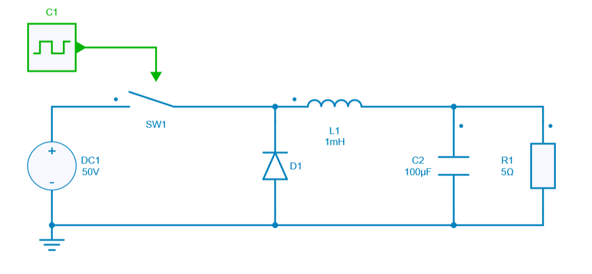
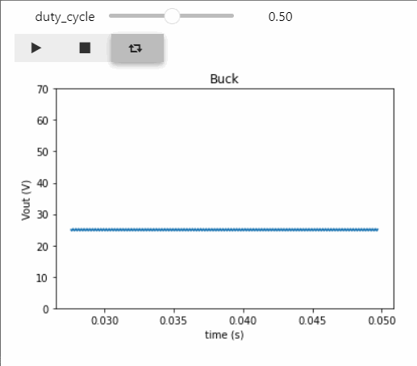

---
tags:
  - Python
  - Interactive simulation
---

# Interactive simulation with Duty Cycle modification

[Download **Python Notebook**](pseudo_real_time_simulation.ipynb)

This python script example helps to understand how to change the value of a parameter during the simulation interactively (pseudo real time).

In this case, the **duty cycle** of a Buck converter will be modified suddenly at any time and the impact of this change will be observed on the output voltage through an oscilloscope. 

The library called **ipywidgets** is used to create this interactive display in pseudo real-time.

This parameter modification is really useful to observe interactive change.

## SIMBA circuit

Below the DC-DC power converter designed inside SIMBA Desktop.

## Python Script

The Python script used for showing the interactive modification of duty cycle during simulation will do the following tasks:

* import all the necessary libraries including **ipywidgets**
* load the DC-DC Buck converter from SIMBA design examples
* create two array **table_t** and **table_Vout**
* enable both voltage and current scopes for R1 parameter (load resistor)
* define a number of points (here 1000) which represents the **intermediate time** allowing to set up the sudden change of the duty cycle value.
  This set of points needs to be modified in order to change this “intermediate time”.
* define a function called **run_simulation** allowing to retrieve the duty cycle, time and output voltage, add datas to the 2 arrays created previously and refresh     thoses arrays once their limits have been reached
* plot the output voltage through an oscilloscope + display a slide bar which allows to modify the duty cycle value during the simulation

## Conclusion

Below the result of the output voltage once the simulation is over through the Python script:

By using the **ipywidgets** library, we can:
* create a slide bar displaying the duty cycle and play with its value
* display 3 buttons in order to run/pause, stop and simulate with no end the simulation
* display the output voltage and check the impact of duty cycle modification interactively

The output voltage can be directly calculated by using the theoretical calculation about Buck converter:

$V_{out} = D \times V_{in}$ where $D$ is the duty cycle.
