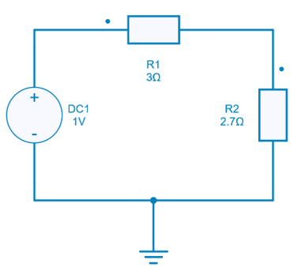

---
tags:
  - Python
  - Optimization
  - Basics
---

# Example of optimization using Scipy Library

This python script proposes a simple example of optimization using *Minimize()* function of Scipy Library. The example considers an impedance adaptation circuit and the objective is to determine the load resistance which leads to the transfer of the maximum power.

## How to Proceed

### Create a Circuit

The model can be created in SIMBA GUI:



It can be seen that a voltage source with its internal resistance R1 supplying power to the load R2. Now, let us consider that R1 has the fixed value of 3 $\Omega$.

### Write an Objective Function

To maximize the power delivered to the load, an objective function has to be defined with:

* the value of resistor R2 as a **input**,
* the computed value of the transferred power as an **ouput**.

Here are the main steps of this function:

* load the created model,
* apply value of resistor R2,
* run the simulation,
* compute and return transferred power.
  

```py
def objective_function(R_load):
    file_path = os.path.join(os.getcwd(), "max_power.jsimba")
    project = JsonProjectRepository(file_path)
    maximum_power = project.GetDesignByName('maximum_power')
    maximum_power.Circuit.GetDeviceByName('R2').Value = R_load[0]
    job = maximum_power.TransientAnalysis.NewJob()
    status = job.Run()
    Iout = job.GetSignalByName('R2 - Current').DataPoints
    power = Iout[-1]**2*R_load
    project.Save()
    return -power
```

!!! note
    This objective function returns a negative power for the *minimize()* function of Scipy Python library, as the objective is to maximize the transferred power.


### Use Minimize() Function of Scipy

The *minimize()* function is a part of the *scipy.optimize module* in the Scipy library, which provides tools for solving optimization problems, including both unconstrained and constrained optimization. The *minimize()* function is used to find the minimum of a scalar function of one or more variables, possibly subject to constraints. It employs various optimization algorithms to find the solution.

The syntax is as given below:

```py
scipy.optimize.minimize(fun, x0, args=(), method=None, bounds=None, constraints=(), ...)
```
#### Parameters:

* **fun**: The objective function to be minimized. This function should accept a 1-D array (or list) of parameters as its first argument and return the scalar value of the objective function.
* **x0**: Initial guess for the optimization variables.
* **args**: Additional arguments to be passed to the objective function.
* **method**: The optimization algorithm to use. Scipy provides various methods like 'BFGS', 'CG', 'Nelder-Mead' also known as Downhill Simplex, 'L-BFGS-B', 'trust-constr' for steepest descent etc. You can choose the method based on the characteristics of your problem.
* **bounds**: Bounds for optimization variables. It can be either a sequence of (min, max) pairs for each variable or a single tuple (min, max) that applies to all variables.
* **constraints**: Constraint definitions, if any. Constraints can be specified as dictionaries or objects with a specific format depending on the constraint type.

Additionally, there are many other optional arguments for fine-tuning the optimization process, controlling convergence criteria, and more.

In this example, the method chosen is L-BFGS-B (Limited-memory BFGS with box constraints). Other methods can also be used for this example as per the user convenience.

The initial guess and bounds can be defined as:

```py
initial_guess = np.array([2.7])
bounds = [(2.5, 3.5)]
result = minimize(objective_function, initial_guess, method='L-BFGS-B', bounds=bounds)
```

### Example of results

For this example, a typical run can lead to the results below printed with 4 digits after the dot.

```py
Optimal R_load = 3.0009 Ω
Transferred Power P = 0.0833
```

Of course, with a simple example, these results are closed to the theoretical value of 3 $\Omega$. For other more complex problems, the initial guess as well the bounds can also be considered to explore a wider domain.
