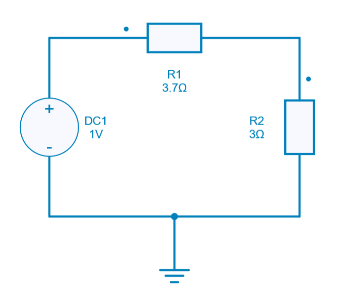
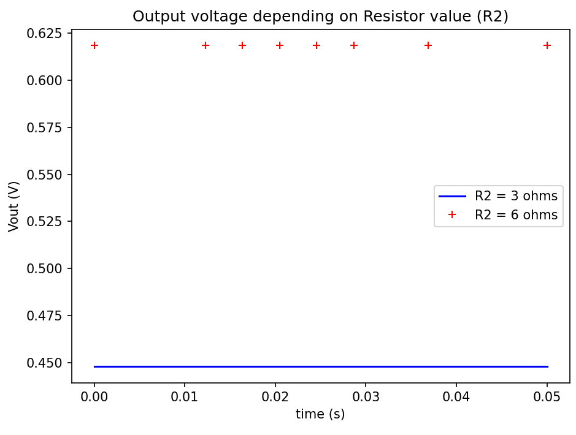
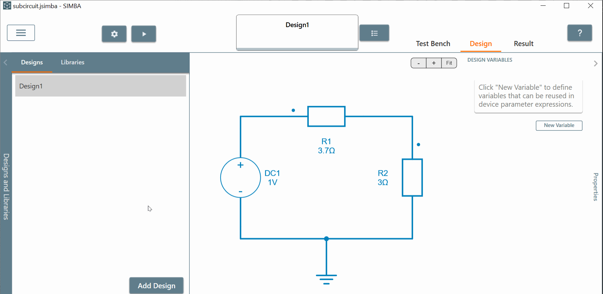

---
tags:
  - Python
  - Basics
---

# How to create, enter and modify a subcircuit ?

[Download **Python script**](subcircuit.py)

[Download **Simba Model**](subcircuit.jsimba)

This python script example helps to understand how to **create** a **subcircuit** but also **enter** and **modify** a parameter value into it.

To illustrate this script, two resistors will be encapsulated into a subcircuit called **Sub_module**.

Subcircuit creation is useful for building complex and personalized models.

## SIMBA circuit

Below the simple circuit designed inside SIMBA Desktop.

A simple DC analysis is performed to measure the output voltage accross the load resistor $R_2$.

## Python Script

The Python script used for showing the subcircuit creation/modification will do the following tasks:

* import all the necessary libraries
* load the circuit **subcircuit.jsimba**
* duplicate the existing **design1** from this circuit  and name it **Design 2 with subcircuit**
* define and create the **subcircuit** which encapsulates both resistors $R_1$ and $R_2$
* rename the subcircuit such as **Sub_module**
* Enter (access) into **Sub_module**, modify the value of R2 and save project
* run the simulation for both **design1** and **Design 2 with subcircuit**
* retrieve the output voltage for both simulation
* plot the output voltage for each value of $R_2$ defined into the **design1** (without subcircuit) and **Design 2 with subcircuit**

## Conclusion

Below the result of the output voltage once the simulation is over through the Python script:

The red curve corresponds to the output voltage with R2 defined into the subcircuit (design2) rather than the blue one which is linked to R2 without the subcircuit (design1)

It is important to say that the project can be reloaded into SIMBA Desktop GUI in order to observe the design2 "**Design 2 with subcircuit**" and the **Design 1** (without subcircuit). Of course the python scripts needs to be run first.

