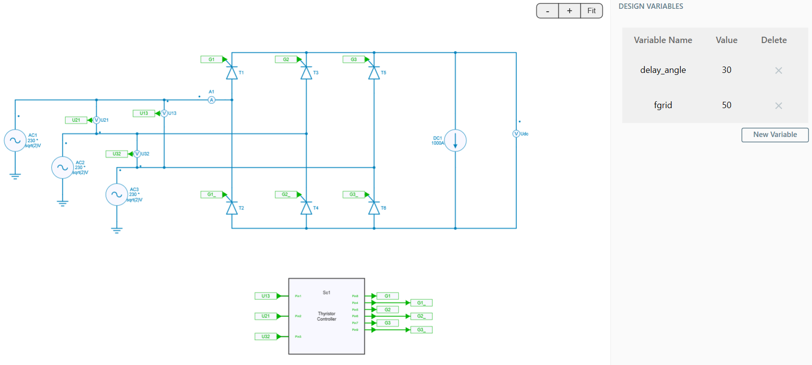
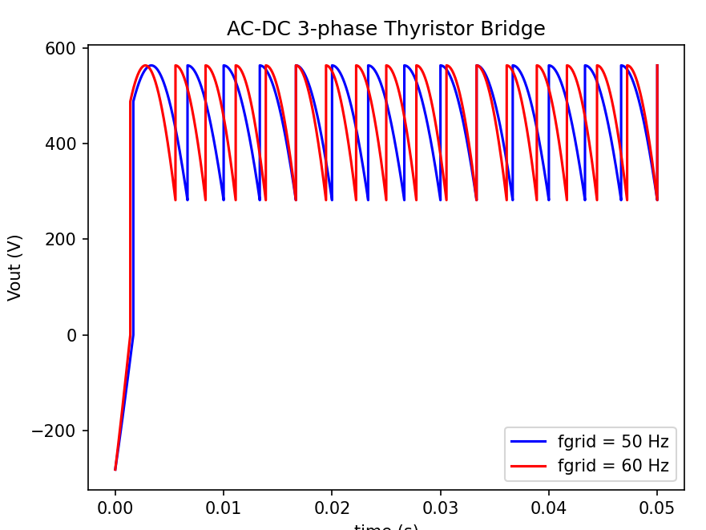

---
tags:
  - Python
  - Basics
---

# How to read and write variables ?

[Download **Python script**](read_write_variables.py)

This python script example shows how to **read** and **write** a design variable which is used in the circuit. In the GUI, these variables can be reached through the **Design Variables** panel.

To illustrate this script, the design named *AC-DC 3-phase Thyristor Bridge* from SIMBA collection of examples is used.

This example shows an AC-DC 3-phase controlled phase rectifier with:

* an AC grid voltage of 230 V RMS and a frequency **fgrid** of 50 Hz,
* a DC current source which represents the load,
* a delay angle of 30°.

## SIMBA circuit

Below the **AC-DC 3-phase Thyristor Bridge** circuit designed inside SIMBA Desktop.

The schematic above shows the electrical top model considered of this controlled phase rectifier.

Thyristors are ideal components, the DC current source is 1000A and the differential voltage meter allows to measure the output voltage called **Udc**.

The *DESIGN VARIABLES* panel shows two variables which are used in this design:

* the delay angle (in degrees): *delay_angle*, used in the subcircuit of the delay angle control,
* the AC grid frequency: *fgrid*, used in three-phase voltages sources and in the subcircuit of the delay angle control.

## Python Script

The Python script used for reading and writing variables will do the following tasks:

* import all the necessary libraries
* load the circuit (ACDC_3ph_ThyristorBridge) from SIMBA collection of examples and read the default value of *fgrid* parameter,
* run a transient analysis of the original circuit with default *fgrid* (here 50 Hz) and retrieve the output voltage **Udc**,
* assign a new value for parameter fgrid = 60 Hz, run a new transient analysis with **fgrid** modified and retrieve the new output voltage **Udc** for fgrid=60 Hz,
* plot the output voltage **Udc** for both values of fgrid: 50 and 60 Hz.

## Conclusion

Below the result of the output voltage once the simulation is over through the Python script:

The blue curve corresponds to the output voltage **Udc** with **fgrid = 50 Hz** rather than the blue one which corresponds to **fgrid = 60 Hz**.

We can clearly observe the impact of the grid frequency on the output voltage.

It is important to say that any variables defined into the **design variables** window could be tuned for understanding the impact of such modification in the circuit.