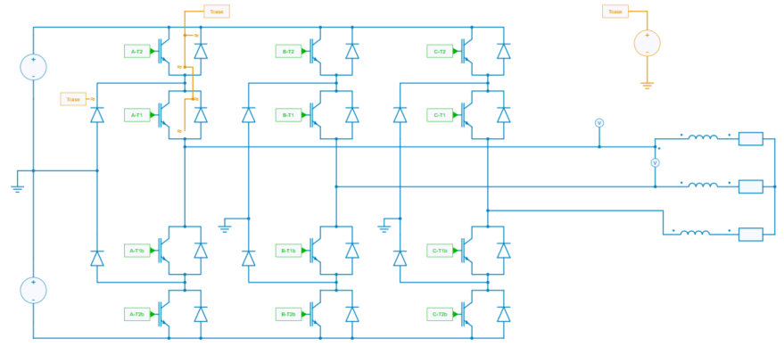
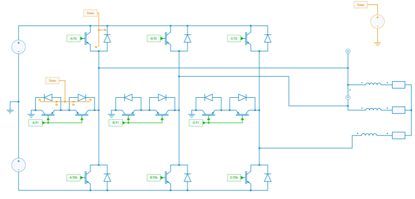
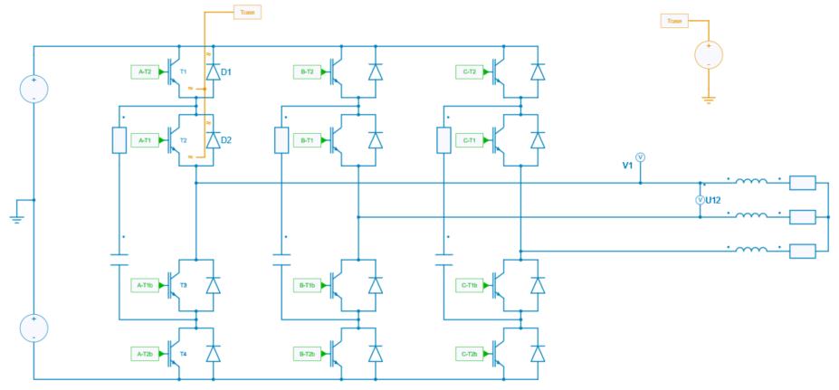
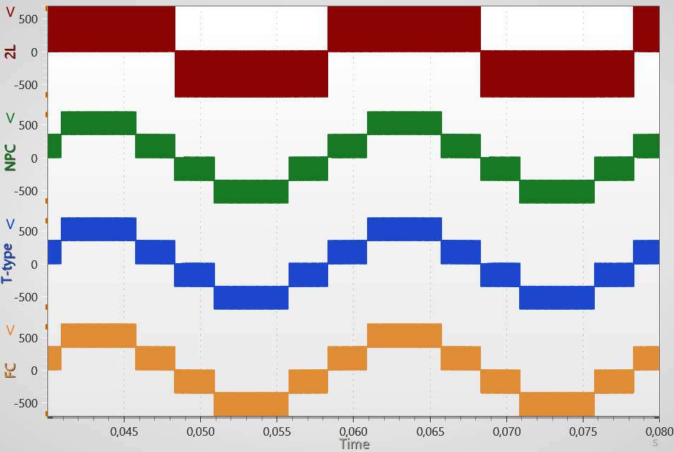
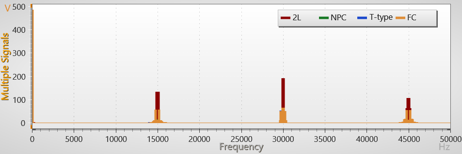
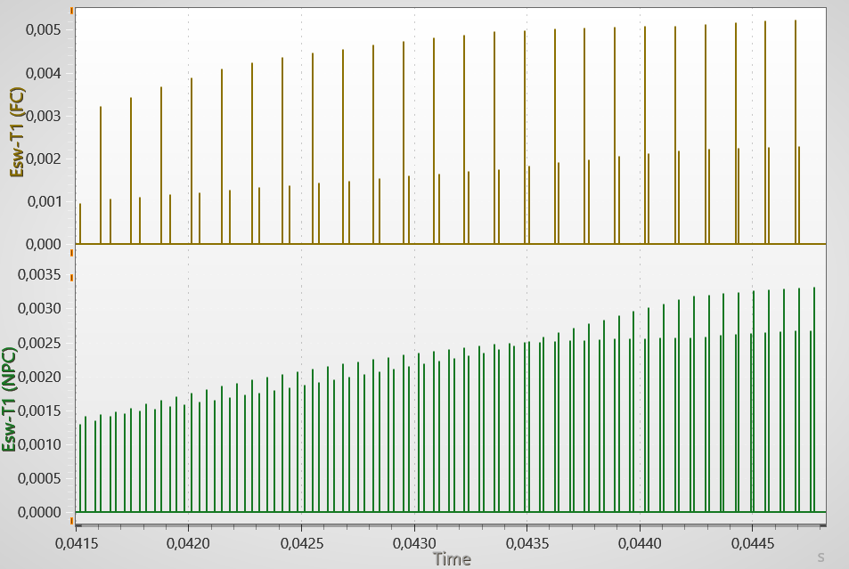
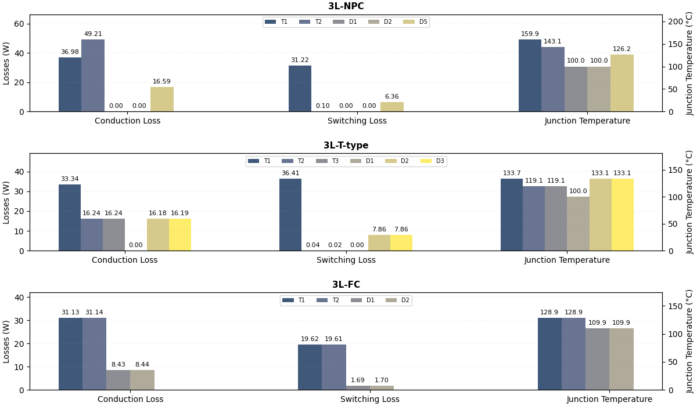

---
tags:
  - Python
  - DC-AC
  - Power Supplies
  - Thermal
---

# Thermal benchmark of 3-Level 3-phase Voltage Source Inverters

[Download **python script for simulation**](benchmark_3L_3ph_inverters.py)

[Download **python script for plotting**](benchmark_3L_3ph_inverters_plot.py)

[Download **Simba model**](benchmark_3L_3ph_inverters.jsimba)

[Download **Python Library requirements**](requirements.txt)

## Review of topology candidates

This example proposes a python script which provides a thermal benchmark of three topologies of 3-Level 3-phase Voltage Source Inverters:

* a Neutral Point Clamped (NPC),
* a T-Type,
* a Flying Capacitor (FC).

The figures below show these different topologies.

The requirements are:

* DC voltage: 700 V,
* Power: 40.9 kW,
* Fundamental frequency: 50 Hz,
* Apparent Switching frequency: 15 kHz.

!!! note "note"
    The *apparent* switching frequency is the switching frequency of the AC voltage waveform. It is twice the *real* switching frequency of devices for the FC topology and it is the *real* switching frequency of devices for the NPC and T-type topologies (but for these last ones, the powerswitches only operate during a half period of the fundamental!)

### The NPC topology

### The T-type topology

### The FC topology

All the topologies are compared with the same AC load and control which has been considered in open-loop.

!!! info "info"
    For the Flying Capacitor Topology, a Phase Disposition (PD) strategy - which allows a lower wTHD of the phase-phase voltage - has been implemented with a state machine in a C-code.

## Thermal description

Modules from Infineon module are considered:

* the reference [F3L100R07W2H3_B11](datasheets/Infineon-F3L100R07W2H3_B11-DataSheet-v01_00-EN.pdf) for the NPC module,
* the reference [F3L200R12W2H3_B11](datasheets/infineon-f3l200r12w2h3-b11-ds-ja.pdf) for the T-Type module,
* the reference [IKZ75N65El5](datasheets/infineon-ikz75n65el5-datasheet-en.pdf) for the FC topology.

The case temperature has been considered constant and has been set to 100 °C.

## Results

### Voltage Waveforms and Spectrum

The figures below show the waveforms and the spectrum of the phase-phase voltage of the 3-Level topologies. The voltage waveform of a classic 2-Level inverter has also been plotted for comparison.

As the apparent switching frequency of the 3-Level topologies is the same, the spectrum are identical. Yet, as previously mentionned, the *real* swicthing frequency is not the same as shown in the figure below which plots the switching energies of powerswitch $T_1$ of the FC and the NPC topologies. These differences could lead to different losses as it will be shown in the next section.

### Powerswitch losses and junction temperatures

The figure below shows the conduction and switching losses and the junction temperatures of the main powerswitches for each topology: NPC, T-type and FC.

This shows how different topologies can be compared for this kind of benchmark.