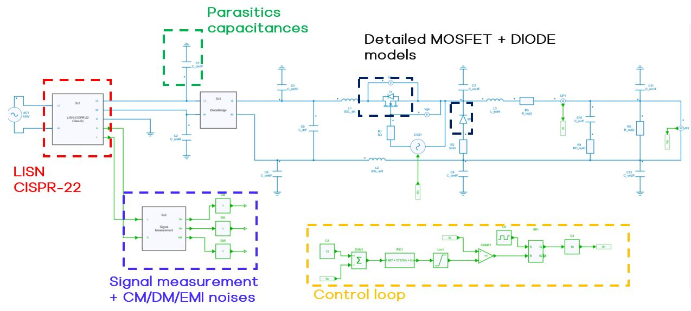
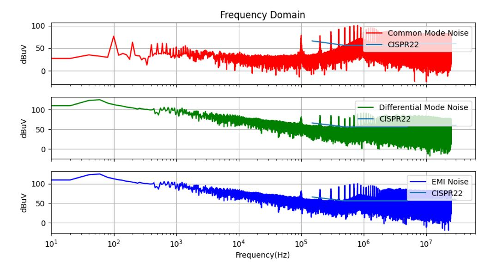
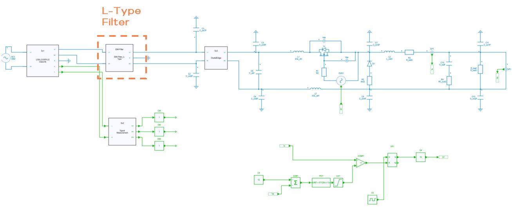
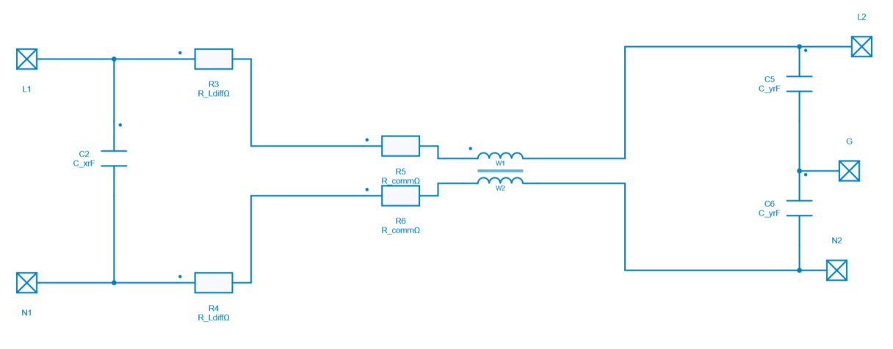
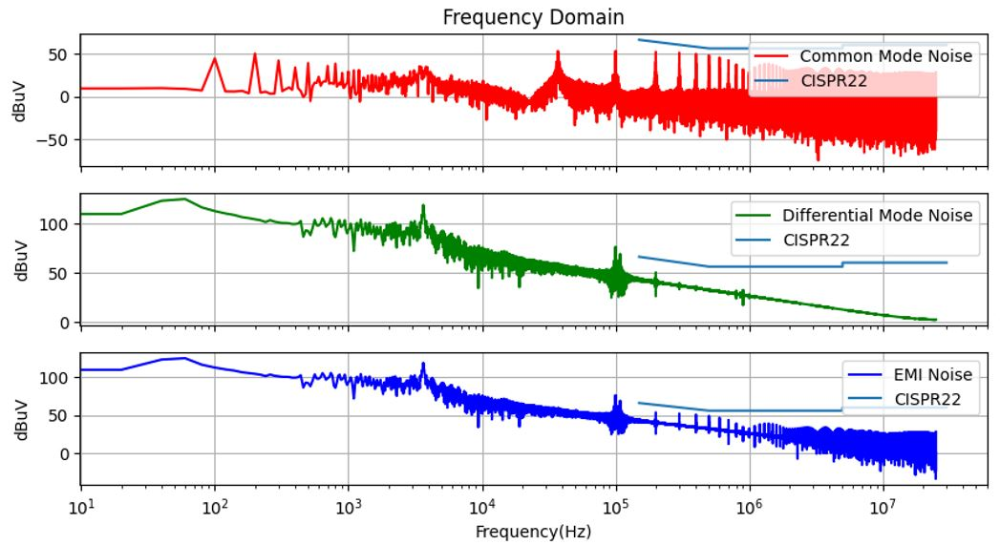

---
tags:
  - Python
  - EMI analysis
  - Converter Design
---

# EMI Analysis and Filter Design for a Buck Converter

[Download **Python notebook**](EMI_analysis.ipynb)

[Download **Simba Model**](Buck_EMI_Analysis.jsimba)

This python notebook example helps to understand how to run an EMI analysis and implement an EMI filter.

Two main causes are responsible for conducted EMI noises and are linked with the power semiconudcteor switchings:

* the $ \frac{di}{dt} $ coupled with parasitic inductances and ESR of input capacitors lead to DM (Differential mode noises).
* the $ \frac{dv}{dt} $ coupled with parasitic capacitances lead to CM (Common mode noises).

This example provides an EMI pre-compliance testing system including circuit models, parasitic capacitances, and circuit blocks essential for EMI analysis, such as EMI filter (L-type for example), Line Impedance Stabilization Network (LISN), and signal measurement block to extract CM/DM/EMI noises. 		 		

!!! tip "Important"
    Measurement of EMI noises has to be done within in accurate system.

SIMBA supports both system and device level simulation and can simulate detailed models of power semiconductor switches.

By combining a more realistic MOSFET behavior and EMI libraries, any user can go through any typical conducted EMI pre-compliance iteration steps of a power electronics converter product development cycle.

The power converter topology used for this example is a simple Buck with closed control loop operation.

## A- SIMBA circuit without EMI filter

Below the DC-DC power converter designed inside SIMBA Desktop for running EMI analysis.
This first project does not include the EMI filter because our initial goal is to measure CM & DM noises to compare with standard filter.

As we can see above some EMI blocks have been added for EMI testing such as:

* LISN model (CISPR-22 Class B)
* Signal measurement for calculating CM, DM and Total EMI noises.

The detailed models of mosfet and diode have been selected for having a realistic transient behavior.

Some parasitics capacitances have been added.

The voltage loop operation is realized by using a generic PID controller.

### Python code

The Python code used for EMI analysis without EMI filter performs these main steps:

* Open & Run the SIMBA Project
* Extract CM, DM & EMI noises
* Perform FFT calculations on CM, DM and EMI signals
* Scale the signals in dBµV (magnitude)
* Add the standard filter CISPR-22 values
* Plot the results of each noises on both Time & Frequency domain in dBuV
* Superimpose noises signals with CISPR-22 standard.

### First Conclusion

Below the result of the EMI analysis without any EMI filter in Frequency domain:

As we can see, the EMI noises in both CM & DM are above the maximum standard CISPR-22 values and therefore fail the testing cases.
The solution which can be proposed is to design an EMI filter to attenuate those noises.

## B- SIMBA circuit with EMI filter

The same DC-DC power converter designed above is reused but now an EMI - L Type filter has been added for running this new EMI analysis.
Finally CM & DM noises will also be compared with the same standard filter CISPR-22.

The L-Type EMI filter has been placed between the LISN and the BridgeDiode blocks.

This L-Type filter as shown below is composed of:

* a common mode choke,
* a Cx capacitance between the two input terminals (L1 and N1),
* Cy capacitances between each output terminal (L2 and N2) and the ground,
* Differential-Mode resistance.

Of course the values of each parameter could be tuned depending on the filter type and applications simulated.

### Python Code

The Python code used for this EMI analysis with EMI filter is the same as the previous one.
Only the design has changed becaused one L-Type filter has been added.

## Conclusion

Below the result of the EMI analysis with the EMI filter in Frequency domain:

As we can see, the EMI noises in both CM & DM are below the maximum standard CISPR-22 values and therefore pass the testing cases.
The solution proposed has worked perfectly and several other EMI filters could be tested as T-Type and Pi Type...