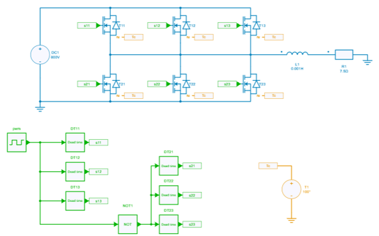
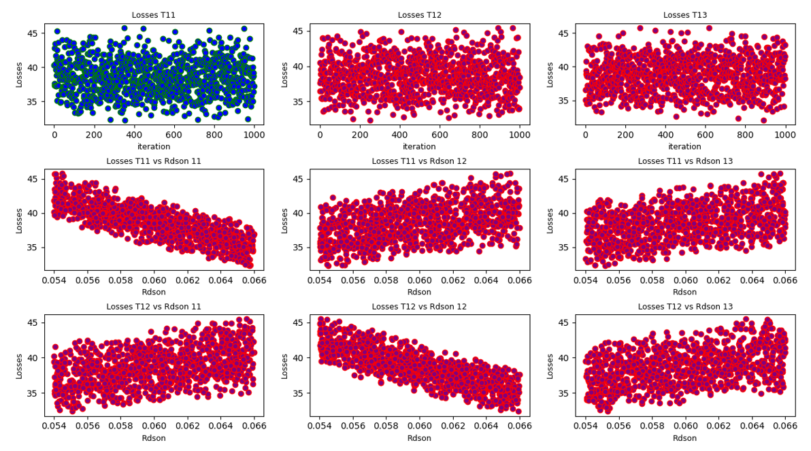

---
tags:
  - Python
  - Worst Case Analysis
---

# Monte Carlo Worst Case Analysis: parallel mosfets - evolution of losses and junction temperature

[Download **Python script**](parallel_mosfets_montecarlo_analysis.py)

[Download **Plot Python script**](parallel_mosfets_montecarlo_plot.py)

[Download **Simba Model**](parallel_mosfets_montecarlo_analysis.jsimba)


This python example performs a Monte Carlo Worst Case Analysis to evaluate the influence - between 3 parallel mosfets - of:

* the current distribution (through Rdson resistances),
* the gate resistance,

on their *losses* and on their *junction temperature*.


## Electrical and thermal model

The electrical model considered is shown below. The gate control signals can consider different dead times. In this example, their influence has not been evaluated.



The same thermal description has been associated to each mosfet and has been imported from Infineon XML file of the IMBG120R060M1H part number.

The main model parameters are the following:

* DC high voltage: 800 V
* Average load current: around 48 A
* Switching frequency: 50 kHz
* Case temperature: 100 °C


## Python script

This example performs an analysis with:

* 1000 iterations
* a variation of 10% of two elements for each power mosfet:
  - the on-resistance $R_{dson}$ with a nominal value of $\left(R_{dson}\right)_{nominal} = 60 ~m \Omega$
  - the gate resistance $R_g$ with a nominal value of $\left(R_{g}\right)_{nominal} = 20 ~\Omega$


```py
iterations = range(1000)
mosfet_index_list = ['11', '12', '13']
param = dict()
for mosfet_index in mosfet_index_list:
    param['Rdson'+ mosfet_index] = {'nominal': 60e-3, 'tolerance': 0.1}
    param['Rg'+ mosfet_index] = {'nominal': 20, 'tolerance': 0.1}
```

A great number of components can be added. The values for the components are distributed using uniform distribution with mean value as a nominal value and variance as the tolerance range.

To perform parallel simulations the multiprocessing library was loaded with *Manager* and *Pool* object.

```py
...
Manager = multiprocessing.Manager()
...
Pool = multiprocessing.Pool()
...
```

The results are then stored in a *.pkl* file through a dataframe and can then be used for different post-processing analysis or display.

```py
df = pd.DataFrame(res)
    script_folder = os.path.realpath(os.path.dirname(__file__))
    filename = "montecarlo_parallel_mosfets_" + datetime.now().strftime("%Y-%m-%d")
    df.to_pickle(os.path.join(script_folder, filename + ".pkl"))
```

## Example of Results

An example of result display is proposed in the [second python script](parallel_mosfets_montecarlo_plot.py).

The first row of figures shows the dispersion of losses between the three mosfets.

The second row shows the evolution of losses of the two first mosfets depending on each $R_{dson}$ resistance.


