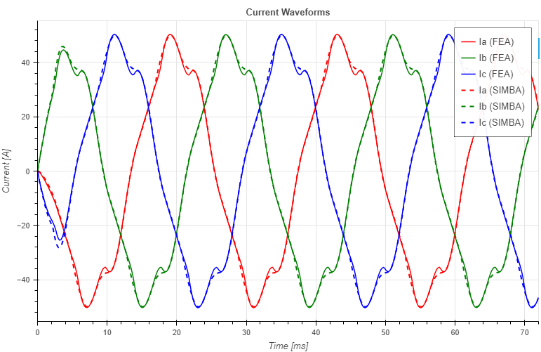

---
tags:
  - Python
  - JMAG
  - Benchmark
---

# JMAG-RT PMSM model validation

[Download **Python notebook**](jmag-rt_validation.ipynb)

[Download **Simba model**](jmag-rt_validation.jsimba)

[Download **JMAG-RT model**](data/20220613_SPMServo.rtt)

[Download **JMAG results (torque & current)**](data/torque_current_jmag.csv)

This example shows the validation of the JMAG-RT lookup table model by comparing simulation results from JMAG FEA software with SIMBA. This readme only shows main elements of this example. To get more details, the python notebook can be opened.

## JMAG-RT Model

The model incorporates key parameters such as Flux, Torque, Advance Angle, and Rotor Angle, which are essential in simulating spatial harmonics and non-linearities and thus to reflect different motor behaviors such as torque ripple or magnetic saturation.

## Simulation circuit

In order to focus solely on the comparison of the model and not take into account other factors, like control etc., a very simple circuit was used:

The circuit consists of a JMAG-RT PMSM motor fed directly from an ideal three-phase voltage source. The motor is connected to a load that imposes a constant speed of 500 rpm.

!!! info "Info"
    To run the circuit simulation, please the change the path of the .rtt file in the SIMBA design.

## Results & Conclusion

The current waveforms obtained from the FEA software and SIMBA are shown below.

In the current waveform, it is observed that despite an ideal sinusoidal voltage input to the PMSM, the current waveform exhibits non-sinusoidal behavior.

# Conclusion

The validation above demonstrates that the simulation results of the JMAG-RT motor model match those obtained with the FEA software, thus confirming the accuracy of the PMSM model in SIMBA. Additionally, the JMAG-RT motor model demonstrates enhanced fidelity by accurately capturing realistic phenomena, including spatial harmonics, providing a more comprehensive representation of motor behavior.