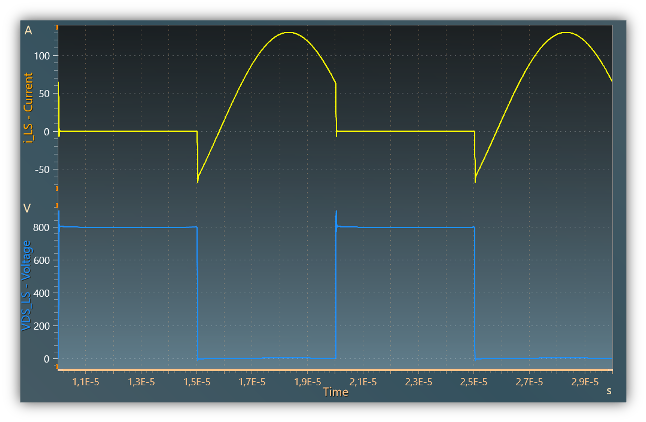
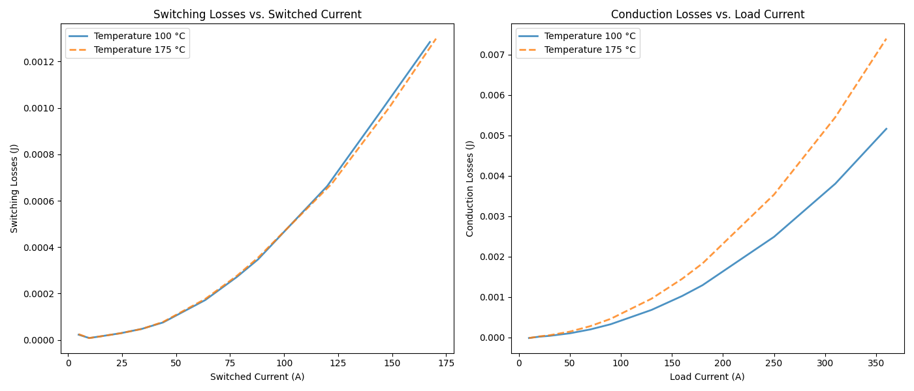
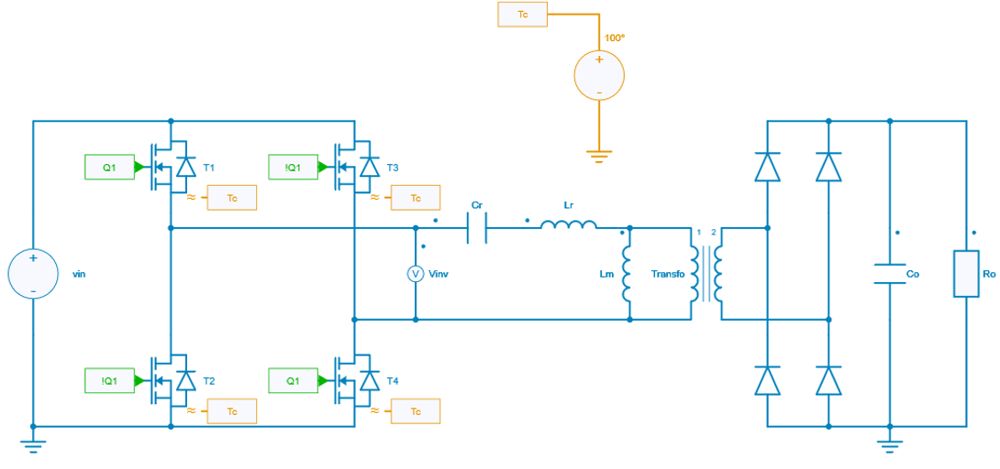

---
tags:
  - Python
  - DC-AC
  - Power Supplies
  - Thermal
  - Spice
  - Parallel Computing
---

### Python Script Overview

Download the Python scripts:

[Download **python script for generating loss data**](1_custom_thermal_data_generation.py)

[Download **python script for loading thermal data**](2_custom_thermal_data_load.py)

[Download **Simba model (ZVS Characterization)**](zvs_characterization_infineonIMBG120R008M2H.jsimba)

[Download **Simba model (LLC Full Bridge)**](LLC_full_bridge.jsimba)

# Custom Loss Data Generation in ZVS Operation Mode

## Overview

In this example, we demonstrate the use of **SIMBA** to generate custom power switch loss data under Zero Voltage Switching (ZVS) operation mode using the manufacturer's SPICE model. This example is based on the keynote presented at the [SIMBA 2024 Power Electronics Conference](https://simba.io/conference_2024), where we explored the thermal and switching loss behaviors of power devices in soft-switching conditions taking advantage of several capabilities of SIMBA: 

- Compatibility with semiconductor **SPICE** models from manufacturers for highly accurate results  
- Support for **Thermal Description Files (*.xml)** provided by manufacturers, enabling ultra-fast simulations  
- Capability to run parallel simulations and configure parametric studies using **Python scripts**

## Context

During the early-stage design phase of power electronic systems, it's crucial to have system-level models that simulate quickly to allow for exploration across multiple domains such as magnetics, control systems, and thermal management. Detailed SPICE models of power switches, while accurate, are often too time-consuming for these early-stage simulations. As a result, engineers typically use idealized switch models combined with loss data tables derived from manufacturer datasheets.

However, manufacturer-provided loss data may not be suitable or available for all operation modes, especially in conditions different from standard double pulse tests (DPT). This poses a challenge when we need to evaluate power switch losses under custom operation modes, such as when:

- The complementary switch differs from the one used in the DPT, affecting recovery losses at turn-on.
- Parasitic elements of the PCB or busbar, like the leakage inductance of the switching loop, significantly impact switching losses.
- Operating under ZVS conditions, as in Dual Active Bridge (DAB) or LLC converter topologies, where turn-off losses are overestimated using standard DPT data.

## Objective

To address this challenge, we aim to generate custom loss data for power switches operating under ZVS conditions using the manufacturer's SPICE model and SIMBA's simulation capabilities.

## Methodology

### 1. Custom loss data generation

- **Circuit Description**:
    - A switching leg to an AC current source lagging the voltage, simulating ZVS conditions.
    - Both high-side and low-side switches are implemented using the manufacturer's detailed SPICE model (Infineon SiC 1200V Mosfet IMBG120R008M2H)

*Figure 1: Schematic of the circuit used for ZVS loss characterization.*

- **Parameters**:
    - Temperatures: $T = \{100^\circ\,\mathrm{C},\ 175^\circ\,\mathrm{C}\}$
    - Load Currents: From 10 A to 360 A
    - Switching Frequencies: $f_1 = 100\,\mathrm{kHz},\ f_2 = 200\,\mathrm{kHz}$

- **Simulation Process**:
    1. For each temperature and load current, run simulations at $f_1$ and $f_2$.
    2. Extract voltage (Vds) and current (Id) waveforms.
    3. Compute total energy losses using numerical integration of the instantaneous power.
    4. Save results into a human readable text file

*Figure 2: MOSFET voltage and Current waveforms*

- **Two-Frequency Method for Loss Separation**: to separate conduction and switching losses, we use the two-frequency method:
    1. **Assumption**:
         - Conduction losses are independent of switching frequency, while switching losses are directly proportional to the switching frequency.
         - Junction temperature variation is small enough to be considered as constant during these few switching periods (1 at 100 kHz and 2 at 200 kHz).
    2. **Procedure**:
         - Run simulations at two different switching frequencies (e.g., $f_1$ and $f_2 = 2f_1$).
         - Measure the total energy losses $E_{\text{total},1}$ and $E_{\text{total},2}$ at these frequencies.
    3. **Calculations**:
        - Switching Losses per Cycle:
  
            $$E_{\text{sw}} = \frac{E_{\text{total},2} - E_{\text{total},1}}{f_2 - f_1}$$

        - Conduction Losses per Cycle:
        
            $$E_{\text{cond}} = \frac{f_2 E_{\text{total},1} - f_1 E_{\text{total},2}}{f_2 - f_1}$$

        - For $f_2 = 2f_1$, these simplify to:

            $$E_{\text{sw}} = E_{\text{total},2} - E_{\text{total},1}$$

            $$E_{\text{cond}} = 2E_{\text{total},1} - E_{\text{total},2}$$

*Figure 3: Generated Thermal Data.*

!!! note
    It takes less than 1 minute, on a 10 cores laptop to generate the thermal data.

!!! info "Observations"
    - *Reduced Losses*: The switching losses under ZVS conditions are significantly lower than those provided in the manufacturer's datasheet, which are based on hard-switching DPTs.
    - *Temperature Dependency*: As temperature increases, the switching losses slightly increase due to changes in device characteristics.

### 2. Custom loss data Loading and Simulation

The generated thermal data are then loaded into a LLC Full-Bridge converter model. 

*Figure 4: Schematic of the LLC full-bridge converter using the generated thermal data.*

*Figure 5: Current through the resonant inductor (yellow) and instantaneous conduction losses (blue) in the LLC converter.*

*Figure 6: Comparison of switching energy calculated using the manufacturer's thermal model (orange) versus custom-generated thermal data (green).*

## Conclusion

This example demonstrates how SIMBA can be used to generate custom loss data for power devices operating under ZVS conditions, leading to more accurate thermal analyses and efficient simulations during the design phase.
