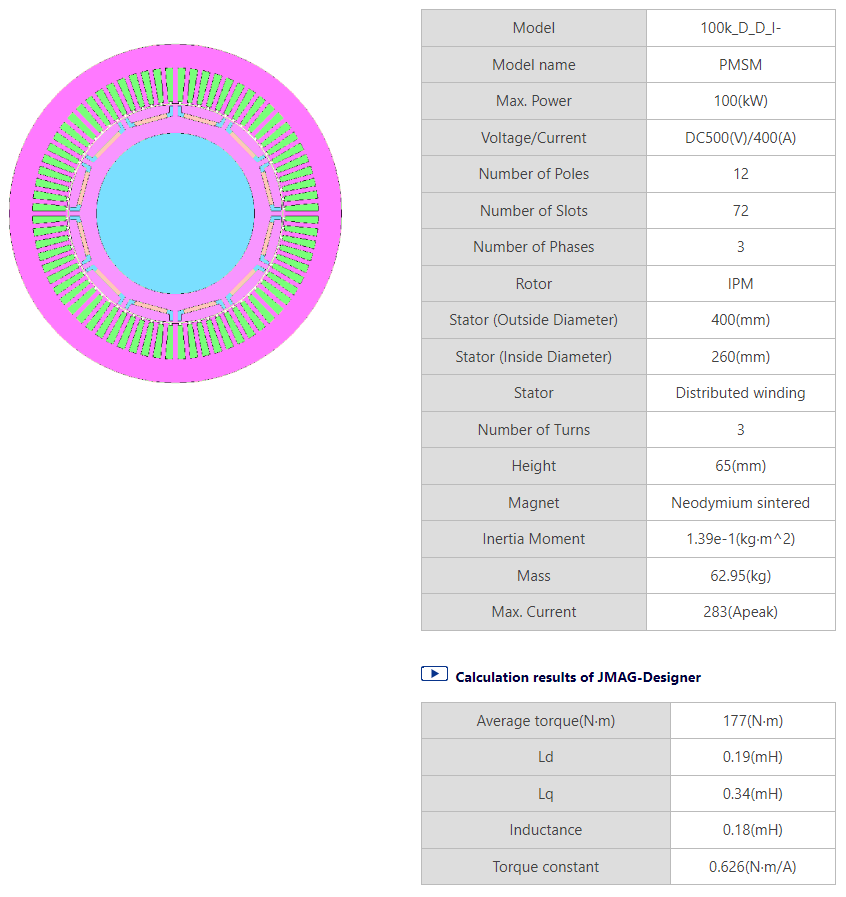

---
tags:
  - Python
  - Motor Drives
  - Parameter Sweep
  - JMAG
---

# Efficiency map of a motor drive inverter

[Download **python script for simulation**](drive_map.py)

[Download **python script for displaying results**](drive_map_plot.py)

[Download **Simba model**](drive_map.jsimba)

[Download **Python Library requirements**](requirements.txt)

[Download **JMAG motor**](100k_D_D_I-.rtt)


## Motor drive inverter model

### Inverter & motor model in SIMBA

The motor drive inverter model consists of a 3-phase 2-level voltage source inverter (VSI) that supplies a JMAG permanent magnet synchronous motor (PMSM). The PMSM is connected to a load that imposes a constant speed, meaning that the motor must be able to produce enough torque to maintain the desired speed.


The PMSM model used for this simulation is directly extracted from [JMAG website](https://www.jmag-international.com/) and can be downloaded [here](https://www.jmag-international.com/modellibrary/032/).

JMAG has the capability to provide real accurate machine model data by the use of **.RTT** file. Thus any JMAG users can extract **.RTT** file and implement a complete drive system in SIMBA.

As SIMBA is compatible with JMAG **PMSM_RTT** file, therfore accurate simulation can be done easily by combining SIMBA solver, thermal & detailed semiconductor models and real motor behavior (**.RTT** file).

Below the motor specifications:



### Control

PMSMs have a strong coupling between the d- and q-axis currents, so a decoupling network is required to linearise and remove the coupling effect. The control system consists of two PI controllers and a decoupling network. The calculated reference voltages are fed into the sinusoidal PWM modulator to generate voltage signals for  the motor windings. The duty cycle of the PWM signal determines the magnitude of the voltage applied to the motor.


It is important to say that the PWM modulator circuits includes also a **space vector modulation** block.


### Thermal modeling

To model the thermal performance of MOSFETs in an inverter, their package temperature is held constant and data is extracted from the **.xml** files provided by the manufacturer. This data, which includes parameters such as thermal impedance, conduction losses and switching losses, plays a crucial role in determining the power dissipation during operation. In this particular case, Wolfspeed **CAB006M12GM3** mosfets were used and can be downloaded [here](https://assets.wolfspeed.com/uploads/2023/05/Wolfspeed_CAB006M12GM3_data_sheet.pdf).


## Python script

This script uses the architecture presented in the tutorial *Parallel (multiprocessing) computing* and also available on [Github repository](https://github.com/aesim-tech/simba-python-examples/tree/main/05.%20Parallel%20Parameter%20Sweep)).

Its primary objective is to run simulations at various operating points, such as different torque and speed levels, to obtain power switch losses in steady-state and generate an efficiency map and calculate losses of the inverter, motor and complete drive.
To achieve this, the script uses the multiprocessing library in Python, which allows multiple simulations to be run in parallel, increasing simulation speed and efficiency.

```py
import multiprocessing
from tqdm import tqdm
```

### Id, Iq current references calculation

Current references are calculated using MTPA (Maximum Torque Per Ampere) and FW (Flux Weakening) algorithm according to the targeted operation point. The function `SelectIdIq()` takes in current and speed references, and returns a boolean value indicating whether the Id and Iq references were successfully calculated or not.

### Operating points

The efficiency of the motor is calculated with the use of function `run_simulation()` for each current and speed reference defined as: 

```py 
speed_refs = numpy.arange(min_speed_ref, max_speed_ref, (max_speed_ref - min_speed_ref)/number_of_speed_points)
current_refs = numpy.arange(min_current_ref, max_current_ref, (max_current_ref - min_current_ref)/number_of_current_points)
``` 
where the maximum speed and current references are defined by user with  `max_speed_ref` and `max_current_ref` variables.

### Multiprocessing

```py
manager = multiprocessing.Manager()
result_dict = manager.dict()
```

The code creates a multiprocessing manager and a dictionary called `result_dict` that will be used to store the results of the simulation. 

```py
for current_ref in current_refs:
        for speed_ref in speed_refs:
            
            ref_idiq = [0.0, 0.0]
            ret = SelectIdIq(ref_idiq, current_ref, speed_ref)
            
            if ret == True:
                pool_args.append((ref_idiq[0], ref_idiq[1], speed_ref, case_temperature, Rg,  i, result_dict, lock));
                i=i+1
```

The code loops through each combination of current and speed references and executes a `SelectIdIq()` function to get the desired current reference values. The computed values are added to the `pool_args` if the function returns True.

```py
pool = multiprocessing.Pool()
for _ in tqdm(pool.imap(run_simulation_star, pool_args), total=len(pool_args)):
    pass
```

The code creates a processing pool using `multiprocessing.Pool()` and starts the simulation using `pool.imap(run_simulation_star, pool_args)`. The `tqdm()` function is used to display a progress bar for the simulation.

```py
for i in result_dict.items():
    inverter_losses.append(i[1][0])
    motor_losses.append(i[1][1])
    t.append(i[1][2])
    s.append(i[1][3])
    e.append(i[1][4])
    input_power.append(i[1][5])
    Pout.append(i[1][6])
inverter_losses = numpy.array(inverter_losses)
motor_losses = numpy.array(motor_losses)
input_power = numpy.array(input_power)
Pout =  numpy.array(Pout)
t = numpy.array(t)
s = numpy.array(s)
e = numpy.array(e)
current_folder = os.path.dirname(os.path.abspath(__file__))
numpy.savetxt(os.path.join(current_folder, "results/inverter_losses.txt"), inverter_losses)
numpy.savetxt(os.path.join(current_folder,"results/motor_losses.txt"), motor_losses)
numpy.savetxt(os.path.join(current_folder,"results/input_power.txt"), input_power)
numpy.savetxt(os.path.join(current_folder,"results/torque.txt"), t)
numpy.savetxt(os.path.join(current_folder,"results/speed.txt"), s)
numpy.savetxt(os.path.join(current_folder,"results/efficiency.txt"), e)
numpy.savetxt(os.path.join(current_folder,"results/Pout.txt"), Pout)

```

After the simulation is complete, the code extracts the results from `result_dict`, stores them in arrays t, s, e, inverter_losses, motor_losses, input_power, Pout and 
save all those data in several **.txt** files from a folder named **results**.

The needed python scripts allowing to run the complete simulation is named **drive_map.py**.

Later we will re use those datas to create a heatmap plot using the `show_heatmap()` function.

```py
show_heatmap(fig, axs[0, 0], s, t, e, "Speed [RPM]", "Torque [N.m]", "Drive Efficiency (inverter + motor) [%])", "RdYlGn")
show_heatmap(fig, axs[0, 1], s, t, (inverter_losses + motor_losses), "Speed [RPM]", "Torque [N.m]", "Drive Losses (inverter + motor) [W])", "coolwarm")
show_heatmap(fig, axs[1, 0], s, t, inverter_losses, "Speed [RPM]", "Torque [N.m]", "Inverter Losses [W])", "coolwarm")
show_heatmap(fig, axs[1, 1], s, t, motor_losses, "Speed [RPM]", "Torque [N.m]", "Motor Losses [W])", "coolwarm")
show_heatmap(fig, axs[2, 0], s, t, efficiency_inverter, "Speed [RPM]", "Torque [N.m]", "Inverter Efficiency [%])", "RdYlGn")
show_heatmap(fig, axs[2, 1], s, t, efficiency_motor, "Speed [RPM]", "Torque [N.m]", "Motor Efficiency [%])", "RdYlGn")
```
The python script for displaying results is the one named **drive_map_plot.py**


## Efficiency & losses

The efficiency calculation is done by using mathematical formulas:

### Drive efficiency:

$$\eta_{drive} = 1 - \frac{Loss_{inverter} + Loss_{motor}}{Loss_{inverter} + Loss_{motor} + P_{input}}$$


### Inverter efficiency:

$$\eta_{inverter} = 1 - \frac{Loss_{inverter}}{Loss_{inverter} + P_{input}}$$


### Motor efficiency:

$$\eta_{motor} = 1 - \frac{P_{motor}}{Loss_{motor} + P_{out}}$$


## Results

The efficiency map was generated for a total of 225 speed / torque targets using the following simulation parameters: 

```py
case_temperature = 80           # Case temperature [Celsius]
Rg = 4.5                         # Gate resistance [Ohm]
switching_frequency = 50000     # Switching Frequency [Hz]
bus_voltage = 500              # Bus Voltage [V]
max_speed_ref = 4000            # [RPM]
max_current_ref = 100            # [A]

number_of_speed_points = 15     # Total number of simulations is number_of_speed_points * number_of_current_points
number_of_current_points = 15   # Total number of simulations is number_of_speed_points * number_of_current_points
relative_minimum_speed = 0.2    # fraction of max_speed_ref
relative_minimum_current = 0.2  # fraction of max_torque_ref
simulation_time = 0.5             # time simulated in each run

# Get motor parameters from Simba file
current_folder = os.path.dirname(os.path.abspath(__file__))
project = ProjectRepository(os.path.join(current_folder , "wolfspeed_evaluation.jsimba"))
simba_full_design = project.GetDesignByName('Design')
Ld_H = float(simba_full_design.Circuit.GetVariableValue("Ld"))
Lq_H = float(simba_full_design.Circuit.GetVariableValue("Lq"))
PM_Wb = float(simba_full_design.Circuit.GetVariableValue("Phi_mag"))
NPP = float(simba_full_design.Circuit.GetVariableValue("NPP"))
```
Each run took approximately less than one minute, and thanks to the use of the Python multiprocessing library, all cases were run in parallel, resulting in a total run time of 2h21 minutes on a 4-core CPU by using a real motor model from (JMAG .rtt file) + thermal mosfets (.xml datas). 


The resulting efficiency map + losses of the inverter, motor and complete drive is shown below:

