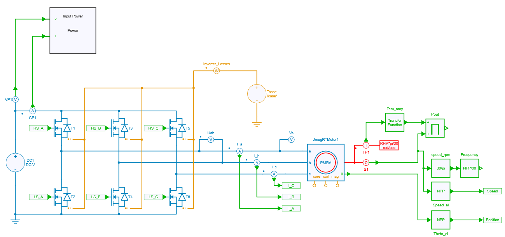
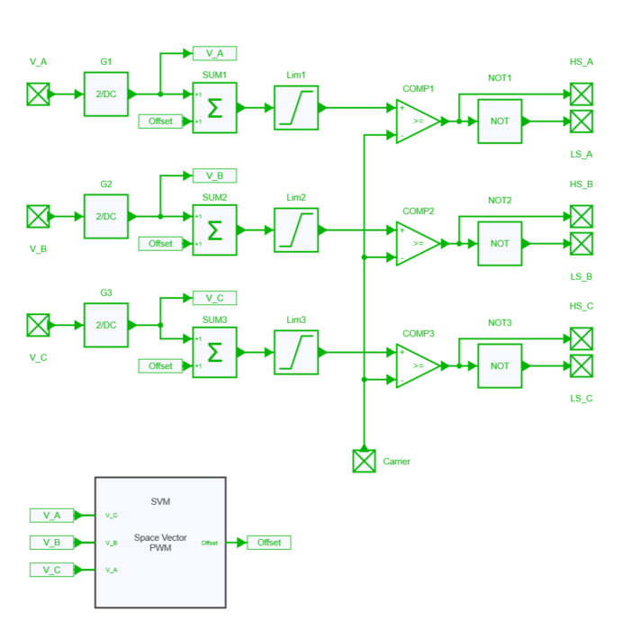
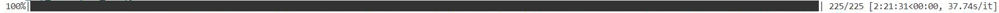
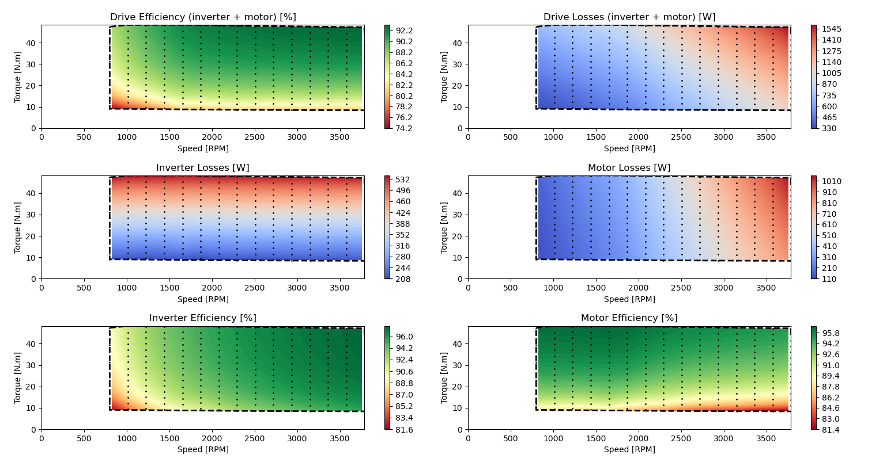

---
tags:
  - Python
  - Motor Drives
  - Parameter Sweep
  - JMAG
---

# Efficiency map of a motor drive inverter

[Download **python script for simulation**](efficiency_map_inverter_jmag.py)

[Download **python script for displaying results**](efficiency_map_inverter_jmag_plot.py)

[Download **Simba model**](efficiency_map_inverter_jmag.jsimba)

[Download **Python Library requirements**](requirements.txt)

[Download **JMAG motor**](100k_D_D_I-.rtt)


## Motor drive inverter model

### Inverter & motor model in SIMBA

The motor drive inverter model consists of a 3-phase 2-level voltage source inverter (VSI) that supplies a JMAG permanent magnet synchronous motor (PMSM). The PMSM is connected to a load that imposes a constant speed, meaning that the motor must be able to produce enough torque to maintain the desired speed.



!!! info
    For detailed specifications of the motor, refer to [JSOL website](https://www.jmag-international.com/modellibrary/032/), where the PMSM model used for this simulation has been directly extracted. JMAG has the capability to provide real accurate machine model data by the use of **.RTT** file. Thus any JMAG user can extract **.RTT** file and implement a complete drive system in SIMBA. These specifications are summarized below:

| Motor specifications | |
|---|---|
| Model | 100k_D_D-I |
| Model Name | PMSM |
| Max. Power | 100 kW |
| DC Voltage | 500 V |
| RMS Current | 400 A |
| Number of Poles | 12 |
| Number of Slots | 72 |
| Number of Phases | 3 |
| Rotor | IPM |
| Stator (Outside Diameter) | 400 mm |
| Rotor (Outside Diameter) | 260 mm |
| Number of Turns | 3 |
| Height | 65 mm |
| Magnet | Neodymium sintered |
| Inertia Moment | 1.39e-1 kg / m² |
| Mass | 62.95 kg |
| Max. Current | 283 A |


| Calculation Results | JMAG Designer |
|---|---|
| Average torque | 177 N.m |
| Ld | 0.19 mH |
| Lq | 0.34 mH |
| Inductance | 0.18 mH |
| Torque Constant | 0.626 N.m / A |


### Control

A DQ control has been implemented (described in [another example](../13. Inverter Efficiency Map/readme.md) which proposes this same principle of getting an inverter efficiency map but with an ideal PMSM).


Yet, the modulation strategy considered here is a "carrier-based" space vector modulation (or MIN-MAX modulation).



### Thermal modeling

To model the thermal performance of MOSFETs in an inverter, their package temperature is held constant and data is extracted from the **.xml** files provided by the manufacturer. In this particular case, Wolfspeed **CAB006M12GM3** mosfets were used and can be downloaded [here](https://assets.wolfspeed.com/uploads/2023/05/Wolfspeed_CAB006M12GM3_data_sheet.pdf).


## Python script

The first python script named [`efficiency_map_inverter_jmag.py`](efficiency_map_inverter_jmag.py) uses the same architecture as in [this example](../13. Inverter Efficiency Map/readme.md), which also uses the architecture presented in the tutorial *Parallel (multiprocessing) computing* and also available on [Github repository](https://github.com/aesim-tech/simba-python-examples/tree/main/05.%20Parallel%20Parameter%20Sweep)).

Its primary objective is to run simulations at various operating points, such as different torque and speed levels, to obtain the losses of the drive in steady-state and generate an efficiency map. Yet, in this example the motor losses are also obtained thanks to the JMAG-RT model.

The second python script named [`efficiency_map_inverter_jmag_plot.py`](efficiency_map_inverter_jmag_plot.py) computes the inverter, the motor and the global efficiencies as described below and plots heatmaps of these losses and effiencies.


### Drive efficiency:

$$\eta_{drive} = 1 - \frac{Loss_{inverter} + Loss_{motor}}{Loss_{inverter} + Loss_{motor} + P_{input}}$$


### Inverter efficiency:

$$\eta_{inverter} = 1 - \frac{Loss_{inverter}}{Loss_{inverter} + P_{input}}$$


### Motor efficiency:

$$\eta_{motor} = 1 - \frac{P_{motor}}{Loss_{motor} + P_{out}}$$


## Results

The efficiency map was generated for a total of 225 speed / torque targets using the following simulation parameters: 

```py
case_temperature = 80           # Case temperature [Celsius]
Rg = 4.5                        # Gate resistance [Ohm]
switching_frequency = 50000     # Switching Frequency [Hz]
bus_voltage = 500               # Bus Voltage [V]
max_speed_ref = 4000            # [RPM]
max_current_ref = 100           # [A]

number_of_speed_points = 15     # Total number of simulations is number_of_speed_points * number_of_current_points
number_of_current_points = 15   # Total number of simulations is number_of_speed_points * number_of_current_points
relative_minimum_speed = 0.2    # fraction of max_speed_ref
relative_minimum_current = 0.2  # fraction of max_torque_ref
simulation_time = 0.5           # time simulated in each run
```
Each run took approximately less than one minute, and thanks to the use of the Python multiprocessing library, all cases were run in parallel, resulting in a total run time of 2h21 minutes on a 4-core CPU. 



The figure below shows the resulting efficiency and loss map of the inverter, the motor and the global drive system:


