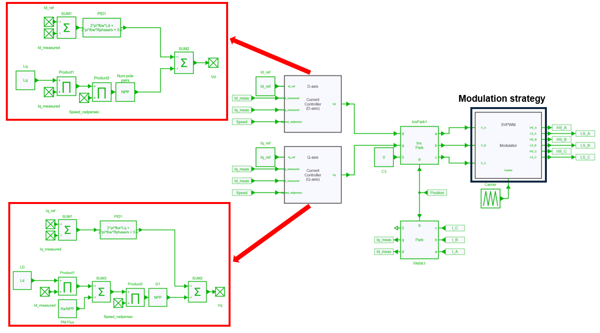

---
tags:
  - Python
  - Motor Drives
  - Thermal
  - JMAG
  - Control
---

# Modulation Strategies of a Motor Drive Inverter (including JMAG-RT model)

[Download **python script for simulation**](modulation_strategies_motor_drive.py)

[Download **python script for plotting**](modulation_strategies_motor_drive_plot.py)

[Download **Simba model**](modulation_strategies_motor_drive.jsimba)

[Download **Python Library requirements**](requirements.txt)

[Download **JMAG motor**](withHF_4000rpm20Nm.rtt)

## Motor drive inverter model

### Inverter & motor model in SIMBA

The motor drive inverter model consists of a 3-phase 2-level voltage source inverter (VSI) that supplies a JMAG interior permanent magnet synchronous motor (IPMSM). The IPMSM is connected to a load that imposes a constant speed, meaning that the motor must be able to produce enough torque to maintain the desired speed.

!!! info
    JMAG has the capability to provide real accurate machine model data by the use of **.RTT** file. Thus any JMAG user can extract **.RTT** file and implement a complete drive system in SIMBA. 
    For more information about JMAG-RT, refer to [JSOL website](https://www.jmag-international.com/products/jmag-rt/). 
    IPMSM's specifications are summarized below:

| Motor specifications | |
|---|---|
| Model | withHF_4000rpm20Nm |
| Model Name | IPMSM |
| Max. Power Output | 80 kW |         
| DC Voltage | 600 V |
| Max. Current | 250 A |
| Number of Poles | 8 |
| Number of Slots | 48 |
| Core material | 35JA300 |
| Magnet | NdFeB, Br=1.2 (T)  |

### Control

A DQ control has been implemented (described in [another example](../13. Inverter Efficiency Map/readme.md) allowing to realize the closed control loop for driving the motor drive inverter.

#### Modulation strategy

Several modulation strategies have been considered in this example. In fact, this example is intended to use different modulation strategies and compare the losses of both inverter (conduction and switching losses) and motor (iron and copper losses). Of course, different switching frequencies will be used (20, 40 and 60 kHz). Thefore, a relation between frequency and modulation strategy can be easily highlighted. 

In this traction motor drive system, 3 modulation strategies will be used:

* SVPWM: a "carrier-based" Space Vector PWM (also known as MIN-MAX modulation)
* SPVM: Sinus PWM
* DPWM: Discontinuous PWM

When opening the SIMBA project **"modulation_strategies_motor_drive.jsimba"** 3 designs have been created representing each **modulation strategy** mentionned above.

**SVPWM**

This modulation strategy offers a similar pattern as the space vector modulation and can be shown as a triangle-intersection or carrier-based implementation of the conventional Space vector modulation.

It is also known as the MIN MAX modulation strategy.

**SPWM**

This Sine modulation (Sine PWM) is probably the simplest modulation strategy whereas the maximum modulation index is equal to 1.

**DPWM**

In DPWM modulation the phase leg is clamped 30° symmetricaly from maximal voltage. This method has low harmonic distortion characteristics.

!!! info
    An existing example is already available for modulation strategies description [here](https://aesim-tech.github.io/simba-technical-resources/03-AdvancedExamples/08-ModulationStrategies/modulation_strategies.html)  

### Thermal modeling

To model the thermal performance of MOSFETs in an inverter, their package temperature is held constant and data is extracted from the **.xml** files provided by the manufacturer. In this particular case, Wolfspeed **CAB006M12GM3** mosfets were used and can be downloaded [here](https://assets.wolfspeed.com/uploads/2023/05/Wolfspeed_CAB006M12GM3_data_sheet.pdf).

## Python script

The python script named [`modulation_strategies_motor_drive.py`](modulation_strategies_motor_drive.py) is used to perform simulations for various operating points and switching frequencies and finally display the losses according to each different scenario. 

Let's consider the operating points mentionned below for performing the simulation:

The python script aims to run a simulation at those 2 operating points, with different speed and torque levels (induced by different Id and Iq values).

Two loops have been considered into the script:

* one **Speed** loop to drive the motor at 2000 and 4000 rpm
* one **Frequency** loop (nested in the Speed loop) to modify the switching frequency at 20, 40 and 60 kHz.

The final goal is to obtain the losses of the complete drive (motor + inverter) in steady-state, plot and compare them for different modulation strategies and operating points. 

In this example the motor losses are obtained thanks to the JMAG-RT model.

## Results

A second python script is available to display results. A first figure shows results displayed as bargraphs as shown below:

When comparing these figures, several conclusions can be provided such as:

At operating point B (high load & load speed: Torque = 250 N.m and Speed = 2000 rpm):

* device conduction losses & and especially copper losses become dominant,
* increasing the switching frequency between 20 and 60 kHz leads to higher losses of the overall system (mainly due to device switching losses)

At operating point D (low load & high speed: Torque = 20 N.m and Speed = 4000 rpm):

* iron losses become dominant,
* increasing the switching frequency between 20 and 60 kHz leads to lower losses of the entire system (mainly due to motor iron losses which decrease as the current ripple decreases)

For each operating points, **SVPWM** and **SPWM** provide very close results.

A combination of **SIMBA** and **JMAG-RT** leads detailed and fast **loss evaluation** of the entire **drive system**.
