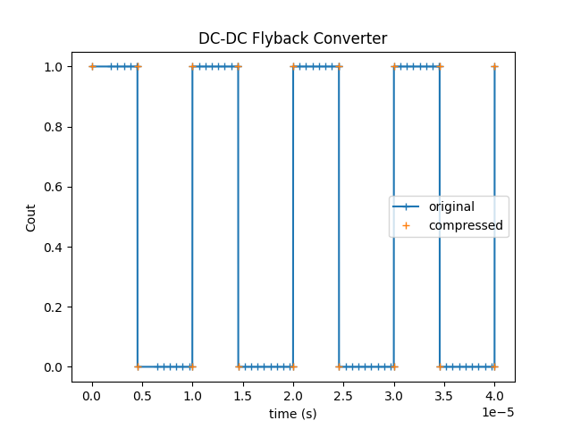

---
tags:
  - Python
  - Basics
---

# Enable and use the compress scopes feature

[Download **python script**](compress_scopes.py)

This example demonstrates how to enable and use the compress scopes feature introduced in the 24.05 release.

The circuit model used in this example is a flyback converter, which is directly loaded from the collection of design examples.


The main steps of this example are as follows:


## Load Module, Project, and Design Example

This requires *aesim.simba version 2024.05 or higher*. Additionally, `matplotlib.pyplot` can be imported to view the curves and results.

## Add a scope to the control square source

An output control probe is added to C1:

```py
C1 = flybackConverter.Circuit.GetDeviceByName("C1")
for s in C1.Scopes: s.Enabled = True
```

## Run simulation and plot signals without the compression, then activate the compression and rerun the simulation


Activate the scope compression:

```py
flybackConverter.TransientAnalysis.CompressScopes = True
```

When the scope compression is enabled, the job `TimePoints` vector is empty. Each signal has its own `TimePoints` vector:

```py
Cout_signal = job2.GetSignalByName('C1 - Out')
Cout_with_compression = Cout_signal.DataPoints
t_with_compression = Cout_signal.TimePoints
```

!!! note
    The control scope Cout does not have the same size (number of points) with and without the compression.

```
len(Cout_without_compression): 25981
len(Cout_with_compression): 81
```

```py Cout_signal.TimePoints``` is the same as ```py job1.TimePoints``` when the scope compression is disabled.

!!! note
    As the scopes have different sizes, they cannot be plotted with the same time vector, and the current vector **job.TimePoints** cannot be used to plot the compressed signal.

Results are shown below: 


