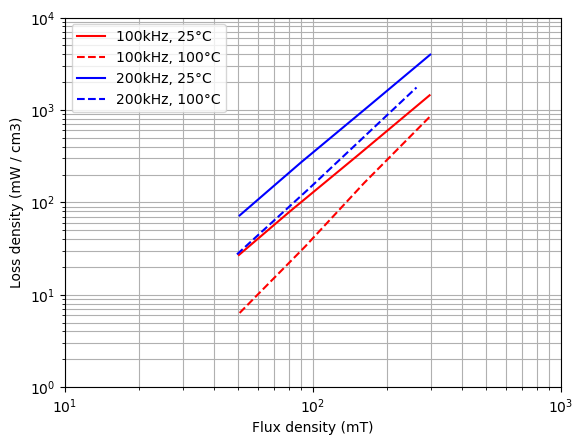

---
tags:
  - Python
  - Power Supplies
  - Thermal
  - Magnetics
  - Converter Design
---

# Loss Evaluation in a Dual Active Bridge (DAB) Converter

[Download **python script**](dual_active_bridge_ti.py)

[Download **Simba model**](dual_active_bridge_ti.jsimba)

This example shows a Dual Active Bridge (DAB) Converter for typical applications of bidirectional chargers. It is extracted from a design guide of Texas Instruments [^1].

* DC primary voltage range: 700 - 800 (nominal) V
* DC secondary voltage range: 250 - 500 (nominal) V
* Power transferred at secondary: 10 kW maximum
* PWM frequency: $F_{sw}$ = 100 kHz

According to the power transfer relation of the DAB:

$$P = \frac{N_{pri}}{N_{sec}} \times \frac{V_{pri} V_{sec} \varphi (\pi - |\varphi|)}{2\pi^2 F_{sw} L}$$

The operation point based on nominal voltage values and maximum power leads to a phase shift of 23°.

## Simba model

The simba model of this DAB converter is shown below:

### Power semiconductor switches

The power semiconductor switches used are SiC mosfets from Wolfspeed. The references are respectively C3M0075120K for primary switches and C3M0030090K for secondary switches.

Dead time values of 100 ns for the turn-on have been considered.

A constant case temperature of 100°C has been considered.

### HF transformer

The 10 kW transformer is a planar transformer with an integrated inductor. It is a design from Payton with following data:

* Max output power: 10 kW
* Max input voltage: 800 V
* Max output voltage: 500 V
* Total Leakage inductor: 35 µH
* Typical phase shift (to get 10 kW with the voltage parameters above): 23°
* DC primary resistor: 43 + 23 mΩ
* DC secondary resistor: 16 mΩ
* Number of turns at primary side: 24
* Number of turns at secondary side: 15 

The design of this DAB converter originally included DC-blocking capacitors of 7.2 µF at both sides of the transformers to avoid saturation of the transformer in case of unbalanced currents (especially during start-up or load transients). These capacitors have not been considered in the Simba model.
 
A magnetic or electrical model of this transformer can be considered, with following parameters:

* magnetic material: DMR44,
* initial permeability: $\mu_i$ = 2400,
* magnetic path length: $Le$ = 0.112 m,
* magnetic core section: $Ac$ = 0.000516 m².

The figure below shows 4 graphs of permeability which helps considering an effective permeability $µ_e(T,f,B)$ for the operation point:

1. initial permeability $µ_i$ vs temperature: it shows a value of 2400 for 25°C and above 4000 for 100°C,
2. real and imaginery permeabilities $µ'$ and $µ''$ vs frequency (kHz): it shows a value of 2400 for $µ'$ and 100 kHz,
3. flux density $B$ (mT) vs magnetic field $H$ (A/m): it shows a value of 25 A/m for a flux density of around 200 mT,
4. incremental permeability (equal to reversible permeability in our case) $µ_{rev} \approx 2200$ for a magnetic field $H$ of 25 A/m.

Thus, the effective permeability can be considered very closed to the initial permeability a value of first 2400 and secondly 2200 for a worst case can be considered, which respectively leads to magnetizing inductors $L_m$ of  8 mH and 7.3 mH.

### Controler

A discreter controler with the sampling time of 100 µs can been considered to control the output voltage: its output sets the reference value of the phase shift. The controler is modeled in Simba with a discrete transfer function.

To evaluate losses of the power semiconductor switches and of the transformer, an open-loop circuit has been considered and the phase-shift of 23° has been directly set.

## Evaluation of losses with a python notebook

### Evaluation of powerswitch losses

Total power switch losses evaluated are 126.4 W. Junction temperatures are between 100°C (diodes) and around 110°C for the mosfets as shown in the figure below:

The total power switch losses mentionned in the application note [^1] were 126 W.

### Evaluation of inductor and transformer losses

Only DC copper losses are evaluated:

* transformer: 16.6 W (8.5 W for the primary winding and 8.1 W for the secondary winding)
* inductor: 4.5 W

The core losses of the transformer could have been evaluated from the loss density curves of the magnetic material and with two methods.

With an FFT of the flux density, the evaluted core losses are 8.4 W, whereas with the maximum of the flux density the evaluted core losses are 15.1 W.

Yet, even when considering the worst case the total evaluated loss of the transformer is 36.7 W which is quite different from the 50 W founded in [^1]. The first reason for this difference is that AC copper losses were not evaluated here but this alone is probably not enough to explain the difference. Thus, this highlights the difficulty of estimating losses in magnetic components and the potential for erroneous conclusions...

### Evaluation of efficiency and loss coefficient

The evaluated efficiency and loss coefficient in this example are respectively 98.4 % and 1.6 %. In the application note [^1], the efficiency and loss coefficient were respectively 98 % and 2 %.

These differences can be explained with the error of loss evaluation in the inductor and the transformer and especially of AC copper losses.

## References

[^1]: Design Guide TIDA-010054, Bidirectional, Dual Active Bridge Reference Design for Level 3 Electric Vehicle Charging Stations, June 2019, Revised April 2024, Texas Instruments.
