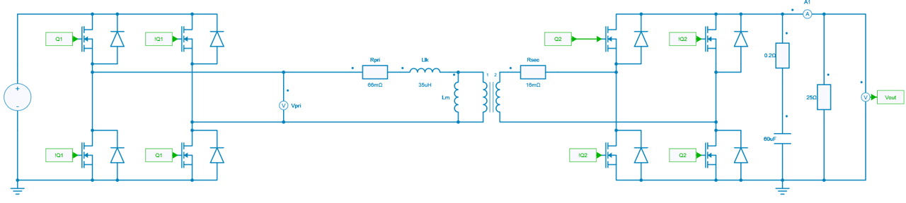

---
tags:
  - Python
  - Power Supplies
  - Converter Design
---

# Loss Computation of a Dual Active Bridge (DAB) Converter

[Download **python script**](dual_active_bridge_ti.ipynb)

[Download **Simba model**](dual_active_bridge_ti.jsimba)

This example shows a Dual Active Bridge (DAB) Converter for typical applications of bidirectional chargers. It is extracted from a design guide of Texas Instruments [^1].

* DC input voltage range: 700 - 800 V
* DC output voltage range: 250 - 500 V
* Output power rating: 10 kW maximum
* PWM frequency: $f_{sw}$ = 100 kHz

## Simba model

The simba model of this DAB converter is shown below:

### Power semiconductor switches

The power semiconductor switches used are SiC mosfets from Wolfspeed. The references are respectively C3M0075120K for primary switches and C3M0030090K for secondary switches.

Dead time values of 100 ns for the turn-on have been considered.

### HF transformer

The 10 kW transformer is a design from Payton with following data:

* Max output power: 10 kW
* Max input voltage: 800 V
* Max output voltage: 500 V
* Total Leakage inductor: 35 µH
* Typical phase shift (to get 10 kW with the voltage parameters above): 23°
* DC primary resistor: 43 + 23 mΩ
* DC secondary resistor: 16 mΩ
* Number of turns at primary side: 24
* Number of turns at secondary side: 15 

The design of this DAB converter originally included DC-blocking capacitors of 7.2 µF at both sides of the transformers to avoid saturation of the transformer in case of unbalanced currents (especially during start-up or load transients). These capacitors have not been considered in the Simba model.

### Controler

A discreter controler with the samping time of 100 µs has been considered to control the output voltage: its output sets the reference value of the phase shift. The controler is modeled in Simba with a discrete transfer function.

## Python script / notebook to compute losses

[^1]: Design Guide TIDA-010054, Bidirectional, Dual Active Bridge Reference Design for Level 3 Electric Vehicle Charging Stations, June 2019, Revised April 2024, Texas Instruments.
