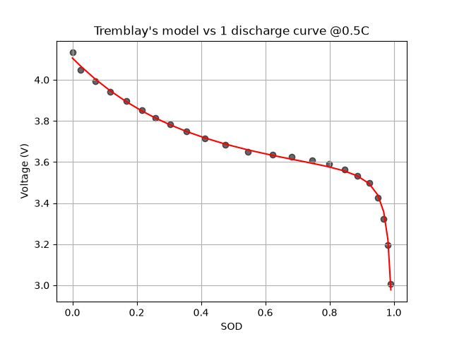
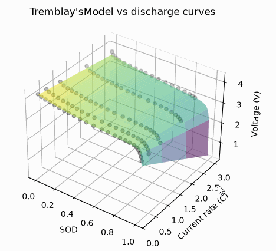
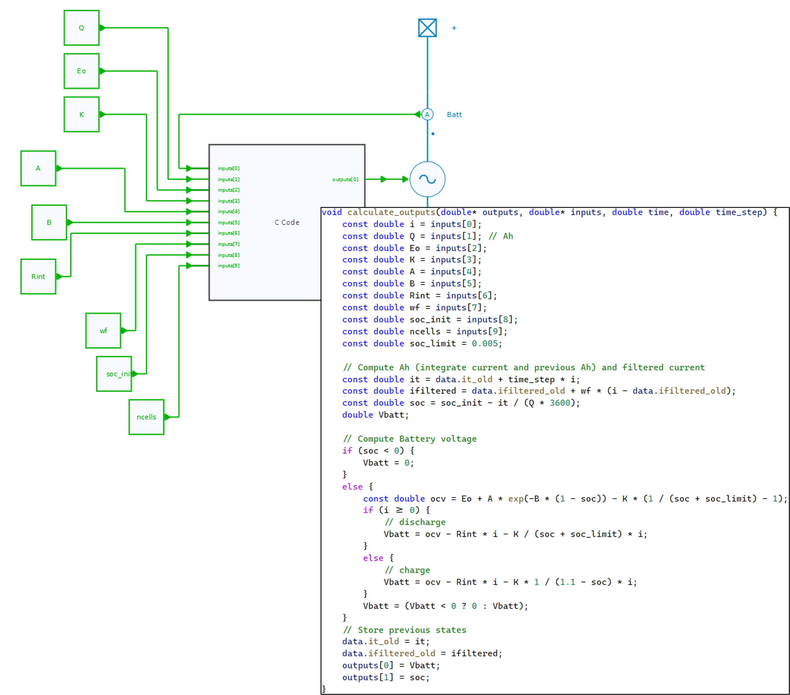
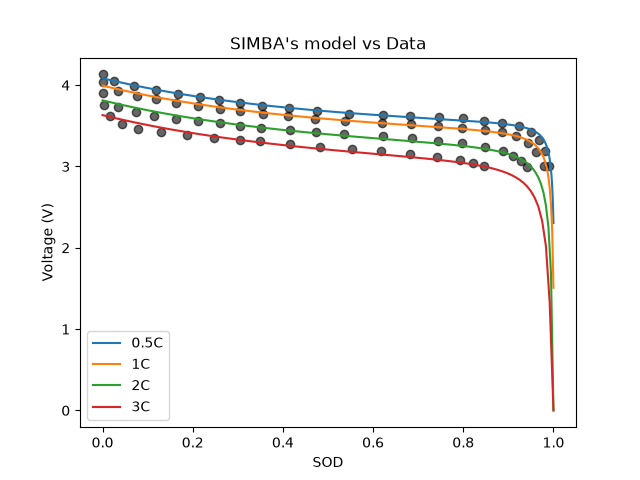

---
tags:
  - Python
  - Renewable Energies
---

# Battery Modeling with SIMBA

[Download **python script**](battery_modeling.py)

[Download **Battery data**](battery_data_LIR18650.py)

[Download **Simba model**](battery_modeling.jsimba)

[Download **Python Library requirements**](requirements.txt)


This python script proposes an implementation of the Tremblay's model described in [^1].


## Battery Model

The battery model considers following equations:

$$V_{batt} = OCV - R_{int} \times i_{batt} - R_{pol} \times i_{filtered}$$

where:
* $R_{int}$ is the constant internal resistance,
* $OCV$ is the Open-Circuit Voltage,
* $R_{pol}$ a polarisation resistance.

!!! info
    This model uses a filtered current ($i_{filtered}$) flowing through the polarisation resistance, to model the slow dynamic behaviour of the voltage for a current variation. This filtered current is obtained by filtering the battery current $i_{batt}$ through a filter with a time constant $T_f$ which is set to 30 s by default.

Open-circuit Voltage ($OCV$) and polarisation resistance ($R_{pol}$) both depend on the State of Charge (or State Of Discharge). The OCV is given by:
$$OCV = E_0 + A \times exp(-B \times sod) - K \left(\dfrac{1}{soc+soc_{limit}} - 1 \right)$$

Whereas $R_{pol}$ depends on the charge / discharge mode.

In discharge, it is given by:
$$R_{pol} = K \left(\dfrac{1}{soc+soc_{limit}}\right)$$

In charge, the polarisation resistance increases until the battery is almost fully charged. It is given by:
$$R_{pol} = K \left(\dfrac{1}{sod - 0.1}\right)$$

where:
* $soc$ is the state of charge [0, 1],
* $sod$ is the state of discharge ($sod = 1 - soc$),
* $E_0$, $A$, $B$, $K$ are empirical parameters to be defined to fit experimental ,
* $soc_{limit}$ is a constant introduced here to allow the mathematical definition when $soc = 0$ and has been set to 0.005 here.

!!! note
    The temperature is assumed to be known and set, thus the model here does not depend on it.


## Extraction of Model Parameters

This step aims to determine the parameters of the battery voltage expression (written above) from a typical $(v, sod)$ discharge curve or for a typical set of several discharge curves for different current rates. It uses the [curve_fit](https://docs.scipy.org/doc/scipy/reference/generated/scipy.optimize.curve_fit.html){:target="_blank"} function (based on non-linear least squares) from Scipy.optimize module.

The principle is simple and an extract of the code is shown below:

* the function `get_battery_voltage` is defined to compute the battery voltage from model parameters $E_0$, $A$, $B$, $K$, $R_{int}$ and the battery current $i_{batt}$,
* the `curve_fit` function is then used to determine parameters to fit the experimental data, *data_sod*, *data_current_rate* and *data_voltage*.

```py
def get_battery_voltage(XY, Eo, A, B, K, Rint):
    sod, current_rate = XY
    soc = 1 - sod
    soc_limit = 0.005
    ocv = Eo + A * np.exp(-B * (1 - soc)) - K * (1 / (soc + soc_limit) - 1)
    return ocv - Rint * current_rate - K / (soc + soc_limit) * current_rate

min_param = [2, 1e-9, 1e-9, 1e-9, 1e-9] # lower bounds for E0, A, B, K, Rint
max_param = [4.1, 1, 40, 1, 10] # upper bounds for E0, A, B, K, Rint

[Eo, A, B, K, Rint], _ = curve_fit(get_battery_voltage, (data_sod, data_current_rate), data_voltage, bounds=(min_param, max_param))
```

The figure below shows experimental data and model outputs where the parameters have been extracted to fit to a single discharge curve at a current rate of 0.5C:



As mentionned above, it is also possible to extract the model parameters to fit a surface which gathers all discharge curves, as shown below:




## Implementation of the battery model

The figure below shows the proposed implementation in SIMBA using a C-code block.



The figure below shows the model results vs the battery data for the different discharge current rates.




[^1]: Tremblay et al., "Experimental Validation of a Battery Dynamic Model for EV Applications, World Electric Vehicle Journal Vol. 3 , 2009, https://dx.doi.org/10.3390/wevj3020289.